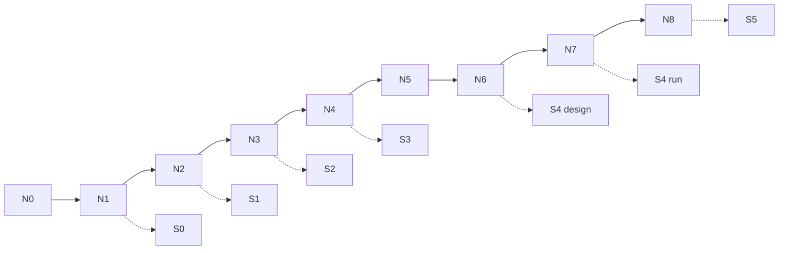

# QA-отчёт: материалы курса «AI для продакта»

**Дата:** 2026-09-18  
**Объект:** Project store `docs/course/` + программа + external catalog  
**Вердикт:** **ready for local sync** (draft v1 + **v2 P0/P1 closed**) · остаток **P2** до когорты

Сетка программы не менялась. Ниже — сквозная проверка Н0–Н8 / S0–S5.

---

## Вердикт в одной фразе

Студенческая выдача Н0–Н8 и каркас SUL S0–S5 **собраны**; v2 закрыл эталоны Ритма, n8n #2/#3, S4 runner и instructor playbook. Синк Context → публичный репо: [`local-push-brief.md`](./local-push-brief.md).

---

## 1. Completeness

| Проверка | Статус | Детали |
|---|---|---|
| Н0–Н8: outline / brief / instructor / checklist | **PASS** | 9×4 = 36 файлов; все непустые (≥19 строк) |
| SUL S0–S5 артефакты | **PASS** | S0 kit + schema/skill/n8n#1; S1 `persona-bank-guide`; S2 `hypothesis-runner-stub`; S3 `market-tornado`; S4 `pretest-protocol`; S5 `s5-defense-rubric` (+ validity stub) |
| n8n в ядре Н0–Н1+ | **PASS** | Н0: установка; Н1: flow #1 JSON+описание; Н3: flow #2 (описание); Н6: flow #3 (описание). Н5 без n8n — ок по программе |
| Dual-track «свой продукт» + демо **Ритм** | **PASS** | Каждый `instructor-notes.md` содержит демо на Ритме; briefs ведут студента на свой кейс. Н4 brief слабее по явной формуле «свой продукт» (опирается на ICP/гипотезы) — не блокер |
| `materials-by-module.md` + `external-materials.md` | **PASS** | Индекс и каталог на месте; снапшоты referenced |

**SUL index (после QA-fix):** [`docs/course/sul/README.md`](./course/sul/README.md) синхронизирован с реальными шаблонами S1–S5.

---

## 2. Continuity

| Цепочка | Статус | Заметка |
|---|---|---|
| Н0 → Н1 (env → harness/n8n/S0) | **PASS** | Явный handoff в outline Н0 |
| S1: ≥10 на Н2 → ≥15 gate на Н3 | **PASS** | Согласовано brief/checklist |
| S2: гипотезы Н3 → runner → S3 sizing Н4 | **PASS** | Ссылки на templates живые |
| S3 → Н5 метрики / tornado связь | **PASS** | Brief Н5 ссылается на tornado Н4 |
| S4: protocol Н6 → N≥50 Н7 | **PASS** | Smoke ≠ S4 зафиксировано |
| S5: защита Н8 ← S0–S4 | **PASS** | Таблица вех + рубрика |
| Явные «→ week-N+1» во всех briefs | **THIN** | Handoff чаще через SUL-вехи, не через папку недели — приемлемо для draft |

Противоречий «программа vs week pack» по критериям приёмки не найдено (включая between-subject, N 50–100, честность > прокрас).

---

## 3. Quality

| Проверка | Статус | Детали |
|---|---|---|
| Пустые stubs | **PASS** | Имена `*-stub` = намеренные шаблоны с критериями; не пустые файлы |
| Внутренние ссылки (authored `docs/` без snapshots) | **PASS** | 135 относительных ссылок, **0 broken** |
| Acceptance criteria | **PASS** | У каждой недели checklist; SUL-вехи с gate-критериями |
| RU consistency | **PASS** | Студенческие тексты RU; EN terms (harness, skill, between-subject) as-is — по программе §5 |
| Облака Mail/Ya в студенческой выдаче | **PASS** | Нет; только ops в программе §4.3 |
| Снапшоты external | **N/A for course** | В `materials-snapshots/` много «битых» относительных ссылок исходников — ожидаемо для дампов, не чинить |

---

## 4. Visuals (mermaid)

| Зона | Диаграмм | Оценка |
|---|---|---|
| Н0–Н1 | 4 на неделю (outline/brief/checklist/instructor) | **полно** |
| Н2–Н8 | ≥1 в каждом `lesson-outline.md` | **минимум выполнен** |
| SUL | README, folder-contract (×2), flow-01, persona-bank, market-tornado | **хорошо** |
| Gaps | Нет второго mermaid в briefs/instructor Н2–Н8; нет диаграммы dual-track в недельных папках (есть в программе) | **v2 nice-to-have** |

---

## 5. Gaps for v2 (приоритет)

| # | Gap | Приоритет | Статус |
|---|---|---|---|
| 1 | **Эталоны Ритм файлами** | **P0** | **CLOSED** → `docs/course/instructor/rhythm-exemplars/` |
| 2 | **n8n JSON flow #2 и #3** | **P0** | **CLOSED** → `docs/course/sul/n8n/flow-02-*`, `flow-03-*` |
| 3 | **Runner reference notebook/script** | **P0** | **CLOSED** → `docs/course/sul/runners/` + sample N=60 |
| 4 | **Единый instructor playbook** Н0–Н8 | **P1** | **CLOSED** → `docs/course/instructor/playbook-0-8.md` |
| 5 | RU-скринкаст Cursor 10 мин; sample RUBRIC на Ритм; `.xlsx` сценарии Н5 | **P2** | open |

GitHub push из cloud agent: **403** — синк по [`local-push-brief.md`](./local-push-brief.md).

---

## Fixes applied in this QA pass

1. [`docs/course/sul/README.md`](./course/sul/README.md) — таблица вех + дерево файлов обновлены под S1–S5 шаблоны; **Prefest → Pretest**.  
2. [`docs/ai-for-pm-course-program.md`](./ai-for-pm-course-program.md) — опечатка **Prefest → Pretest** (mermaid + таблица S4).  
3. [`docs/course/week-05/student-brief.md`](./course/week-05/student-brief.md) — `занизil` → `занизил`.

Curriculum / сетка недель **не** переписывались.

---

## Top 5 actions

1. Локально синкнуть по [`local-push-brief.md`](./local-push-brief.md) → `gavnukkk97/ai-for-pm-course`.  
2. ~~Эталоны Ритма~~ done.  
3. ~~n8n #2/#3~~ done.  
4. ~~S4 runner~~ done.  
5. ~~Playbook 0–8~~ done. · P2: screencast / xlsx / sample RUBRIC.

---

## Evidence snapshot

- Week packs: `docs/course/week-00` … `week-08`  
- SUL: `docs/course/sul/`  
- Program (locked + typo fix): `docs/ai-for-pm-course-program.md`  
- Index: `docs/course/materials-by-module.md`  
- Internal detail: [`../internal/course-qa.md`](../internal/course-qa.md)
