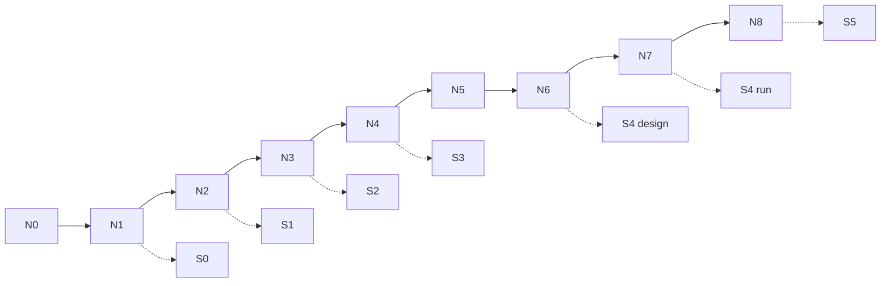

# QA-отчёт: материалы курса «AI для продакта»

**Дата:** 2026-09-20 (P2 close) · база 2026-09-18  
**Объект:** Project store `docs/course/` + программа + external catalog  
**Вердикт:** **ready for local sync** (draft v1 + **v2 P0/P1 closed** + **P2 closed** except author video)

Сетка программы не менялась. Ниже — сквозная проверка Н0–Н8 / S0–S5.

---

## Вердикт в одной фразе

Студенческая выдача Н0–Н8 и каркас SUL S0–S5 **собраны**; v2 закрыл эталоны Ритма, n8n #2/#3, S4 runner и instructor playbook; **P2** закрыл sample S5, unit-sheet CSV, mermaid в briefs Н2–Н8 и shot-list скринкаста. Синк: [`local-push-brief-steps-1-4.md`](./local-push-brief-steps-1-4.md).

---

## 1. Completeness

| Проверка | Статус | Детали |
|---|---|---|
| Н0–Н8: outline / brief / instructor / checklist | **PASS** | 9×4 = 36 файлов; все непустые (≥19 строк) |
| Лекции / ДЗ / слайды | **PASS** | `lecture.md` · `homework.md`+key · `slides.md` на Н0–Н8 |
| SUL S0–S5 артефакты | **PASS** | + EXAMPLE S5 · unit-sheet CSV |
| n8n в ядре Н0–Н1+ | **PASS** | flow #1–#3 JSON+описание |
| Dual-track «свой продукт» + демо **Ритм** | **PASS** | |
| `materials-by-module.md` + `external-materials.md` | **PASS** | |

**SUL index:** [`docs/course/sul/README.md`](./course/sul/README.md).

---

## 2. Continuity

| Цепочка | Статус | Заметка |
|---|---|---|
| Н0 → Н1 … S5 | **PASS** | без противоречий с программой |
| Явные handoff в briefs | **PASS** | mermaid deliverable-flow в student-brief Н2–Н8 (P2) |

---

## 3. Quality

| Проверка | Статус | Детали |
|---|---|---|
| Пустые stubs | **PASS** | |
| Acceptance criteria | **PASS** | |
| RU consistency | **PASS** | |
| Облака Mail/Ya в студенческой выдаче | **PASS** | нет |

---

## 4. Visuals (mermaid)

| Зона | Диаграмм | Оценка |
|---|---|---|
| Н0–Н1 | 4 на неделю | **полно** |
| Н2–Н8 outlines | ≥1 / week | **минимум** |
| Н2–Н8 student-brief | +1 mermaid / week | **P2 CLOSED** |
| SUL | README, contracts, templates, examples | **хорошо** |

---

## 5. Gaps (приоритет)

| # | Gap | Приоритет | Статус |
|---|---|---|---|
| 1 | Эталоны Ритм файлами | P0 | **CLOSED** |
| 2 | n8n JSON flow #2 и #3 | P0 | **CLOSED** |
| 3 | Runner reference | P0 | **CLOSED** |
| 4 | Instructor playbook 0–8 | P1 | **CLOSED** |
| 5a | Sample filled S5 RUBRIC + memo | P2 | **CLOSED** → `docs/course/sul/examples/` |
| 5b | Unit-sheet CSV (Н5 scenarios) | P2 | **CLOSED** → `docs/course/sul/templates/unit-sheet/` |
| 5c | Второй mermaid в briefs Н2–Н8 | P2 | **CLOSED** |
| 5d | RU-скринкаст Cursor 10 мин (видео) | P2 | **OPEN (author)** · shot-list → `instructor/screencast-cursor-10min-shotlist.md` |

GitHub push из cloud agent: **403** — синк по [`local-push-brief-steps-1-4.md`](./local-push-brief-steps-1-4.md) / [`local-push-brief-p2.md`](./local-push-brief-p2.md).

---

## Fixes applied (P2 pass · 2026-09-20)

1. EXAMPLE S5: filled rubric + decision memo (Rhythm H02 N=60).  
2. Mermaid в `week-02`…`week-08/student-brief.md`.  
3. Unit-sheet CSV pack + README how-to-open.  
4. Screencast shot-list (видео остаётся за автором).  
5. Indexes / homework-keys / materials-production обновлены.

Curriculum / сетка недель **не** переписывались.

---

## Top actions

1. Локально синкнуть **все** handoff (lectures→homework→slides→p2) по [`local-push-brief-steps-1-4.md`](./local-push-brief-steps-1-4.md).  
2. Записать RU-скринкаст Cursor по shot-list (единственный открытый P2-артефакт).  
3. После sync — удалить handoff-ветки.

---

## Evidence snapshot

- Week packs: `docs/course/week-00` … `week-08`  
- SUL: `docs/course/sul/` (+ `examples/`, `templates/unit-sheet/`)  
- Program (locked): `docs/ai-for-pm-course-program.md`  
- Index: `docs/course/materials-by-module.md`  
- Internal: [`../internal/materials-production.md`](../internal/materials-production.md) · [`../internal/p2-close.md`](../internal/p2-close.md)
