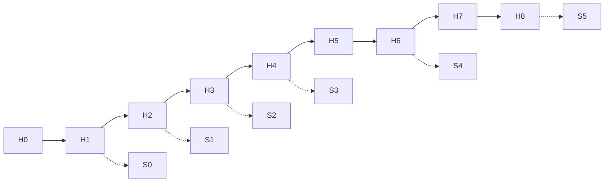

# Материалы курса «AI для продакта»

Студенческая выдача. Программа: [`../program.md`](../program.md) — **сетку недель не переписываем**, только наполняем практику.

**Одна фраза:** прошлые курсы учат *считать*; этот — *собрать AI-контур продакта* (harness + n8n) и **Synthetic User Lab** на своём продукте. Демо преподавателей — на стенде **Ритм**.

---

## Быстрый старт

1. Вернитесь к корневому [`README.md`](../../README.md), если ещё не читали «что получите».  
2. Выберите ветку cold-start: [`cold-start-triage.md`](./cold-start-triage.md) (live / idea-only / NDA / no-Docker).  
3. Начните с [`week-00/`](./week-00/) → `student-brief.md`.  
4. Каждую неделю идите по цепочке: **brief → homework → checklist**.  
5. С Н1 ведите флагман в [`sul/`](./sul/) (вехи S0→S5).  
6. После курса (и как weekly ritual): [`monday-survival-checklist.md`](./monday-survival-checklist.md).

---

## Карта папок

| Папка | Неделя / веха | Для студента |
|---|---|---|
| [`week-00/`](./week-00/) | **Н0** async-онбординг | [`README`](./week-00/README.md) · brief · ДЗ · checklist |
| [`week-01/`](./week-01/) | **Н1** AI-экзоскелет + **S0** | [`README`](./week-01/README.md) · brief · ДЗ · checklist |
| [`week-02/`](./week-02/) | **Н2** ICP → **S1** старт | [`README`](./week-02/README.md) · brief · ДЗ · checklist |
| [`week-03/`](./week-03/) | **Н3** Discovery → **S2** | [`README`](./week-03/README.md) · brief · ДЗ · checklist |
| [`week-04/`](./week-04/) | **Н4** AI-ставки → **S3** | [`README`](./week-04/README.md) · brief · ДЗ · checklist |
| [`week-05/`](./week-05/) | **Н5** Метрики / юнит | [`README`](./week-05/README.md) · brief · ДЗ · checklist |
| [`week-06/`](./week-06/) | **Н6** Аналитика → **S4** | [`README`](./week-06/README.md) · brief · ДЗ · checklist |
| [`week-07/`](./week-07/) | **Н7** Питч + претест | [`README`](./week-07/README.md) · brief · ДЗ · checklist |
| [`week-08/`](./week-08/) | **Н8** Капстоун **S5** | [`README`](./week-08/README.md) · brief · ДЗ · checklist |
| [`sul/`](./sul/) | Флагман **S0→S5** | starter kit, шаблоны, n8n, runner |
| [`cold-start-triage.md`](./cold-start-triage.md) | Старт | ветки live / idea / NDA / no-Docker |
| [`monday-survival-checklist.md`](./monday-survival-checklist.md) | После курса | понедельник: digest · skill · SUL |
| [`media/`](./media/) | Визуалы | манифест скринов/видео (файлы — от автора) |
| [`instructor/`](./instructor/) | Только преподавателям | playbook, эталоны Ритм, shot-list |
| [`materials-by-module.md`](./materials-by-module.md) | Reading list | ссылки по неделям |

Внешние источники: [`../external-materials.md`](../external-materials.md).

---

## Что в каждой недельной папке

| Файл | Для кого | Содержание |
|---|---|---|
| `README.md` | студент | индекс недели + prev/next |
| `student-brief.md` | студент | что сделать за неделю, артефакты, сдача |
| `homework.md` | студент | ДЗ: задачи, приёмка, оценка часов |
| `checklist.md` | оба | критерии приёмки недели |
| `lesson-outline.md` | оба | цели, тайминг, теория-скелет |
| `lecture.md` | преподаватель | скрипт живой лекции ~1,5 ч |
| `slides.md` | преподаватель | markdown-колода для Google Slides / Marp |
| `instructor-notes.md` | преподаватель | демо на Ритме, типичные сбои |
| `homework-key.md` | преподаватель | рубрика оценки (не «ответы») |

### Прямые ссылки: briefs / ДЗ / слайды

| Нед. | Brief | ДЗ | Слайды |
|---|---|---|---|
| Н0 | [`brief`](./week-00/student-brief.md) | [`ДЗ`](./week-00/homework.md) | [`slides`](./week-00/slides.md) |
| Н1 | [`brief`](./week-01/student-brief.md) | [`ДЗ`](./week-01/homework.md) | [`slides`](./week-01/slides.md) |
| Н2 | [`brief`](./week-02/student-brief.md) | [`ДЗ`](./week-02/homework.md) | [`slides`](./week-02/slides.md) |
| Н3 | [`brief`](./week-03/student-brief.md) | [`ДЗ`](./week-03/homework.md) | [`slides`](./week-03/slides.md) |
| Н4 | [`brief`](./week-04/student-brief.md) | [`ДЗ`](./week-04/homework.md) | [`slides`](./week-04/slides.md) |
| Н5 | [`brief`](./week-05/student-brief.md) | [`ДЗ`](./week-05/homework.md) | [`slides`](./week-05/slides.md) |
| Н6 | [`brief`](./week-06/student-brief.md) | [`ДЗ`](./week-06/homework.md) | [`slides`](./week-06/slides.md) |
| Н7 | [`brief`](./week-07/student-brief.md) | [`ДЗ`](./week-07/homework.md) | [`slides`](./week-07/slides.md) |
| Н8 | [`brief`](./week-08/student-brief.md) | [`ДЗ`](./week-08/homework.md) | [`slides`](./week-08/slides.md) |

---

## Сквозные артефакты студента

1. **Свой продукт / рабочий кейс** — 1-pager с Н0, все гипотезы и SUL на нём.  
2. **Harness** — Cursor *или* Claude Code (≥1 свободно).  
3. **n8n** — local или cloud; с Н1 — рабочий flow #1 (+ digests на Н3/Н6).  
4. **SUL-репо** — структура из [`sul/`](./sul/) под свой продукт, вехи S0→S5.

---

## Анти-скоуп

- не повтор JTBD / юнит / АБ «с нуля»;  
- n8n ≠ курс автопостинга;  
- синтетика ≠ живой трафик (границы на каждой SUL-вехе).

---

## Для преподавателей

- Playbook: [`instructor/playbook-0-8.md`](./instructor/playbook-0-8.md)  
- Эталоны Ритм: [`instructor/rhythm-exemplars/`](./instructor/rhythm-exemplars/)  
- n8n: [`sul/n8n/`](./sul/n8n/) · runner: [`sul/runners/`](./sul/runners/)  
- QA производства: [`../course-qa-report.md`](../course-qa-report.md)
