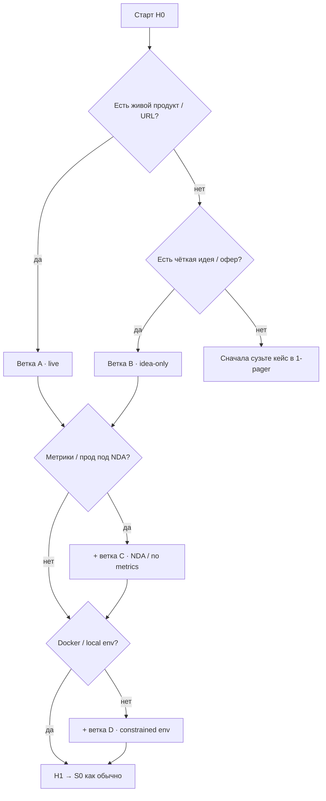

# Cold-start: какой путь у вас

Короткий триаж **до Н1**. Выберите одну основную ветку (можно комбинировать «c» с «a»/«b»). Сетка недель **не меняется** — меняется только объект сдачи и замены.

Связано: [`week-00/student-brief.md`](./week-00/student-brief.md) · [`sul/`](./sul/) · корневой [README](../../README.md) («как проходить»).

---

## A. Есть живой продукт / URL

**Делаете каждую неделю как в brief.** SUL вешается на реальный объект (лендинг, экран, офер, флоу).

| Неделя | Делаете | Не пропускаете |
|---|---|---|
| Н0–Н1 | env, harness, n8n #1, S0 на **своём** репо | — |
| Н2–Н3 | ICP / discovery / гипотезы по **живому** объекту | desk-research ок как дополнение |
| Н4–Н5 | ставки, sizing, метрики с пометкой источника | — |
| Н6–Н7 | bare vs rich, претест на URL/скринах продукта | — |
| Н8 | защита + следующий **живой** шаг (АБ / интервью / ship) | — |

---

## B. Только идея / pre-product

**Делаете всё**, но объект = зафиксированный концепт (1-pager + макет/копия офера/прототип-текст). Честно пишете в ONEPAGER: «нет URL».

| Неделя | Делаете | Замена / skip |
|---|---|---|
| Н0 | 1-pager с сегментом, JTBD, гипотетическим офером | не ждать идеального лендинга |
| Н1–S0 | scaffold SUL на идею | — |
| Н2–S1 | персоны по заявленному сегменту | конкуренты — desk + assumptions |
| Н3–S2 | гипотезы на **тексте офера / wireframe** | не требует прод-трафика |
| Н4–S3 | market tornado с пометкой `assumption` | не выдумывать «точный TAM» |
| Н5 | дерево метрик **целевое** (как будет считаться) | skip: доступ к факт-метрикам |
| Н6–S4 | претест на тексте/мокапе вариантов A/B | skip: «живой сайт» — замена мокапом в PROTOCOL |
| Н7–Н8 | питч + защита; в вердикте обязателен **calibration debt** | не притворяться, что был live АБ |

---

## C. NDA / нет доступа к метрикам

**Делаете контур и SUL**, но без секретов и без прод-цифр в git.

| Неделя | Делаете | Замена / skip |
|---|---|---|
| Н0 | в ONEPAGER: «NDA / нет прод»; что **можно** описать публично | не класть внутренние дашборды в репо |
| Н1–Н3 | skills, digests, discovery на **обезличенном** описании | red-team: нет утечек в артефактах |
| Н5 | unit-sheet на **синтетических / публичных** цифрах или ranges | skip: выгрузка Metabase/прод CSV |
| Н6 | bare-контекст из разрешённого; rich — только то, что можно показать преподавателю офлайн | в REPORT: `data_access: none/nda` |
| Н8 | `CALIBRATION.md` = **calibration debt** + какой живой тест закроет | не фейковать «знак совпал с АБ» |

Секреты, клиентские имена, внутренние URL — только в private notes вне сдачи (или замазанный PDF преподавателю по договорённости).

---

## D. Нет Docker / constrained env

**Курс не блокируется.** Harness и n8n обязательны в каком-то виде; local Docker — предпочтение, не догма.

| Что | Делаете | Замена |
|---|---|---|
| n8n Н0–Н1 | **n8n Cloud** (trial) или shared classroom instance | вместо Docker local |
| n8n Read/Write File | Cloud: артефакт в workflow output / Google Drive / gist **без секретов** | local file node |
| Runner S4 | Colab / локальный Python без Docker / уменьшенный N по согласованию с преподавателем | полный local demo-runner |
| Скрин сдачи | Cloud UI «Workflows» / execution log | Docker desktop screenshot |

Зафиксируйте в `notes/verify.md` или ONEPAGER: `env: cloud-n8n` / `no-docker`.

---

## Мини-правило приёмки

Ветка не отменяет brief недели. В сдаче одной строкой: **`track: A|B` + флаги `NDA` / `no-docker`**. Преподаватель смотрит честность объекта и замен, а не «идеальный прод».
