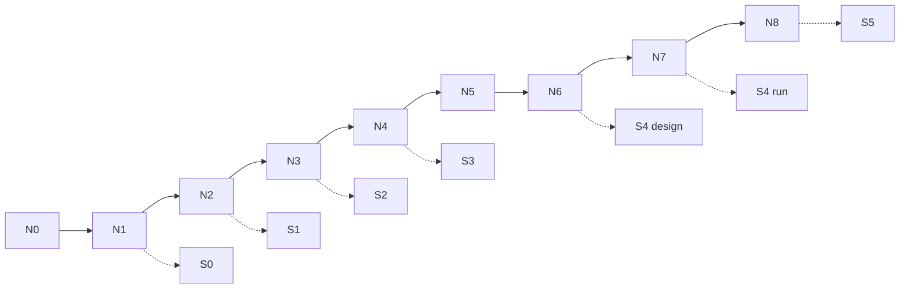

# Instructor playbook · Н0–Н8

Единый конспект занятия поверх недельных `instructor-notes.md`.  
Сетку программы **не** меняем. Эталоны Ритма: [`rhythm-exemplars/`](./rhythm-exemplars/).

**Формат:** ~7 живых × ~1,5 ч + практика 4–6 ч/нед. Н0 — async.

---

## Карта ресурсов

| Что | Где |
|---|---|
| Week packs | [`../week-00/`](../week-00/) … [`../week-08/`](../week-08/) |
| Эталоны Ритм | [`rhythm-exemplars/`](./rhythm-exemplars/) |
| n8n #1–#3 | [`../sul/n8n/`](../sul/n8n/) |
| S4 runner | [`../sul/runners/`](../sul/runners/) |
| Программа | [`../../ai-for-pm-course-program.md`](../../ai-for-pm-course-program.md) |

---

## Н0 · Async онбординг (~тур 15–20 мин в kickoff)

| | |
|---|---|
| **Цель** | Env + договор AI≠вывод + 1-pager своего продукта; тур стенда Ритм |
| **Демо order** | Контекст Ритм → файлы harness → Metabase/psql counts → слайд AI≠вывод → сдача Н0 |
| **Notes** | [`../week-00/instructor-notes.md`](../week-00/instructor-notes.md) |
| **Failure modes** | Нет своего продукта → шаблон рабочего кейса; Docker/n8n ↓ → Cloud; 1-pager «про AI вообще» → вернуть объект SUL |
| **Не показывать** | Private Mail/Ya; prod secrets |

---

## Н1 · Экзоскелет + n8n #1 + S0 (~90 мин)

| Блок | Мин | Содержание |
|---|---|---|
| A Harness skill | 15 | backlog-status на файлах Ритма; evals-lite |
| B n8n flow #1 | 15 | Manual → LLM → artifact; credential в UI |
| C S0 + этика | 10 | папки + SYNTHETIC notice + between-subject tease |
| Студенты / Q | rest | fluency ≥1 harness |

**Links:** notes [`../week-01/instructor-notes.md`](../week-01/instructor-notes.md) · flow [`../sul/n8n/flow-01-description.md`](../sul/n8n/flow-01-description.md)

**Failures:** skill не пишет файл; n8n credential → Mock Code node ok с `MOCK_LLM`; путают n8n и harness.

---

## Н2 · ICP / конкуренты / S1 старт (~90)

| Блок | Мин | |
|---|---|---|
| A ICP | 12 | кто / не кто / WTP-proxy |
| B Персоны | 12 | schema + live P02; антипаттерн «Мария эффективная» |
| C Конкуренты | 8 | заменитель №1 = Notes / «ничего» |

**Эталон:** [`rhythm-exemplars/01-icp-competitive-map.md`](./rhythm-exemplars/01-icp-competitive-map.md)  
**Notes:** [`../week-02/instructor-notes.md`](../week-02/instructor-notes.md)

**Failures:** 10 персон = 1 сегмент; копируют Аню в B2B; нет sources.md.

---

## Н3 · Discovery + digest #2 + S2 (~90)

| Блок | Мин | |
|---|---|---|
| A X→Y→Z | 15 | H01 + дырявая Z |
| B Red-team | 10 | LLM-оптимизм paywall; within-subject запрет |
| C Brief + n8n #2 | 10 | Минто BRIEF + signals digest |

**Эталон:** [`rhythm-exemplars/02-discovery-brief.md`](./rhythm-exemplars/02-discovery-brief.md)  
**n8n:** [`../sul/n8n/flow-02-description.md`](../sul/n8n/flow-02-description.md)  
**Notes:** [`../week-03/instructor-notes.md`](../week-03/instructor-notes.md)

**Failures:** engagement без Z; агент видит оба варианта; digest = рерайт ICP.

---

## Н4 · Ставки / sizing / S3 (~90)

| Блок | Мин | |
|---|---|---|
| A 3 ставки | 10 | kill авто-ship |
| B Bottom-up + tornado | 20 | trial > price |
| C Границы | 5 | §3.4 |

**Эталон:** [`rhythm-exemplars/03-strategy-go-no-go-memo.md`](./rhythm-exemplars/03-strategy-go-no-go-memo.md)  
**Notes:** [`../week-04/instructor-notes.md`](../week-04/instructor-notes.md)

**Failures:** TAM сверху вниз; нет kill-критерия; tornado без source.

---

## Н5 · Дерево / unit / калибровка (~90)

| Блок | Мин | |
|---|---|---|
| A Дерево | 15 | NS depth → $ |
| B Unit + калибровка | 15 | агент врёт CAC → человек правит |
| C Мост S4 | 5 | Z → success event |

**Эталон:** [`rhythm-exemplars/04-metrics-tree-unit-sheet.md`](./rhythm-exemplars/04-metrics-tree-unit-sheet.md)  
**Notes:** [`../week-05/instructor-notes.md`](../week-05/instructor-notes.md)

**Failures:** KPI-список без связей; скопированы числа Ритма в свой продукт.

---

## Н6 · Bare vs rich + flow #3 + S4 design (~90)

| Блок | Мин | |
|---|---|---|
| A Bare fail | 10 | галлюцинации |
| B Rich | 20 | context pack + COMPARE |
| C Digest + protocol | 10 | schedule + pretest template |

**Эталон:** [`rhythm-exemplars/05-bare-vs-rich-context-pack.md`](./rhythm-exemplars/05-bare-vs-rich-context-pack.md)  
**n8n:** [`../sul/n8n/flow-03-description.md`](../sul/n8n/flow-03-description.md)  
**Runner prep:** [`../sul/runners/README.md`](../sul/runners/README.md)  
**Notes:** [`../week-06/instructor-notes.md`](../week-06/instructor-notes.md)

**Failures:** rich = длинный промпт; within-subject в protocol; schedule без артефакта.

---

## Н7 · Питч + pretest S4 (~90)

| Блок | Мин | |
|---|---|---|
| A Питч эталон | 15 | 7 секций; ask = живой тест |
| B Претест | 15 | live 4–6 + готовый N=60 REPORT |
| C ЛПР спарринг | 10–15 | возражения на доску |

**Эталон:** [`rhythm-exemplars/06-pretest-pitch-demo-notes.md`](./rhythm-exemplars/06-pretest-pitch-demo-notes.md)  
**Sample REPORT:** [`../sul/runners/runs/demo-h02-landing-n60/REPORT.md`](../sul/runners/runs/demo-h02-landing-n60/REPORT.md)  
**Notes:** [`../week-07/instructor-notes.md`](../week-07/instructor-notes.md)

**Failures:** N=12 «дорого»; p-value без оговорок; питч = тур Cursor.

**API cost:** предупредить; дешёвая модель ok при том же seed-протоколе.

---

## Н8 · Капстоун S5 (~90)

| Блок | Мин | |
|---|---|---|
| A Эталон защиты | 15 | inconclusive намеренно; WHERE-IT-LIES |
| B Ротация защит | bulk | 7+3; вопросы: метрика/N/validity/живой шаг |
| C Peer + закрытие | 15 | паттерны класса |

**Эталон talk-track:** в [`rhythm-exemplars/06-pretest-pitch-demo-notes.md`](./rhythm-exemplars/06-pretest-pitch-demo-notes.md) §S5  
**Рубрика:** [`../sul/templates/s5-defense-rubric.md`](../sul/templates/s5-defense-rubric.md)  
**Notes:** [`../week-08/instructor-notes.md`](../week-08/instructor-notes.md)

**Failures:** демо инструментов вместо вердикта; нет WHERE-IT-LIES; репо без S4 логов.

---

## Prep checklist (до потока)

- [ ] Import n8n #1–#3, credentials только локально  
- [ ] `python3 sul/runners/pretest_runner.py --n 60` один раз (sample REPORT)  
- [ ] Открыты все 6 rhythm-exemplars  
- [ ] Слайд границ §3.4 на каждом SUL-блоке  
- [ ] Private clouds / Metabase prod — не в шаринг студентам
