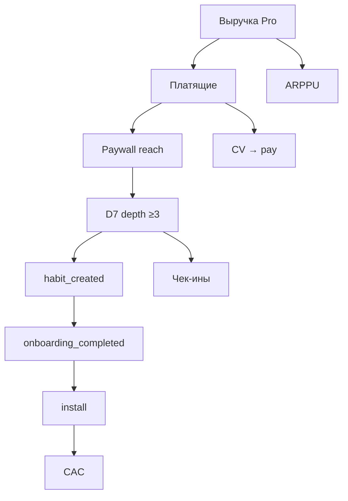

# Эталон · Дерево метрик + unit sheet · Ритм

**Неделя:** Н5 · instructor demo  
Паттерн: prior course M1.3 / M5.1. Числа — учебные napkin, не прод БД.

---

## DEFINITIONS (минимум)

| Метрика | Определение | Окно / дедуп |
|---|---|---|
| Install | первая установка / первый `user` | — |
| Onboarding completed | событие `onboarding_completed` | 1 на user |
| Habit created | `habit_created` | 1+ на user |
| D1 check-in | ≥1 `check_in` в 24ч после habit | user-level |
| D7 depth ≥3 | ≥3 check-ins в разные дни за 7д от habit **или** эквивалент «depth≥3» стенда | user; NSM-кандидат |
| Paywall view | показ paywall | |
| New Pro | первая оплата / первая subscription row | 14д от habit для CV |
| CAC | стоимость **одного install** (учебный) | канал |
| ARPPU | выручка / платящие; mix месяц/год явный | период |

**Запрет агенту:** выдумывать CAC/LTV без строки в DEFINITIONS.

---

## Дерево

**Рычаги:** онбординг (шум↓), напоминания, timing paywall, benefit-copy.  
**Связь гипотез:** H03→Onb/D1 · H01→Reach/Depth · H02→CV intent.

**Узкое место (демо):** habit → depth ≥3 (**~27%** на учебной воронке), не цена Pro.

---

## Unit sheet (paying user / month)

Учебная волна **10k install** (M1.3 order-of-magnitude):

| Шаг | Rate | Users |
|---|---|---|
| Install | — | 10 000 |
| Onboarding | 72% | 7 200 |
| Habit | 75% of onb | 5 400 |
| Depth ≥3 | 27% of habit | ≈ 1 460 |
| Paywall reach (demo) | — | ≈ 2 000 |
| New Pro | — | 380 |
| CAC | 45 ₽/install | |
| First payment mix | 70% × 299 + 30% × (1990/12≈166) ≈ **806 ₽** napkin | |
| Margin assumption | 85% | teaching |
| LTV napkin | ~1 100 ₽/payer | teaching; не закон |

**Вывод для класса:** чинить depth/онбординг раньше прайсинга; paywall reach > depth = давление до value.

---

## Три сценария

| | Downside | Base | Upside |
|---|---|---|---|
| Depth habit→≥3 | 20% | 27% | 35% |
| New Pro (при той же волне) | ~280 | 380 | ~500 |
| Фокус действия | упростить онбординг + late paywall | текущий план | + benefit copy после depth |
| Красный флаг | агент «улучшил LTV×3» без DEFINITIONS | — | — |

Ритуал: **агент считает → человек калибрует** (подставить нарочный выдуманный CAC на демо).

---

## Мост к S4

Success event претеста H02 на лендинге ≠ D7 depth; для питча primary = proxy intent/pay на варианте A/B, guardrail = «не понял цену». Depth остаётся north-star продукта.
