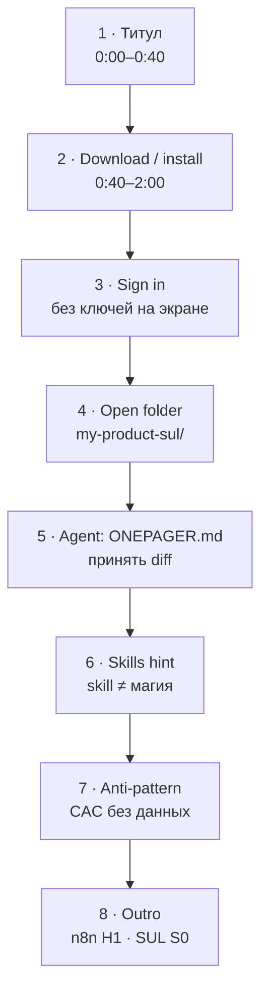

# Плейсхолдер · outline RU-скринкаста «Cursor ~10 мин»

> **«плейсхолдер → заменить видео»**  
> Целевой файл: [`../cursor-10min-onboarding.mp4`](../cursor-10min-onboarding.mp4) **или** YouTube/unlisted URL.  
> Это **не** фейковый mp4 — только slide-flow по shot-list.  
> Съёмка: [`../../instructor/screencast-cursor-10min-shotlist.md`](../../instructor/screencast-cursor-10min-shotlist.md).

Пока видео нет — студентам хватает [cursor.com](https://cursor.com) + dry-run из [`../../week-00/student-brief.md`](../../week-00/student-brief.md).
