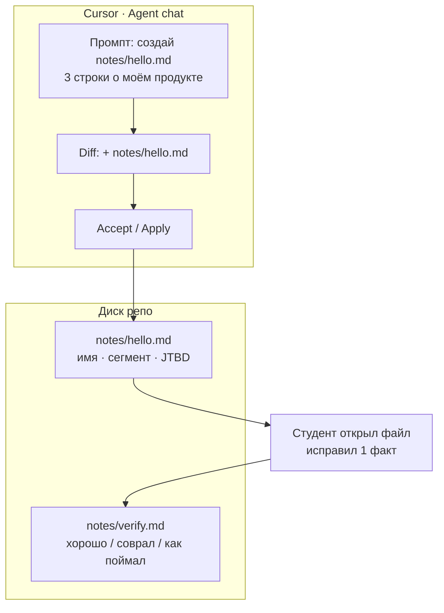

# Плейсхолдер · Cursor Agent → `notes/hello.md`

> **«плейсхолдер → заменить скрином»**  
> Целевой файл: [`../n0-cursor-agent-hello.png`](../n0-cursor-agent-hello.png) (ещё нет — пишет kir с реального Cursor).  
> Идея скрина: принятый diff + файл `notes/hello.md` **на диске**, не только в чате.

Студенту важно увидеть цепочку **промпт → diff → файл → правка руками**.



```text
┌─ Agent ─────────────────────────────┐
│  «создай notes/hello.md …»          │
│  [diff] + notes/hello.md            │
│           [ Accept ]                │
└─────────────────────────────────────┘
              │
              ▼
┌─ Explorer ── notes/ ────────────────┐
│  hello.md     ← файл на диске       │
│  verify.md    ← пишет человек       │
└─────────────────────────────────────┘
```

**Критерий dry-run:** harness зелёный только если `hello.md` лежит в репо и вы его правили руками.
