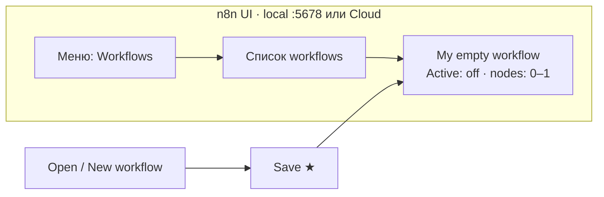

# Плейсхолдер · n8n список Workflows

> **«плейсхолдер → заменить скрином»**  
> Целевой файл: [`../n0-n8n-workflows-empty.png`](../n0-n8n-workflows-empty.png) (ещё нет — пишет kir с local `:5678` **или** Cloud).  
> Идея скрина: UI «Workflows» с **одним** сохранённым пустым flow. Без секретов, без LLM-нод на Н0.

На Н0 достаточно «инстанс жив + workflow сохранён» — не рабочий AI-flow.



```text
n8n ──────────────────────────────────
│ Overview │ Workflows │ Credentials │
│            ▲ вы здесь               │
├─────────────────────────────────────┤
│ Name                 │ Updated      │
│ My empty workflow    │ сегодня      │  ← один сохранённый
│ (можно без нод)      │              │
└─────────────────────────────────────┘
```

**Сдача Н0:** скрин этого списка *или* export JSON пустого flow → `runs/n8n/n0-empty-workflow.json`.
