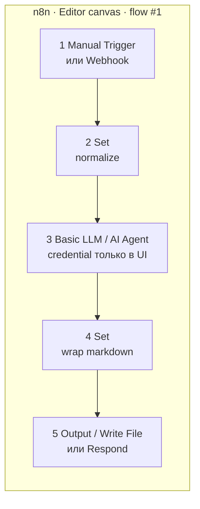

# Плейсхолдер · n8n canvas flow #1

> **«плейсхолдер → заменить скрином»**  
> Целевой файл: [`../n1-n8n-flow01-canvas.png`](../n1-n8n-flow01-canvas.png) (ещё нет — пишет kir с canvas без секретов в нодах).  
> Идея скрина: цепочка **триггер → normalize → LLM → wrap → артефакт** на холсте n8n.

Подробности узлов: [`../../sul/n8n/flow-01-description.md`](../../sul/n8n/flow-01-description.md).



```text
[Manual Trigger]──►[Set normalize]──►[Basic LLM]──►[Set wrap]──►[Output]
       ▲                                    │
   Execute / POST                           credential в UI
   {product_name, backlog_snippet, ask}     (не в git JSON)
```

**Приёмка:** один успешный Execute → осмысленный Markdown-сводка (не lorem); в экспорте нет API keys.
