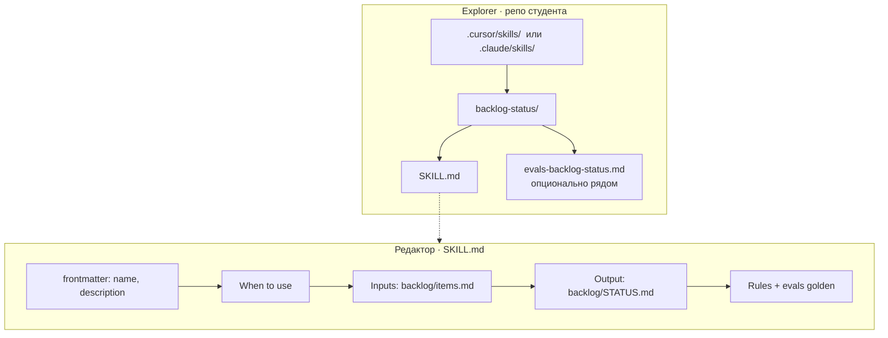

# Плейсхолдер · папка skill + открытый `SKILL.md`

> **«плейсхолдер → заменить скрином»**  
> Целевой файл: [`../n1-skill-skillmd.png`](../n1-skill-skillmd.png) (ещё нет — пишет kir из Explorer + редактор).  
> Идея скрина: в дереве видна папка skill; справа открыт `SKILL.md` с when/inputs/output/rules.

Эталон текста: [`../../sul/skills/backlog-status/SKILL.md`](../../sul/skills/backlog-status/SKILL.md).



```text
.cursor/skills/
└── backlog-status/
    ├── SKILL.md          ← открыт в редакторе
    └── (evals…)

SKILL.md
────────
# backlog-status
## When to use
## Inputs  → backlog/items.md
## Output  → backlog/STATUS.md
## Rules   → не выдумывать id
```

**Смысл для Н1:** skill = версионируемая процедура в git, не разовый промпт в чате.
