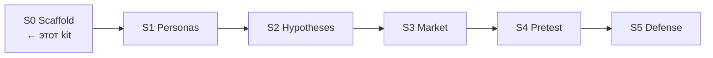

# Synthetic User Lab (SUL) — starter kit

Флагман курса «AI для продакта». Вы собираете лабораторию **на своём продукте**; преподаватели параллельно показывают эталон на **Ритме**.

Вехи программы (не урезаем): **S0 → S5**. Этот каталог — каркас **S0** + заготовки под следующие вехи.



| Веха | Неделя | Что здесь уже есть | Что допишете вы |
|---|---|---|---|
| **S0** Scaffold | 1 | контракт папок, skill, n8n flow #1, notice, рубрика-заготовка | README под свой продукт, зелёные контуры |
| **S1** Personas | 2–3 | `persona.schema.json` + пример + [`personas/persona-bank-guide.md`](./personas/persona-bank-guide.md) | ≥15 персон, ≥3 сегмента |
| **S2** Hypotheses | 3–4 | [`hypotheses/_TEMPLATE.md`](./hypotheses/_TEMPLATE.md) + [`hypotheses/hypothesis-runner-stub.md`](./hypotheses/hypothesis-runner-stub.md) | 5–7 гипотез X→Y→Z + runner-plan |
| **S3** Market eval | 4–5 | [`templates/market-tornado.md`](./templates/market-tornado.md) + [`templates/decision-memo-stub.md`](./templates/decision-memo-stub.md) | sizing + tornado на своих числах |
| **S4** Pretest | 6–7 | [`templates/pretest-protocol.md`](./templates/pretest-protocol.md) + [`runners/`](./runners/) | ≥50–100 агентов, 2 варианта, REPORT |
| **S5** Defense | 8 | [`validity-rubric-stub.md`](./validity-rubric-stub.md) + [`templates/s5-defense-rubric.md`](./templates/s5-defense-rubric.md) + **EXAMPLE** [`examples/`](./examples/) | честная защита |

Теоретический фундамент: AgentA/B (arXiv 2504.09723), урок 4.6 `stats-ab-course`, ethics notice как в voice-of-agents.

---

## Быстрый старт S0

```bash
# из вашего репо курса / рабочего кейса
cp -R path/to/docs/course/sul ./sul-lab
cd sul-lab
# отредактируйте README (этот файл), product link, notice
```

1. Прочитайте [`folder-contract.md`](./folder-contract.md).  
2. Подключите skill [`skills/backlog-status/`](./skills/backlog-status/) к Cursor или Claude Code.  
3. Импортируйте n8n [`n8n/flow-01-webhook-to-artifact.json`](./n8n/flow-01-webhook-to-artifact.json) — см. [`n8n/flow-01-description.md`](./n8n/flow-01-description.md). Позже: flow [#2](./n8n/flow-02-description.md), [#3](./n8n/flow-03-description.md).  
4. Заполните блок «Мой продукт» ниже.  
5. Отметьте чеклист S0 в [`../week-01/checklist.md`](../week-01/checklist.md).

---

## Мой продукт (заполните)

| Поле | Значение |
|---|---|
| Название | _…_ |
| URL / артефакт для претеста | _…_ |
| Сегменты (черновик) | _…_ |
| Harness | Cursor / Claude Code |
| n8n | local :5678 / cloud URL |
| Имя workflow #1 | _…_ |
| Как запускать flow #1 | Manual / Webhook … |

---

## Дерево

```text
sul/
├── README.md                 ← вы здесь
├── folder-contract.md
├── SYNTHETIC-DATA-NOTICE.md
├── validity-rubric-stub.md   ← короткая заготовка валидности
├── personas/
│   ├── persona.schema.json
│   ├── persona-bank-guide.md ← S1
│   └── examples/persona-example.md
├── hypotheses/
│   ├── _TEMPLATE.md
│   └── hypothesis-runner-stub.md ← S2
├── runs/
│   └── .gitkeep              ← сюда логи прогонов (S2+)
├── skills/
│   └── backlog-status/SKILL.md
├── n8n/
│   ├── flow-01-description.md
│   ├── flow-01-webhook-to-artifact.json
│   ├── flow-02-description.md
│   ├── flow-02-signals-to-digest.json      ← Н3
│   ├── flow-03-description.md
│   └── flow-03-analytics-digest.json       ← Н6
├── runners/                  ← S4 reference (mock/llm)
│   ├── README.md
│   ├── pretest_runner.py
│   ├── pretest_runner.ipynb
│   └── runs/demo-h02-landing-n60/
├── templates/
│   ├── decision-memo-stub.md
│   ├── market-tornado.md     ← S3
│   ├── pretest-protocol.md   ← S4
│   ├── s5-defense-rubric.md  ← S5
│   └── unit-sheet/           ← Н5 CSV (definitions/funnel/scenarios)
└── examples/                 ← EXAMPLE filled S5 (Rhythm), not student work
    ├── README.md
    ├── s5-rhythm-filled-rubric.md
    └── s5-rhythm-decision-memo.md
```

Instructor эталоны Ритм (не копировать в студенческий кейс): [`../instructor/rhythm-exemplars/`](../instructor/rhythm-exemplars/).

---

## Границы (повторять в каждом отчёте)

- Синтетический пользователь **смещён**.  
- Совпадение направления с живым тестом **не доказано** для вашего домена, пока не сделаете калибровку (S5).  
- Для: отбраковки гипотез, подготовки интервью, чувствительности.  
- Не для: финального ship/kill без живых данных, если трафик позволяет.

---

## Связанные материалы курса

- Программа §3: [`../../ai-for-pm-course-program.md`](../../ai-for-pm-course-program.md)  
- Неделя 1: [`../week-01/`](../week-01/)  
- Источники: [`../../external-materials.md`](../../external-materials.md)
