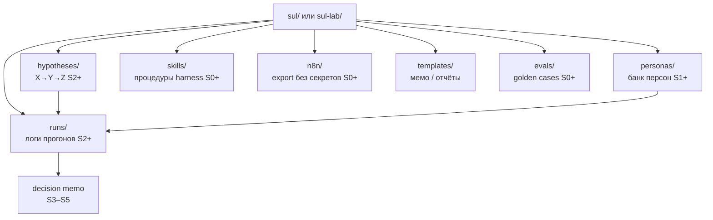
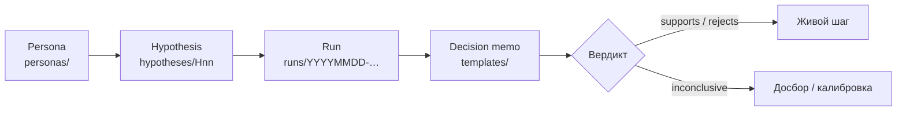

# SUL — контракт папок (S0)

Этот файл — **источник правды** для агента и человека. Меняйте схему осознанно и версионируйте.

## Карта контракта



## Корневые директории

| Путь | Назначение | Кто пишет | Когда |
|---|---|---|---|
| `personas/` | Банк персон (JSON/MD по схеме) | студент + агент | S1+ |
| `hypotheses/` | Гипотезы и планы симуляции | студент + агент | S2+ |
| `runs/` | Логи прогонов: seed, модель, сырые выводы, сводки | агент / n8n | S2+ |
| `skills/` | Skills harness (процедуры) | студент | S0+ |
| `n8n/` | Описания и export workflow (без секретов) | студент | S0+ |
| `templates/` | Общие шаблоны мемо/отчётов | курс → студент | S0+ |
| `evals/` | Golden cases и чеклисты приёмки | студент | S0+ |

Допустимо держать SUL в подпапке репо продукта (`./sul-lab/…`) — тогда все пути относительны к ней.

## Именование

- Персоны: `personas/<segment>/<persona_id>.md` или `.json`  
- Гипотезы: `hypotheses/H<nn>-<slug>.md`  
- Прогоны: `runs/<YYYYMMDD>-<hypothesis_id>-<run_id>/`  
  - обязательно: `meta.json` (seed, model, temperature, n_agents, variants)  
  - `summary.md`  
  - опционально `raw/`  

## Поля meta.json (минимум с S2)

```json
{
  "run_id": "20260918-H01-001",
  "hypothesis_id": "H01",
  "seed": 42,
  "model": "provider/model-name",
  "temperature": 0.2,
  "n_agents": 0,
  "design": "between-subject",
  "variants": ["A", "B"],
  "artifact_under_test": "https://… or path",
  "data_class": "synthetic",
  "operator": "human-name"
}
```

## Правила для агента

1. Не смешивать `live` и `synthetic` данные в одном файле без явной колонки `source`.  
2. Не удалять `runs/` без подтверждения человека.  
3. Любая генерация персон проверяется против `persona.schema.json`.  
4. Перед выводом «рекомендуем ship» — открыть [`validity-rubric-stub.md`](./validity-rubric-stub.md) и заполнить раздел честности.

### Поток: персона → гипотеза → прогон → memo



## Связь с n8n

- Flow #1 (S0): пишет человекочитаемый артефакт (сводка) — можно класть в `runs/n8n/`.  
- Позже: webhook/`Execute Workflow` может создавать папку `runs/…` и триггерить скрипт прогона (S2–S4).
