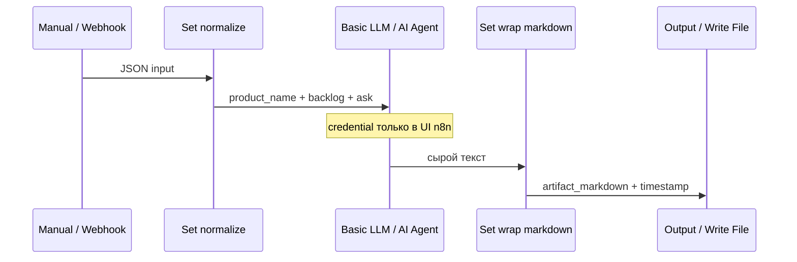

# n8n Flow #1 — Webhook/Manual → LLM → артефакт

**Назначение S0:** первый воспроизводимый glue-контур. Не SMM: на вход — кусок бэклога/1-pager, на выход — Markdown-сводка для человека.

## Топология



```text
[Manual Trigger] ──┐
                   ├──► [Set: normalize] ──► [Basic LLM Chain] ──► [Set: wrap markdown] ──► (output)
[Webhook] ─────────┘                              ▲
                                                  │
                                          OpenAI/Anthropic Chat Model
                                          (credential в UI n8n)
```

На S0 достаточно **Manual Trigger**. Webhook оставьте в workflow для следующей недели (формы, CI, кнопка «пересобрать сводку»).

## Узлы

| # | Node | Зачем |
|---|---|---|
| 1 | **Manual Trigger** | Локальный Execute |
| 2 | **Webhook** (опционально активен) | POST JSON `{ "product_name", "backlog_snippet", "ask" }` |
| 3 | **Set** (`Normalize`) | Единые поля; дефолты, если webhook пустой |
| 4 | **Basic LLM Chain** *или* **AI Agent** | System: «ты chief of staff PM; только по данным входа; помечай assumptions» |
| 5 | **Set** (`Wrap`) | Собирает `artifact_markdown` с заголовком и timestamp |
| 6 | *(опционально)* **Write Binary File** / ReadWriteFile | Только self-hosted с понятным mount; на Cloud — копируйте output в `runs/n8n/` руками |

## Пример тела Webhook

```json
{
  "product_name": "Ритм",
  "ask": "Сводка статусов и top-3 риска",
  "backlog_snippet": "| id | title | status | owner |\n| H1 | Paywall D3 | doing | kir |\n| H2 | Onboarding | todo | |"
}
```

## Credentials

Создайте в UI n8n (OpenAI / Anthropic / другой chat model). **Не** коммитьте ключи. В JSON экспорта поле credentials — placeholder ids.

## Приёмка

1. Execute → в output есть осмысленный Markdown.  
2. В `sul/README.md` записано имя workflow и способ запуска.  
3. Re-import JSON на чистый инстанс: узлы на месте, нужно только заново выбрать credential.

## Import

Файл: [`flow-01-webhook-to-artifact.json`](./flow-01-webhook-to-artifact.json)  
n8n: **Workflows → ⋮ → Import from File**.

Если версия узлов не совпала (LangChain package), соберите вручную по таблице выше — это ок для зачёта S0.

## Docs

- [Build an AI workflow](https://docs.n8n.io/advanced-ai/intro-tutorial/)  
- [Webhook](https://docs.n8n.io/integrations/builtin/core-nodes/n8n-nodes-base.webhook/)  
- [Read/Write Files from Disk](https://docs.n8n.io/integrations/builtin/core-nodes/n8n-nodes-base.readwritefile/)
