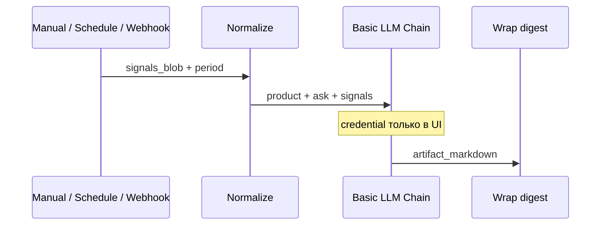

# n8n Flow #2 — Signals → discovery digest

**Назначение Н3:** регулярная или ручная сводка `evidence/inbox` → Markdown для человека. Не SMM.

## Топология



```text
[Manual] ──┐
[Schedule] ├──► [Set normalize] ──► [Basic LLM Chain] ──► [Wrap markdown]
[Webhook] ─┘                              ▲
                                          └── Chat Model (placeholder creds)
```

## Узлы

| # | Node | Зачем |
|---|---|---|
| 1 | Manual Trigger | Execute на сдаче |
| 2 | Schedule (cron `0 9 * * 1`) | weekly; на Cloud ок если активен |
| 3 | Webhook POST `sul-signals-digest` | JSON с `signals_blob` |
| 4 | Set Normalize | `product_name`, `period_label`, `signals_blob`, `ask` |
| 5 | Basic LLM Chain | top-5 / дыры / H__ / assumptions |
| 6 | Set Wrap | `artifact_markdown` + `suggested_path` |

**Self-hosted опционально:** перед Normalize — Read Binary/Files из `evidence/inbox/`. На n8n Cloud проще вставить текст в Manual или Webhook.

## Пример тела

```json
{
  "product_name": "Ритм",
  "period_label": "2026-W38",
  "signals_blob": "## inbox\n- habit→depth ~27% (desk)\n- early paywall pressure before value\n- copy test: benefit vs Оформить Pro"
}
```

## Credentials

Только в UI. В JSON — `REPLACE_IN_N8N_UI`.

## Приёмка

1. Execute → Markdown со структурой top-5 / дыры / H__.  
2. Скопировать в `runs/n8n/digest-signals-<period>.md`.  
3. Имя workflow #2 записано в `sul/README.md`.

## Import

[`flow-02-signals-to-digest.json`](./flow-02-signals-to-digest.json) → Workflows → Import from File.

Эталон Ритм: [`../../instructor/rhythm-exemplars/02-discovery-brief.md`](../../instructor/rhythm-exemplars/02-discovery-brief.md).
