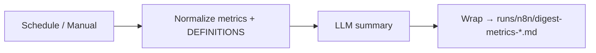

# n8n Flow #3 — Schedule analytics digest

**Назначение Н6:** еженедельная (или ручная) сводка метрик/STATUS → Markdown. Человек = судья. Не автопостинг.

## Топология



## Узлы

| # | Node | Зачем |
|---|---|---|
| 1 | Manual Trigger | сдача: один Execute = ok |
| 2 | Schedule (`0 10 * * 1`) | weekly digest |
| 3 | Set Normalize | `metrics_blob`, `definitions_blob`, `period_label` |
| 4 | Basic LLM Chain | snapshot / риски / 3 вопроса человеку |
| 5 | Set Wrap | `artifact_markdown` + suggested path |

На сдаче достаточно Manual + пометка «schedule configured» в SUL README.

## Пример входа (Manual)

```json
{
  "product_name": "Ритм",
  "period_label": "2026-W38",
  "definitions_blob": "depth_ge3 = D7 habit depth ≥3; paywall_cv = pays/paywall_views",
  "metrics_blob": "| metric | value |\n| depth_ge3 | 27% |\n| paywall_cv | 5.4% |\n| early_pw_share | 41% |"
}
```

## Credentials

Placeholder в JSON. Ключи только в UI.

## Приёмка

1. Output содержит только числа из входа или явный gap.  
2. Файл в `runs/n8n/`.  
3. Re-import без секретов.

## Import

[`flow-03-analytics-digest.json`](./flow-03-analytics-digest.json)

Эталон bare/rich: [`../../instructor/rhythm-exemplars/05-bare-vs-rich-context-pack.md`](../../instructor/rhythm-exemplars/05-bare-vs-rich-context-pack.md).
