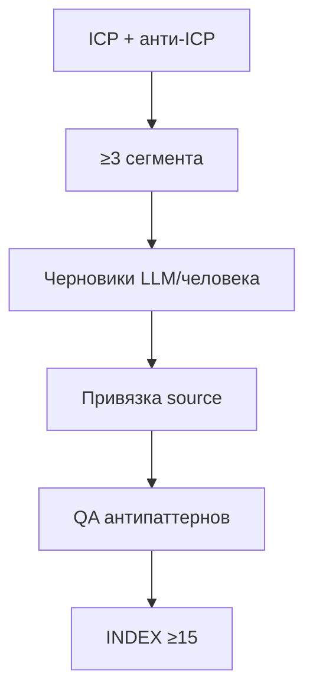

# S1 · Persona bank guide

Цель вехи: **≥15 персон**, **≥3 сегмента**, словарь полей соблюдён, нет «среднего пользователя».

Недели: старт на **Н2**, приёмка gate на **Н3**.

Схема: [`persona.schema.json`](./persona.schema.json) · пример: [`examples/persona-example.md`](./examples/persona-example.md).

---

## Процесс (рекомендуемый)



1. Зафиксируйте сегменты в `personas/SEGMENTS.md` (slug · кто · JTBD отличие · размер-proxy).  
2. На сегмент ≥4–5 персон (чтобы не вырождалось в одну «маску»).  
3. Заполните поля схемы; JSON опционален, Markdown с теми же ключами — ок.  
4. `source`: стремитесь, чтобы **≤30%** банка было чистым `llm_draft`.  
5. Прогоните QA (ниже) → `personas/QA.md`.  
6. Обновите `INDEX.md`.

---

## Обязательные поля (человекочитаемо)

| Поле | Зачем |
|---|---|
| `id` | Стабильная ссылка из гипотез/прогонов |
| `segment` | Именованный сегмент, не «users» |
| `jtbd` | Работа в контексте, не абстрактное «хочет удобство» |
| `constraints` | Бюджет, время, навыки, политика, девайс |
| `channels` | Где достижимы |
| `success_signal` | Что считать успехом в симуляции |
| `source` | Откуда взялась персона |
| `bias_notes` | Как именно эта персона исказит мир |

---

## Антипаттерны (резать на QA)

- Возраст «25–45» + «хочет эффективность» без JTBD.  
- Все персоны отличаются только именем.  
- Один сегмент на 15 файлов.  
- Нет constraints («готова на всё»).  
- `success_signal` = «осталась довольна».  
- Копия примерной Ани из Ритма в чужой домен.

---

## INDEX.md (шаблон)

```markdown
| id | segment | source | status | notes |
|----|---------|--------|--------|-------|
| P01 | seg-a | mixed | ready | |
```

---

## Критерий приёмки S1

- [ ] ≥15 персон, ≥3 сегмента.  
- [ ] INDEX полный.  
- [ ] QA.md без критичных антипаттернов (или с планом фикса до S4).  
- [ ] Гипотезы Н3 ссылаются на реальные id.
