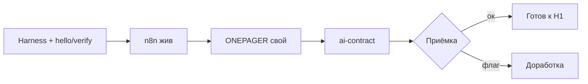

# Н0 · Checklist приёмки

## Студент сдаёт

- [ ] Harness ≥1 установлен; есть `notes/hello.md` (или аналог), созданный агентом.  
- [ ] `notes/verify.md` — что проверили руками после агента.  
- [ ] n8n открывается; сохранён хотя бы пустой workflow (скрин или export).  
- [ ] `product/ONEPAGER.md` заполнен по шаблону (сегмент, JTBD, объект автоматизации, данные, ограничения, критерий успеха).  
- [ ] `notes/ai-contract.md` — ускоряет / не заменяет + ≥3 красных флага.  
- [ ] Кейс — **свой**, не копия Ритма как «мой продукт».

## Преподаватель принимает

- [ ] 1-pager достаточно конкретен для SUL (есть URL/экран/офер/процесс).  
- [ ] Нет секретов в публичном репо (ключи в `.env`, не в Markdown).  
- [ ] Студент понимает: Ритм = демо instructor.

## Красные флаги (вернуть на доработку)

- Нет объекта продукта («займусь AI вообще»).  
- Договор с AI без границы ответственности.  
- Env не воспроизводится («у меня вчера работало» без скрина/лога).
