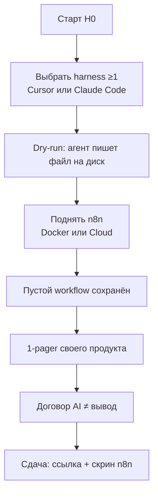
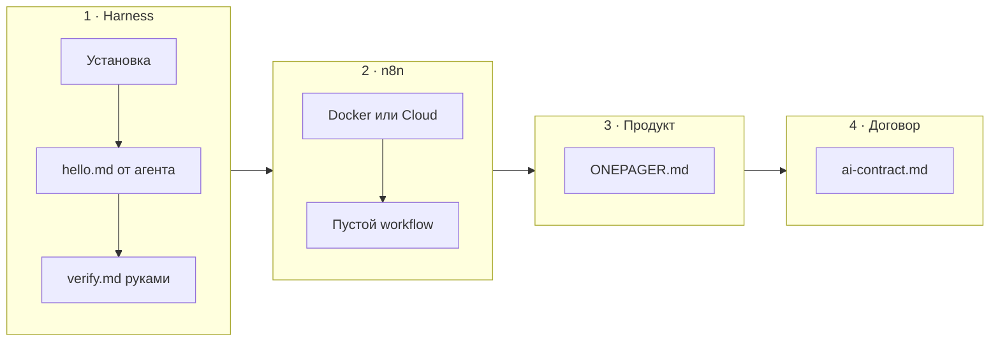

# Н0 · Лекция — Онбординг: env, договор AI, 1-pager

| Поле | Значение |
|---|---|
| **Неделя** | 0 (до первого живого занятия) |
| **Формат** | async 2–4 ч + опциональный sync-тур 15–20 мин |
| **Длительность sync** | ~20 мин (не полный 90-минутный слот) |
| **Артефакт** | Env готов + 1-pager своего продукта + договор AI≠вывод |
| **Демо instructor** | Тур по стенду Ритма (`product-analytics-ai-course`) |

---

## Цели

После Н0 студент:

1. Поднял **≥1 harness** (Cursor *или* Claude Code) и сделал dry-run: агент читает контекст → пишет Markdown **на диск**.
2. Поднял **n8n** (Docker *или* Cloud) и сохранил пустой workflow.
3. Зафиксировал личный договор: AI ускоряет черновик, человек отвечает за вывод.
4. Оформил **1-pager своего продукта/процесса** — объект, на котором дальше пойдёт SUL (S0→S5), а не «идею стартапа».

---

## Повестка с таймингом

| Мин | Блок (sync-тур) |
|---|---|
| 0–3 | Контекст: Ритм как демо-стенд; прошлые курсы = метрики/АБ, здесь = harness / n8n / SUL |
| 3–8 | Файловый контур в harness: агент читает репо / `PRODUCT_CONTEXT`, не фантазирует схему |
| 8–13 | Данные: Metabase / `psql` counts — «вам Ритм поднимать не обязательно» |
| 13–16 | Договор AI ≠ вывод + правдоподобная ложь («конверсия без окна») |
| 16–20 | Сдача Н0 + анти-примеры 1-pager |
| — | **Async 2–4 ч:** harness dry-run → n8n → ONEPAGER → ai-contract |

---

## Нарратив занятия

### Что сказать на открытии (0–3)

«На прошлых курсах вы считали метрики, воронки, АБ. Здесь другой слой: **агентный контур**, которому можно делегировать research → гипотезы → экономику → претест — с человеческой приёмкой.

Демо-продукт курса — **Ритм**: B2C-приложение привычек, freemium → Pro. На стенде есть Postgres, события, Metabase. Но это **не ваш кейс**. Ритм — эталон структуры и демо harness/n8n/SUL. Сдаёте вы **свой** URL, офер, экран или рабочий процесс.

Два слоя стека, которые вы поднимаете уже на Н0:

| Слой | Что | Зачем |
|---|---|---|
| **Harness** | Cursor / Claude Code + skills + правила репо | процесс и контракт «как агент работает с файлами» |
| **n8n** | триггеры, webhook, расписание, LLM → файл | glue продуктовых процессов и запусков SUL |

Модели вторичны. Fluency ≥1 harness обязательна; второй — по желанию. Цель курса — не «выучить все модели», а **процесс + контракт**.»

### Файловый контур (3–8)

«Открываю в Cursor (или Claude Code) стенд Ритма. Смотрите: у агента есть файлы — `PRODUCT_CONTEXT`, словарь событий, README стенда. Правило курса звучит так же, как в М0.2 Ритма: агент **читает репо**, а не додумывает схему из воздуха.

Dry-run на Н0 — минимальная проверка fluency. Вы говорите агенту: «создай `notes/hello.md` с тремя строками о моём продукте». Файл должен появиться **на диске**, не только в чате. Потом вы открываете файл руками, правите одну фактическую ошибку и пишете в `notes/verify.md`: что агент сделал хорошо / что соврал / как поймали.

Если агент только «поговорил» и не оставил артефакт — harness ещё не зелёный. Мы учим контур «контекст → файл → проверка», не чат.»

### Данные на стенде (8–13)

«Покажу Metabase или `psql`: counts по `users` / `events`. Это чтобы вы увидели, как выглядит учебный продукт с данными. Подчёркиваю: **студентам не обязательно поднимать Ритм**. Вам нужен свой объект: URL лендинга, экран тарифа, Notion-процесс приоритизации, CSV сегмента работодателя — что угодно, если это объект автоматизации и SUL.

Честно пишите в 1-pager, к каким данным есть доступ: CSV / Metabase / Notion / ничего. Допущения ок, если помечены. Ждать идеальный прод-доступ — ловушка, которая убивает Н0.»

### Договор AI ≠ вывод (13–16)

«Наследуем формулировку из курса по Ритму:

> AI — соавтор черновика и кода. Не соавтор решения.  
> Нет проверки — нет цифры, гипотезы или питча в сдаче.

Правдоподобная ложь выглядит так: модель выдаёт «конверсия в Pro 12%» без числителя, знаменателя и окна. Звучит уверенно — и бесполезно. На Н0 вы фиксируете в `notes/ai-contract.md` три пункта:

1. Где AI **может** готовить черновик сам.
2. Что **подписываете лично** перед сдачей/работой.
3. Три красных флага приёмки: подмена метрики, «средний пользователь», отсутствие цены ошибки.

Это не ритуал. На Н1–Н4 без этого договора банк персон и гипотезы быстро превратятся в красивый мусор.»

### Сдача и анти-примеры 1-pager (16–20)

«На Н0 сдаёте четыре вещи: harness dry-run + verify, скрин n8n с сохранённым workflow, `product/ONEPAGER.md`, `notes/ai-contract.md`. Чеклист — в `checklist.md`.

Анти-примеры 1-pager:

- «Хочу стартап про AI» — нет объекта SUL.
- Скопировали данные Ритма и назвали своим продуктом — не принимаем.
- «Все пользователи смартфонов» уже на этапе «для кого» — слишком широко; сузьте до сегмента и процесса.

Нормально: «внутренний процесс приоритизации фич в B2B-саасе X; SUL на лендинге тарифа Pro». Нормально: «онбординг B2B-клиента у работодателя; автоматизация research-пакета». Если «нет продукта» — берите шаблон рабочего кейса: бэклог, онбординг, лендинг тарифа, сегмент работодателя. Главное — **экран / офер / процесс**, на котором потом появятся персоны и гипотезы.»

### Async-нарратив (запись / чат потока)

«После тура копируете **процесс**, не данные Ритма: harness dry-run → n8n (Docker или Cloud) → ONEPAGER → ai-contract. Дальше Н1: skill, n8n #1, S0.»

---

## Демо-биты: свой продукт vs Ритм

| Beat | Ритм (instructor) | Свой продукт (студент) |
|---|---|---|
| Стенд | `product-analytics-ai-course` → `docs/stand/` (Postgres+Metabase); вход `docs/student-getting-started.md` | Свой URL / офер / процесс в 1-pager |
| Файлы | Открыть стенд / `PRODUCT_CONTEXT` в Cursor или Claude Code | `notes/hello.md` от агента + `notes/verify.md` руками |
| Данные | Metabase / `psql` counts `users`/`events` | Честно: CSV / Metabase / Notion / ничего |
| Сдача | Эталон структуры 1-pager «Ритм» (поля из М1.1) | `product/ONEPAGER.md` + `notes/ai-contract.md` + скрин n8n |

**How-to указатели:**

- Sync-скрипт тура: [`instructor-notes.md`](./instructor-notes.md)
- Практика студента: [`student-brief.md`](./student-brief.md)
- Playbook потока: [`../instructor/playbook-0-8.md`](../instructor/playbook-0-8.md)
- Индекс эталонов Ритм: [`../instructor/rhythm-exemplars/`](../instructor/rhythm-exemplars/)

---

## Доска / mermaid

### Онбординг-поток

### Env checklist (четыре блока сдачи)

---

## Переход к практике недели

После тура (или сразу, если sync нет): открыть [`student-brief.md`](./student-brief.md).

1. Harness dry-run + `verify.md`
2. n8n пустой flow
3. `product/ONEPAGER.md` по шаблону
4. `notes/ai-contract.md` — 3 пункта

Приёмка: [`checklist.md`](./checklist.md). Дальше → Н1 (harness skill + n8n #1 + S0).

---

## Не говорить / типичные ловушки

- Private Mail.ru / Яндекс clouds — только ops instructor; в студенческую выдачу не попадает.
- Пароли и ключи LLM в чате потока / на экране шаринга.
- Пиратские архивы и «агентные фермы» из дампов.
- Не блокировать Н0 на Docker → переключить на n8n Cloud.
- «Нет продукта» → дать шаблоны рабочего кейса, не отпускать с пустым 1-pager.
- 1-pager без объекта SUL (экран / офер / процесс) → вернуть.
- Ставить Cursor+Claude сразу как обязаловку приёмки — зелёный **один**.
- Копировать данные Ритма как «свой продукт».

---

## Приложение: глоссарий EN

| Термин | В контексте Н0 |
|---|---|
| **Harness** | Cursor / Claude Code + rules + skills — контур работы с файлами |
| **dry-run** | Минимальный прогон: агент пишет файл на диск |
| **workflow** | Сохранённый сценарий n8n (на Н0 может быть пустым) |
| **freemium / Pro** | Модель Ритма: бесплатный слой → платная подписка |
| **SUL** | Synthetic User Lab — контур персон/гипотез/прогонов (с Н1) |
| **стенд / standup** | Учебный стенд Ритма с данными |
| **JTBD** | Job to be done — в шаблоне 1-pager |
| **NDA** | Ограничение доступа к прод-данным — писать в 1-pager |
| **Cursor / Claude Code** | Два допустимых harness |
| **Docker / n8n Cloud** | Два способа поднять n8n |
| **webhook** | Намёк на следующие недели; на Н0 не обязателен |
