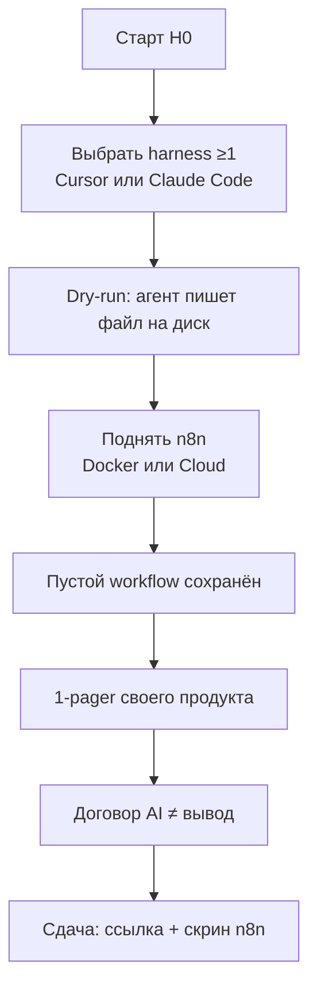

# Н0 · Lesson outline — Онбординг

| Поле | Значение |
|---|---|
| **Неделя** | 0 (async, до первого живого занятия) |
| **Формат** | самостоятельная установка + короткий sync/тур (опционально) |
| **Ориентир** | 2–4 ч практики |
| **Артефакт** | Env готов + 1-pager своего продукта |
| **Демо instructor** | Тур по стенду Ритма |

---

## Цели

После Н0 студент:

1. Поднял **≥1 harness** (Cursor или Claude Code) и сделал dry-run «прочитай файл → напиши Markdown».  
2. Поднял **n8n** (local Docker *или* cloud trial) и открыл пустой workflow.  
3. Подписал для себя договор: **AI ускоряет черновик, человек отвечает за вывод**.  
4. Выбрал **свой продукт / рабочий кейс** и оформил 1-pager (не «идею стартапа», а то, на чём будет автоматизация и SUL).

### Онбординг-поток

---

## Теория коротко (что сказать / что прочитать)

### 1. Зачем этот курс после аналитики и АБ

Прошлые курсы: метрика → деньги → эффект. Здесь: **агентный контур**, которому можно делегировать research → гипотезы → экономику → претест — с человеческой приёмкой.

### 2. Два слоя стека

| Слой | Что | Зачем |
|---|---|---|
| **Harness** | Cursor / Claude Code + skills + правила репо | процесс и контракт «как агент работает с файлами» |
| **n8n** | триггеры, webhook, расписание, LLM→файл/таблица | glue продуктовых процессов и запусков SUL |

Модели вторичны. Fluency ≥1 harness обязательна; второй — по желанию.

### 3. Договор «AI ≠ вывод» (наследование М0.2 Ритма)

> AI — соавтор черновика и кода. Не соавтор решения.  
> Нет проверки — нет цифры / гипотезы / питча в сдаче.

### 4. Свой продукт vs Ритм

- Студент тянет **свой** кейс (URL, офер, экраны, или чёткий процесс на работе).  
- Преподаватель показывает паттерны на **Ритме** (стенд `product-analytics-ai-course`).

---

## Практика недели

См. [`student-brief.md`](./student-brief.md). Ядро:

1. Установка harness + dry-run.  
2. Установка n8n + пустой flow.  
3. 1-pager продукта по шаблону.  
4. Sanity-check договор (3 пункта).

---

## Materials

Обязательное — в [`../materials-by-module.md`](../materials-by-module.md) §Н0.  
Внешний каталог: [`../../external-materials.md`](../../external-materials.md).

---

## Дальше

Н1: fluency harness + первый skill + n8n flow #1 + SUL S0 — [`../week-01/`](../week-01/).
