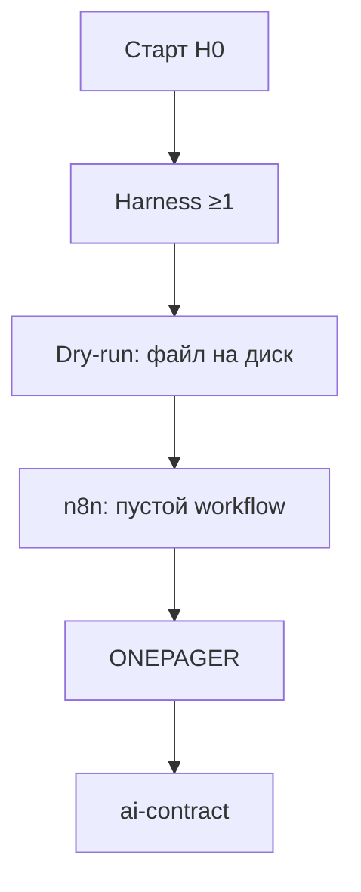

# Слайды · Н0 · Онбординг: env, договор AI, 1-pager

> Markdown-колода для paste в Google Slides / Marp / Pitch. Один слайд = блок между `---`.
> Источники: `lecture.md`, `lesson-outline.md`, playbook §Н0.

---

# Н0 · Онбординг

- Env: harness + n8n
- Договор: AI ≠ вывод
- 1-pager своего продукта

<!-- Notes: Async 2–4 ч + опциональный sync-тур 15–20 мин. Не полный 90-минутный слот. Артефакт: env готов + ONEPAGER + ai-contract. -->

---

# Повестка тура (~20 мин)

- 0–3 · Контекст: Ритм как демо-стенд
- 3–13 · Файлы harness + данные Metabase
- 13–20 · AI ≠ вывод + сдача Н0

<!-- Notes: Async после тура: dry-run → n8n → ONEPAGER → ai-contract. Если sync нет — студент идёт сразу по student-brief. -->

---

# Зачем этот курс

- Прошлые курсы: метрики → деньги → АБ
- Здесь: агентный контур + человеческая приёмка
- Research → гипотезы → экономика → претест

<!-- Notes: Делегируем черновик агенту; решение подписывает человек. Fluency процесса важнее «всех моделей». -->

---

# Ритм — демо, не ваш кейс

- Ритм = B2C-привычки, freemium → Pro
- Стенд: Postgres, события, Metabase
- Сдаёте **свой** URL / офер / процесс

<!-- Notes: Демо-бит: показать stand tour. Студентам Ритм поднимать не обязательно. Копируют процесс, не данные. -->

---

# Два слоя стека

| Слой | Что | Зачем |
|---|---|---|
| **Harness** | Cursor / Claude Code | файлы, skills, rules |
| **n8n** | Docker или Cloud | триггеры → LLM → артефакт |

<!-- Notes: Модели вторичны. Fluency ≥1 harness обязательна; второй — по желанию. -->

---

# Демо · Ритм vs свой продукт

- Ритм: `PRODUCT_CONTEXT`, словарь, counts
- Свой: URL / офер / Notion-процесс в 1-pager
- Данные: честно CSV / Metabase / Notion / ничего

<!-- Notes: Live order playbook: контекст Ритм → файлы harness → Metabase/psql → слайд AI≠вывод → сдача. -->

---

# Файловый контур

- Агент **читает репо**, не фантазирует схему
- Dry-run: `notes/hello.md` **на диске**
- Потом руками: `notes/verify.md`

<!-- Notes: Если агент только «поговорил» — harness ещё не зелёный. Контур: контекст → файл → проверка. -->

---

# Онбординг-поток

<!-- Notes: Четыре блока сдачи: harness, n8n, продукт, договор. Docker↓ → n8n Cloud, не блокировать Н0. -->

---

# Договор: AI ≠ вывод

> AI — соавтор черновика. Не соавтор решения.

- Нет проверки → нет цифры / гипотезы / питча
- Правдоподобная ложь: «конверсия 12%» без окна

<!-- Notes: Три пункта в ai-contract.md: где AI черновит; что подписываете лично; 3 красных флага (подмена метрики, «средний пользователь», нет цены ошибки). -->

---

# 1-pager: объект SUL

- Нужен экран / офер / процесс
- Не «хочу стартап про AI»
- Не копия данных Ритма

<!-- Notes: Нормально: приоритизация фич, онбординг B2B, лендинг тарифа. «Нет продукта» → шаблон рабочего кейса. -->

---

# Анти-примеры

- «Все пользователи смартфонов»
- 1-pager «про AI вообще»
- Cursor + Claude сразу как обязаловка

<!-- Notes: Приёмка fluency — по одному harness до зелёного. Широкий ICP сузить до сегмента и процесса. -->

---

# Практика недели

1. Harness dry-run + `verify.md`
2. n8n: пустой сохранённый workflow
3. `product/ONEPAGER.md`
4. `notes/ai-contract.md`

<!-- Notes: Чеклист — checklist.md. Ссылка + скрин n8n. Private Mail/Ya и secrets — не показывать. -->

---

# Дальше → Н1

- Skill `backlog-status`
- n8n flow #1
- SUL S0 + этика синтетики

<!-- Notes: Закрытие: «паттерн Ритма, не данные». Вопросы в чат потока до живого Н1. -->
