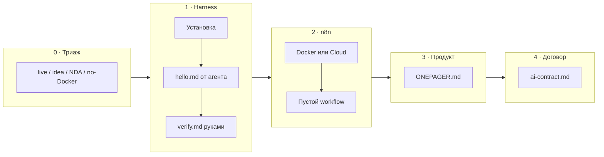

# Н0 · Student brief — онбординг

Срок: **до первого живого занятия** (неделя 0, async).  
Сдача: ссылка на папку/репо с четырьмя артефактами ниже + скрин n8n «Workflows».

**Сначала триаж:** нет URL, NDA или нет Docker — не стоп. Откройте [`../cold-start-triage.md`](../cold-start-triage.md) и в ONEPAGER одной строкой зафиксируйте ветку (`track: A|B` + флаги `NDA` / `no-docker`).

### Env checklist (визуально)



Живые UI-скрины ещё пишет автор ([`../media/README.md`](../media/README.md)). Пока смотрите **плейсхолдеры** (mermaid/ASCII, помечены «плейсхолдер → заменить скрином») — они показывают, *что* должно получиться на экране.

Индекс: [`../media/placeholders/`](../media/placeholders/). Outline скринкаста Cursor (~10 мин): [`../media/placeholders/cursor-10min-screencast-outline.md`](../media/placeholders/cursor-10min-screencast-outline.md).

---

## 1. Поднять harness (≥1)

Выберите **одно** ядро (второе — опционально):

| Вариант | Старт | Проверка dry-run |
|---|---|---|
| **Cursor** | [cursor.com](https://cursor.com) → Agent chat | Откройте пустую папку курса; попросите: «создай `notes/hello.md` с 3 строками о моём продукте» — файл появился |
| **Claude Code** | [Quickstart](https://code.claude.com/docs/en/quickstart) | В терминале в папке проекта: создайте `CLAUDE.md` с 5 правилами работы; попросите агента дополнить `notes/hello.md` |

**Как выглядит успех (плейсхолдер, не фото UI):** [`../media/placeholders/n0-cursor-agent-hello.md`](../media/placeholders/n0-cursor-agent-hello.md) — промпт → Accept diff → `notes/hello.md` на диске → `verify.md` руками.

**Минимум проверки после dry-run:**

- [ ] Файл на диске, не только в чате.  
- [ ] Вы открыли файл и исправили одну фактическую ошибку агента.  
- [ ] Записали в `notes/verify.md`: «что агент сделал хорошо / что соврал / как поймал».

Документация (бесплатно): Cursor Skills · Claude Code Quickstart — ссылки в reading list модуля.

---

## 2. Поднять n8n

Любой из вариантов:

**A. Local (Docker)** — предпочтительно для курса:

```bash
docker volume create n8n_data
docker run -it --rm \
  --name n8n \
  -p 5678:5678 \
  -v n8n_data:/home/node/.n8n \
  docker.n8n.io/n8nio/n8n
```

Откройте http://localhost:5678 → создайте аккаунт владельца → **New workflow** (можно пустой).

**B. n8n Cloud** — trial/cloud, если Docker недоступен. Зафиксируйте URL инстанса в 1-pager.

Офиц. ориентиры: [Choose how to use n8n](https://docs.n8n.io/choose-how-to-use-n8n/) · [Docker install](https://docs.n8n.io/hosting/installation/docker/).

На Н0 **не** нужен рабочий LLM-flow — достаточно «инстанс жив + пустой workflow сохранён».

**Как выглядит список Workflows (плейсхолдер):** [`../media/placeholders/n0-n8n-workflows-empty.md`](../media/placeholders/n0-n8n-workflows-empty.md) — один сохранённый пустой flow в UI.

---

## 3. 1-pager своего продукта

Создайте `product/ONEPAGER.md` (или Google Doc → экспорт в репо). Шаблон:

```markdown
# <Название продукта / кейса>

## Для кого (1–2 сегмента)
…

## Проблема / JTBD одной фразой
…

## Что уже есть (URL, экраны, офер, внутренний процесс)
…

## Что хочу автоматизировать AI-контуром за 8 недель
(research / гипотезы / экономика / претест / питч — выберите 2–3)

## Данные, к которым есть доступ
(CSV, Metabase, Notion, ничего — честно)

## Ограничения
(NDA, нет прод-доступа, только идея лендинга, …)

## Критерий успеха курса для меня
«через 8 недель у меня будет …»
```

**Плохо:** «хочу стартап про AI».  
**Нормально:** «внутренний процесс приоритизации фич в B2B-саасе X; SUL на лендинге тарифа Pro».

---

## 4. Договор с AI (полстраницы)

Файл `notes/ai-contract.md`:

1. Где AI **может** готовить черновик сам.  
2. Что **подписываете лично** перед тем, как артефакт пойдёт в работу/сдачу.  
3. Три красных флага приёмки (подмена метрики, «средний пользователь», отсутствие цены ошибки).

---

## Критерии приёмки Н0

См. [`checklist.md`](./checklist.md).

---

## Что не делать

- Не копировать данные Ритма как «свой продукт».  
- Не ждать идеального доступа к прод-метрикам — честные допущения ок, если помечены.  
- Не ставить целью «выучить все модели» — цель: процесс + контракт.

<!-- week-nav -->
---

**Навигация:** · старт курса · · [Н0 индекс](./README.md) · [Н1 →](../week-01/) · [курс](../README.md) · [SUL](../sul/)

