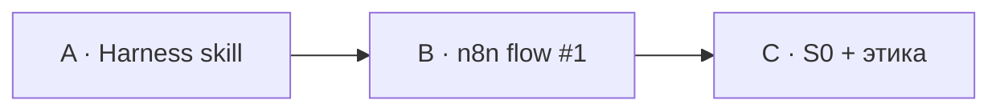

# Н1 · Instructor notes — демо на Ритме

## Цель демо (live ~35–40 мин суммарно)

Показать **тот же** контур, что сдают студенты, на файлах Ритма: skill «бэклог → статус» + n8n «триггер → LLM → артефакт» + папки S0.

Студенты копируют **паттерн**, не данные Ритма.

---

## Prep

- [ ] Локально: Cursor *или* Claude Code с папкой-черновиком `ritm-sul-demo/` (можно временной).  
- [ ] В демо-папке: урезанный `product/ONEPAGER.md` про Ритм (habit app, paywall).  
- [ ] `backlog/items.md` — 7 пунктов про paywall / onboarding / Metabase.  
- [ ] n8n local с credential LLM (не показывать ключ на экране).  
- [ ] Import [`../sul/n8n/flow-01-webhook-to-artifact.json`](../sul/n8n/flow-01-webhook-to-artifact.json), подставить credential.  
- [ ] Слайд границ синтетики (из программы §3.4).

---

## Порядок демо

## Скрипт A — Harness (15 мин)

1. Открыть `AGENTS.md` / `CLAUDE.md`: правило «не выдумывать события Ритма».  
2. Запустить skill `backlog-status` → показать diff `STATUS.md`.  
3. Сломать специально: убрать owner у пункта → skill должен пометить блокер (evals-lite).  
4. Фраза классу: «skill = git; промпт в чате завтра забудете».

## Скрипт B — n8n (15 мин)

1. Manual Trigger → показать input JSON с куском бэклога Ритма.  
2. LLM-шаг: «сводка статусов + top-3 риска».  
3. Сохранить/показать output файл.  
4. Underscore: webhook понадобится на S2/S4; сегодня достаточно Manual.  
5. Показать, что в export JSON нет ключей.

## Скрипт C — S0 + этика (10 мин)

1. Дерево `personas/ hypotheses/ runs/ skills/`.  
2. `SYNTHETIC-DATA-NOTICE` — обязателен (паттерн voice-of-agents).  
3. Один тезис AgentA/B: between-subject, претест ≠ ship.  
4. Домашка: S0 на **своём** репо к концу недели.

---

## Типичные сбои

| Симптом | Реакция |
|---|---|
| Skill «болтает», не пишет файл | Вернуть к контракту: выход = путь файла; запрет «только чат» |
| n8n падает на credential | Помочь с OpenAI/Anthropic key *или* разрешить Mock: Code node с заглушкой текста на S0 (пометить `MOCK_LLM=true`) |
| Студент ставит все pm-skills | Сузить: 1 свой skill + опционально 1 plugin |
| Путают n8n и harness | Повторить таблицу слоёв из outline |
| Хотят сразу Selenium как AgentA/B | Отложить до S4; S0 = папки + dry-run |

---

## Ops (не студентам)

Идеи паттернов n8n/MCP из private Mail/Ya clouds — только вам. В выдачу попадает переписанное (этот brief + `sul/n8n`). Пароли у kir.

---

## Эталоны / playbook

- Playbook Н1: [`../instructor/playbook-0-8.md`](../instructor/playbook-0-8.md)#н1--экзоскелет--n8n-1--s0-90-мин
- n8n #1: [`../sul/n8n/flow-01-description.md`](../sul/n8n/flow-01-description.md)
