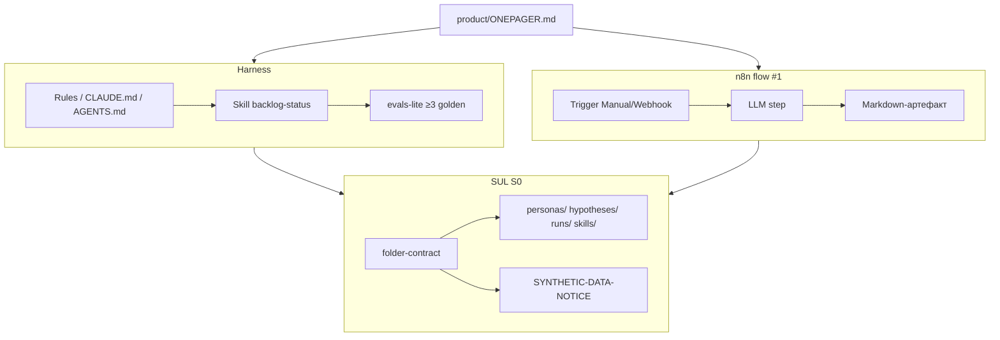
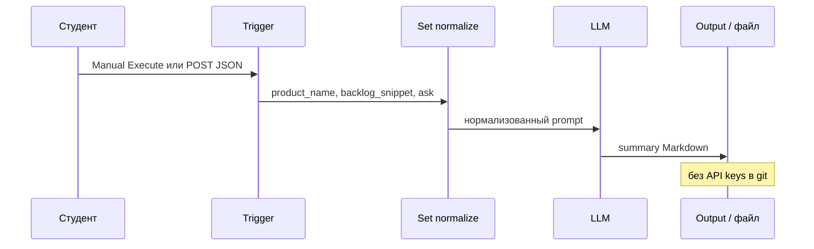

# Н1 · Лекция — AI-экзоскелет + n8n flow #1 + SUL S0

| Поле | Значение |
|---|---|
| **Неделя** | 1 |
| **Формат** | живое занятие ~90 мин + практика 4–6 ч |
| **Длительность live** | ~90 мин |
| **Артефакты** | Harness fluency · 1 skill · n8n flow #1 · **SUL S0** |
| **Демо instructor** | Тот же контур на файлах Ритма (`ritm-sul-demo/`) |

---

## Цели

После Н1 студент:

1. Свободно ведёт процесс в **≥1 harness**: rules + skill + evals-lite.
2. Собран агент **«бэклог → статус»**: читает items, пишет STATUS-таблицу на диск.
3. Собран **n8n flow #1**: Manual/Webhook → LLM → Markdown/таблица.
4. Поднят **SUL S0**: папки + README + dry-run + n8n привязан к репо; понимает границу синтетики (AgentA/B-трезвость).

---

## Повестка с таймингом

| Мин | Блок |
|---|---|
| 0–10 | Разбор 1-pager (2–3 примера студентов) |
| 10–35 | Harness: skill live на Ритме |
| 35–55 | n8n flow #1 live на Ритме |
| 55–70 | S0 контракт папок + этика синтетики |
| 70–90 | Q&A / Docker-блокеры |
| — | Практика 4–6 ч по [`student-brief.md`](./student-brief.md) |

Теория 40–50 мин встроена в блоки: harness-примитивы · skill vs промпт · evals-lite · n8n ядро · S0 · границы синтетики.

---

## Нарратив занятия

### 0–10 · Разбор 1-pager

«Начинаем с ваших `ONEPAGER.md`. Беру два-три примера — без публичного стыда, с красными флагами.

Что ищем:

1. Есть ли **объект SUL** — экран, офер, процесс? Или снова «хочу AI-стартап»?
2. Есть ли честный блок данных: CSV / Metabase / Notion / ничего?
3. Выбраны ли 2–3 вещи на автоматизацию за 8 недель — research, гипотезы, экономика, претест, питч — или размытое «всё»?

Фраза классу: Ритм на занятии — **паттерн**. Сдаёте свой продукт. Если в 1-pager скопированы habit/paywall Ритма без своего URL — возвращаем на доработку до skill.

Хороший 1-pager звучит так: «B2B-саас X, лендинг тарифа Pro, данные — экспорт из CRM + Notion бэклога; хочу research pack, банк персон и претест копий». Плохой: «сделаем агентов, которые сами ведут продукт».»

### 10–35 · Harness: продукт процесса, не чат

#### Что сказать про архитектуру

«Harness — это не «чат с моделью». Это контур:

**контекст (файлы) → навыки (skills) → guardrails (rules) → evals (человек + golden cases).**

| Примитив | Cursor | Claude Code |
|---|---|---|
| Постоянный контекст | Rules / `AGENTS.md` | `CLAUDE.md` |
| Процедура по запросу | Skill (`SKILL.md`) | Skill (`.claude/skills/…`) |
| Внешние инструменты | MCP | MCP |
| Приёмка | чеклист + golden files | то же |

Промпт в чате — разовый. Skill — версионируемая процедура в git: когда вызывать, какие входы/выходы, что запрещено. Завтра промпт забудете; skill останется в репо и у команды.

Не ставьте «все 68» из pm-skills. На Н1 — **один** свой skill `backlog-status` + опционально один plugin. Fluency важнее коллекции.»

#### Live-скрипт A на Ритме (говорить, делая)

«Открываю демо-папку `ritm-sul-demo/`. В `product/ONEPAGER.md` — Ритм: habit app, freemium → Pro, сценарий paywall. В `backlog/items.md` — семь пунктов: paywall D3 vs D7, онбординг ≤60 сек, событие в Metabase, и т.д.

В `AGENTS.md` / `CLAUDE.md` правило: **не выдумывать события Ритма**. Нет поля в словаре — пишем `assumption`, не фантазируем `user.plan_type`.

Запускаю skill `backlog-status`. Смотрите diff `backlog/STATUS.md`: таблица id · title · status · owner · next и блок «риски / блокеры». Файл на диске — не абзац в чате.

Evals-lite прямо сейчас: у пункта убираю owner. Перезапускаю skill. Ожидание: пункт помечен как блокер. Если skill «молчит» или пишет «всё ок» — skill сломан, чиним контракт выхода.

Минимум evals на курсе — до LLM-as-judge:

1. ≥3 **golden cases** (пустой бэклог; все Done; пункт без owner → блокер).
2. Чеклист человека: метрика определена? источники? нет «среднего пользователя»?
3. Seed / температура зафиксированы, где есть генерация.

Фраза на доску: **skill = git; промпт в чате завтра забудете.**»

#### Что студент копирует

«Тот же skill из `docs/course/sul/skills/backlog-status/`. Свой бэклог 5–10 пунктов из **своего** ONEPAGER, не семь пунктов про paywall Ритма. Evals кладёте в `evals/backlog-status.md`.»

### 35–55 · n8n flow #1: glue, не SMM

#### Зачем n8n рядом с harness

«Два слоя снова. Harness — процесс и файлы в репо. n8n — воспроизводимый запуск: Manual сегодня, webhook завтра из формы или CI, позже — digests и прогоны SUL.

Сценарий Н1: **триггер → LLM → Markdown-артефакт**. Не автопостинг в Telegram. Не SMM. На вход — кусок бэклога / 1-pager; на выход — сводка для человека.»

#### Live-скрипт B (говорить, делая)

«Импортирую [`../sul/n8n/flow-01-webhook-to-artifact.json`](../sul/n8n/flow-01-webhook-to-artifact.json). Credential LLM — только в UI n8n; на экране ключ не показываю; в export JSON ключей нет.

Топология:

1. **Manual Trigger** (на S0 достаточно; Webhook оставляем в workflow на потом).
2. **Set normalize** — поля `product_name`, `backlog_snippet`, `ask`.
3. **Basic LLM / AI Agent** — system: chief of staff PM; только по данным входа; assumptions помечать.
4. **Set wrap** — Markdown + timestamp.
5. Output / опционально Write File (self-hosted); на Cloud — копируем execution в `runs/n8n/flow01-last.md` руками и документируем.

Execute с куском бэклога Ритма: ask = «сводка статусов + top-3 риска». На выходе — осмысленный Markdown, не lorem.

Underscore: webhook понадобится на S2/S4; сегодня зелёный Manual. Если credential падает — Mock Code node + пометка `MOCK_LLM=true` на S0 допустимы: важнее зелёный контур, чем живой GPT.»

«Если путают слои — стоп: n8n ≠ harness. Два слоя, одна сдача: оба зелёные.»

### 55–70 · SUL S0 + этика синтетики

#### Контракт папок

«S0 — не симуляция пользователей. S0 — **folder-contract**: место, куда потом лягут персоны, гипотезы, прогоны.

Дерево (копируете из `docs/course/sul/` в **свой** репо):

- `personas/`
- `hypotheses/`
- `runs/`
- `skills/`
- README под свой продукт
- `SYNTHETIC-DATA-NOTICE` — обязательно

Dry-run harness: «прочитай folder-contract и создай пустой `hypotheses/_TEMPLATE.md` по схеме» — файл на месте. В README одна фраза, как n8n flow #1 позже будет триггерить прогоны (даже если пока Manual).

Критерий S0 из программы: **README + оба контура (harness dry-run + n8n) зелёные**.»

#### Трезвость AgentA/B (stats-ab 4.6) — что сказать дословно

«На следующих неделях появятся синтетические персоны и претесты. Зафиксируем границу уже на S0 — в духе урока 4.6 stats-ab и AgentA/B (arXiv 2504.09723).

AgentA/B показал: LLM-агенты с персонами могут дать **сонаправленность** с живым тестом на одном кейсе Amazon — и это дорого-дешевле живого слота. Читать аккуратно: одно сравнение, один совпавший знак — «многообещающе», не «доказано».

Правила курса:

1. **Between-subject** по умолчанию: одна персона / один агент видит один вариант. Не «покажи оба и выбери лучший» — это within-subject с памятью о первом.
2. Синтетика годится для **отбраковки и подготовки** интервью / бэклога.
3. Синтетика **не** годится для финального ship/kill без живых данных, если трафик позволяет.
4. Любой вывод про пользователей — метка `live` / `synthetic` / `assumption`.
5. Selenium «как в AgentA/B» — не на S0. S0 = папки + dry-run. UI-агенты — ближе к S4.

Фраза: **претест ≠ ship**. NOTICE в репо — не бюрократия, а страховка от самообмана.»

### 70–90 · Q&A / блокеры

«Типичные блокеры и реакция:

| Симптом | Что делаем |
|---|---|
| Skill «болтает», не пишет файл | Контракт: выход = путь файла; запрет «только чат» |
| n8n падает на credential | Ключ в UI *или* Mock + `MOCK_LLM=true` |
| Ставят все pm-skills | Сузить: 1 skill + опц. 1 plugin |
| Путают n8n и harness | Таблица двух слоёв с доски |
| Хотят Selenium сразу | Отложить до S4 |
| Docker не встаёт | n8n Cloud; не блокировать неделю |

Дома: S0 на **своём** репо. Паттерн Ритма, не данные Ритма.»

---

## Демо-биты: свой продукт vs Ритм

| Beat | Ритм (instructor) | Свой продукт (студент) |
|---|---|---|
| Prep | `ritm-sul-demo/`: ONEPAGER habit/paywall · `backlog/items.md` (7: paywall/onboarding/Metabase) | ONEPAGER из Н0 · 5–10 пунктов своего бэклога |
| A · Skill ~15′ | Rules «не выдумывать события» → `backlog-status` → diff STATUS → убрать owner → блокер (evals) | Тот же skill из `sul/skills/backlog-status/`; evals в `evals/backlog-status.md` |
| B · n8n ~15′ | Import `sul/n8n/flow-01-webhook-to-artifact.json`; Manual + кусок бэклога → сводка + top-3 риска | Свой `backlog_snippet`; credentials только UI; README: URL / имя / как запускать |
| C · S0 ~10′ | Дерево папок + NOTICE + тезис AgentA/B between-subject | Копия `sul/` под свой продукт; dry-run harness создаёт `_TEMPLATE` гипотезы |

**How-to указатели:**

- Skill: [`../sul/skills/backlog-status/`](../sul/skills/backlog-status/)
- n8n описание: [`../sul/n8n/flow-01-description.md`](../sul/n8n/flow-01-description.md)
- n8n JSON: [`../sul/n8n/flow-01-webhook-to-artifact.json`](../sul/n8n/flow-01-webhook-to-artifact.json)
- SUL корень: [`../sul/`](../sul/)
- Instructor prep: [`instructor-notes.md`](./instructor-notes.md)
- Playbook: [`../instructor/playbook-0-8.md`](../instructor/playbook-0-8.md)#н1

---

## Доска / mermaid

### Архитектура недели

### Sequence flow #1

На доске рядом — таблица Cursor vs Claude (Rules/AGENTS.md · CLAUDE.md · Skill · MCP · приёмка) и порядок демо: **A Harness → B n8n → C S0+этика**.

---

## Переход к практике недели

«Паттерн, не данные Ритма.» Открыть [`student-brief.md`](./student-brief.md):

- **A** harness + skill + evals-lite  
- **B** n8n flow #1  
- **C** S0 scaffold  
- **D** чтение (Skills / MCP / AgentA/B abstract)

Gate: README + оба контура зелёные — [`checklist.md`](./checklist.md). Дальше → Н2: ICP, конкуренты, банк персон (S1 старт).

---

## Не говорить / типичные ловушки

- Ключ LLM на экране шаринга.
- Ops-паттерны private Mail/Ya clouds → только переписанное в brief / `sul/n8n`.
- «Чат с моделью» без записи на диск — не принимать как fluency.
- Ставить «все 68» pm-skills.
- API keys в git / export JSON.
- Selenium / AgentA/B UI на S0.
- Путать n8n и harness.
- Вывод про пользователей без метки `live` / `synthetic` / `assumption`.
- Within-subject («агент видит оба варианта») — запретить жёстко уже на этике S0.
- Credential fail → Mock ок на S0; не держать студента неделю на ключе.

---

## Приложение: глоссарий EN

| Термин | Смысл на Н1 |
|---|---|
| **Harness** | Контур контекст → skills → rules → evals |
| **Skill / `SKILL.md`** | Версионируемая процедура агента в git |
| **Rules / `AGENTS.md` / `CLAUDE.md`** | Постоянные guardrails репо |
| **MCP** | Внешние инструменты harness (на Н1 — только intro) |
| **evals-lite** | ≥3 golden + чеклист человека + seed/temp |
| **golden cases** | Вход → ожидаемые поля выхода |
| **webhook / Manual Trigger** | Способы старта n8n flow |
| **SUL S0 / folder-contract** | Контракт папок до симуляций |
| **`SYNTHETIC-DATA-NOTICE`** | Явная метка синтетики в репо |
| **between-subject / AgentA/B** | Дизайн претеста; претест ≠ ship |
| **dry-run** | Прогон без полного прод-контура |
| **paywall / onboarding** | Типовые пункты бэклога демо Ритма |
| **pm-skills** | Внешние библиотеки skills — ставить выборочно |
