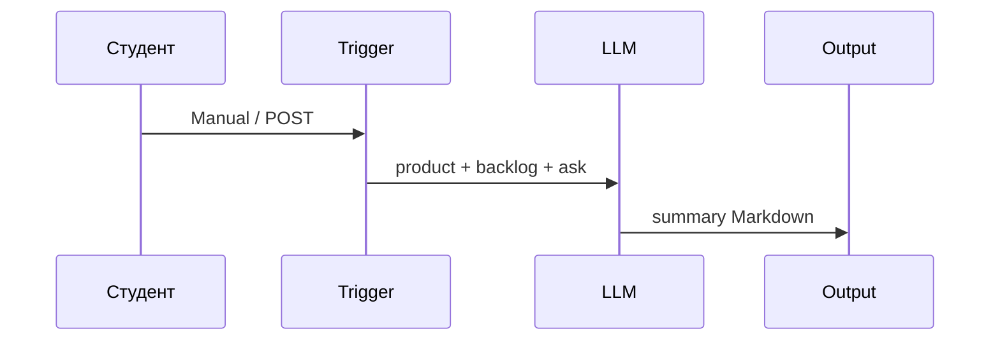
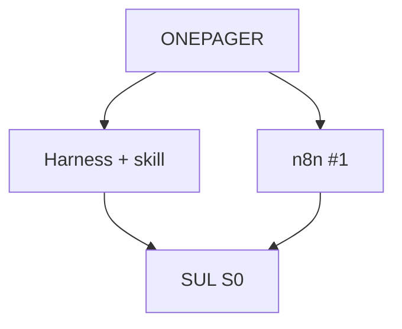

# Слайды · Н1 · AI-экзоскелет + n8n #1 + SUL S0

> Markdown-колода для paste в Google Slides / Marp / Pitch. Один слайд = блок между `---`.
> Источники: `lecture.md`, `lesson-outline.md`, playbook §Н1.

---

# Н1 · Экзоскелет + n8n + S0

- Harness fluency + skill `backlog-status`
- n8n flow #1: триггер → LLM → артефакт
- SUL S0: папки + этика синтетики

<!-- Notes: Живое ~90 мин + практика 4–6 ч. Демо на файлах Ритма (`ritm-sul-demo/`). Студенты копируют паттерн, не данные. -->

---

# Повестка (~90 мин)

- 0–10 · Разбор 1-pager
- 10–35 · A · Harness skill live
- 35–55 · B · n8n flow #1
- 55–70 · C · S0 + этика
- 70–90 · Q&A / блокеры

<!-- Notes: Playbook: fluency ≥1 harness. Теория встроена в блоки A/B/C. -->

---

# Цели недели

- Rules + skill + evals-lite в ≥1 harness
- Агент «бэклог → STATUS на диск»
- n8n #1 зелёный (Manual ок)
- S0: folder-contract + NOTICE

<!-- Notes: Критерий S0 из программы: README + оба контура (harness dry-run + n8n) зелёные. -->

---

# Разбор 1-pager (0–10)

- Есть объект SUL: экран / офер / процесс?
- Честный блок данных?
- 2–3 вещи на автоматизацию за 8 недель?

<!-- Notes: 2–3 примера без публичного стыда. Копия habit/paywall Ритма без своего URL → вернуть до skill. -->

---

# Harness ≠ чат

- Контекст (файлы) → skills → rules → evals
- Промпт — разовый; skill — в git
- Fluency важнее коллекции «68 skills»

<!-- Notes: Фраза на доску: skill = git; промпт в чате завтра забудете. Один свой backlog-status + опц. 1 plugin. -->

---

# Примитивы Cursor / Claude

| | Cursor | Claude Code |
|---|---|---|
| Контекст | Rules / `AGENTS.md` | `CLAUDE.md` |
| Процедура | Skill (`SKILL.md`) | `.claude/skills/…` |
| Приёмка | чеклист + golden | то же |

<!-- Notes: MCP — только intro на Н1. Внешние tools не обязательны для сдачи. -->

---

# Демо A · Skill на Ритме (~15′)

- `ritm-sul-demo/`: ONEPAGER + `backlog/items.md`
- Rule: не выдумывать события
- `backlog-status` → diff `STATUS.md`

<!-- Notes: Свой продукт: тот же skill из sul/skills/backlog-status/; свой бэклог 5–10 пунктов из ONEPAGER, не paywall Ритма. -->

---

# Evals-lite (минимум)

- ≥3 golden: пустой / все Done / без owner → блокер
- Чеклист человека: метрика? источники?
- Live: убрать owner → skill должен сломаться правильно

<!-- Notes: До LLM-as-judge. Seed/температура зафиксированы, где есть генерация. -->

---

# Два слоя снова

| Harness | n8n |
|---|---|
| процесс и файлы в репо | воспроизводимый запуск |
| skills / rules / evals | Manual → webhook позже |
| STATUS.md | Markdown-сводка |

<!-- Notes: Если путают — стоп. n8n ≠ harness. Два слоя, одна сдача: оба зелёные. -->

---

# n8n flow #1 · зачем

- Триггер → LLM → Markdown-артефакт
- Не автопостинг, не SMM
- Glue для digests и прогонов SUL позже

<!-- Notes: Сегодня Manual; webhook понадобится на S2/S4. Credential только в UI; в export JSON ключей нет. -->

---

# Демо B · n8n live (~15′)

1. Manual Trigger + Set normalize
2. LLM: сводка + top-3 риска
3. Output / файл (или copy с Cloud)

<!-- Notes: Import flow-01-webhook-to-artifact.json. Кусок бэклога Ритма. Credential fail → Mock Code + MOCK_LLM=true ок на S0. -->

---

# Sequence flow #1

<!-- Notes: На Cloud — execution → runs/n8n/flow01-last.md руками. Self-hosted — Write File опционально. -->

---

# SUL S0 · folder-contract

- `personas/` · `hypotheses/` · `runs/` · `skills/`
- README под **свой** продукт
- `SYNTHETIC-DATA-NOTICE` — обязательно

<!-- Notes: S0 — не симуляция пользователей. Место, куда лягут персоны и прогоны. Dry-run: создать hypotheses/_TEMPLATE.md. -->

---

# Этика синтетики

- Between-subject: одна персона — один вариант
- Синтетика: отбраковка / подготовка интервью
- Претест ≠ ship

<!-- Notes: AgentA/B (arXiv 2504.09723): сонаправленность на одном кейсе — «многообещающе», не «доказано». Метка live / synthetic / assumption. Selenium — не на S0. -->

---

# Демо C · S0 + этика (~10′)

- Дерево папок на экране
- NOTICE в репо
- Тезис: within-subject запрещён

<!-- Notes: Дома — S0 на своём репо. Паттерн Ритма, не данные Ритма. -->

---

# Архитектура недели

<!-- Notes: Порядок демо playbook: A Harness → B n8n → C S0+этика. -->

---

# Типичные блокеры

- Skill болтает → выход = путь файла
- Credential ↓ → Mock + `MOCK_LLM`
- Все pm-skills → сузить до 1
- Docker ↓ → n8n Cloud

<!-- Notes: Не держать студента неделю на ключе. Selenium/UI-агенты — отложить до S4. -->

---

# Практика · A / B / C

- **A** Rules + `backlog-status` + evals
- **B** n8n flow #1 + README запуска
- **C** S0 scaffold + NOTICE + dry-run

<!-- Notes: student-brief.md. Gate: checklist.md — README + оба контура зелёные. -->

---

# Ритм vs свой · шпаргалка

| Beat | Ритм | Свой |
|---|---|---|
| Skill | 7 пунктов paywall | 5–10 из ONEPAGER |
| n8n | demo backlog snippet | свой `backlog_snippet` |
| S0 | эталон дерева | копия `sul/` под продукт |

<!-- Notes: Не принимать чат без записи на диск. Ключ LLM на шаринге — запрещён. -->

---

# Дальше → Н2

- ICP / анти-ICP
- Карта конкурентов
- Банк персон S1 старт (≥10)

<!-- Notes: Закрытие Q&A. Дома fluency ≥1 harness до зелёного. -->
