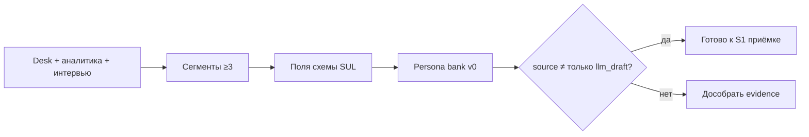

# Н2 · Лекция — Клиент, ICP, конкуренты, УТП → S1 старт

| Поле | Значение |
|---|---|
| **Неделя** | 2 |
| **Формат** | живое занятие ~90 мин + практика 4–6 ч |
| **Длительность live** | ~90 мин |
| **Артефакты** | Research pack · ICP · карта конкурентов · v0 банка персон (**S1 старт**) |
| **Демо instructor** | ICP + сегменты + персоны на Ритме; эталон [`../instructor/rhythm-exemplars/01-icp-competitive-map.md`](../instructor/rhythm-exemplars/01-icp-competitive-map.md) |

---

## Цели

После Н2 студент:

1. Собран **research pack** по **своему** продукту: сегменты, JTBD-черновики, конкуренты, УТП-гипотеза, sources.
2. Есть **ICP one-pager**: кто / не кто / почему платят / каналы.
3. Стартовал **банк персон S1**: ≥10 черновых персон, ≥3 сегмента, поля по схеме; план довести до ≥15 к Н3.
4. Понимает границу: LLM-черновик персоны ≠ принятая персона без `source`; смещённый ICP → врёт весь SUL одинаково.

---

## Повестка с таймингом

| Мин | Блок |
|---|---|
| 0–10 | Разбор 1–2 ICP студентов (красные флаги) |
| 10–35 | Live: ICP Ритм + 3 сегмента → 2 персоны по схеме |
| 35–55 | Карта конкурентов Ритма (прямые / «ничего» / Excel) |
| 55–75 | Workshop: 1 персона своего продукта в чате класса |
| 75–90 | Q&A / критерии S1 |
| — | Практика 4–6 ч: `research/` + ≥10 `personas/` |

---

## Нарратив занятия

### 0–10 · Красные флаги ICP

«На доске — пустой шаблон ICP. Прошу одного-двух добровольцев зачитать «для кого» из своего ONEPAGER / черновика `research/icp.md`.

Красные флаги, которые называю вслух:

1. **«Все со смартфоном» / «все, кому может пригодиться»** — это не ICP. Нет платёжного контекста и нет достижимого канала.
2. **Нет анти-ICP.** Если не сказали, кого сознательно не обслуживаем, банк персон раздуется до «среднего пользователя».
3. **ICP = фича.** «Люди, которым нужен AI-ассистент» — это описание инструмента, не сегмента с работой.
4. **Скопирован Ритм.** «25–40, бросили трекер на неделе 1–2» в B2B-саасе без своего evidence — паттерн украли вместе с данными. Каркас полей — да; сегменты habit-starters — нет.

ICP на курсе = сегмент с **платёжным контекстом** и **достижимым каналом**. Анти-ICP обязателен. Фраза эталона, которую повторяем весь модуль: *без анти-ICP банк персон раздуется до среднего пользователя*.»

### 10–35 · Live ICP и персоны на Ритме

#### Контекст продукта (говорить у 1-pager)

«Открываю эталон и ONEPAGER Ритма. Ритм — B2C-приложение привычек, freemium → Pro 299 ₽/мес / 1 990 ₽/год. Работа пользователя: удерживать 1–3 ежедневных ритуала, не бросая через неделю. Сценарий: онбординг → habit → check-in → streak → paywall → Pro. NSM-кандидат: **D7 habit depth ≥3**.

Это учебный продукт. Цифры ICP частично teaching assumption — в `sources.md` так и помечаем. Студентам копировать цифры в свой кейс нельзя; копировать **поля таблицы** — можно.»

#### Заполнение ICP вслух (скрипт A, ~12 мин)

«Диктую / заполняю на доске:

| Поле | Ритм |
|---|---|
| Кто | 25–40, уже пробовали трекер/челлендж и бросили на неделе 1–2; нужен short-series retention, не каталог из 50 привычек |
| Не кто | школьники; корпоративный wellness на 10k мест; люди без смартфона как primary channel |
| Каналы | Instagram / word-of-mouth / Product Hunt RU / поиск «привычка без стыда» |
| WTP-proxy | ≤300 ₽/мес на подписки «для себя»; год — если доказан streak ≥7 |
| Jobs | J1: маленький win в развалившийся день · J2: серия без перфекционизма · J3: снять freemium-лимит, не споткнувшись о paywall |

Спрашиваю класс: «кого выкинули?» — фиксируем анти-ICP голосом студентов. Если молчат — сам: школьники и corp wellness. Отказ экономит метрики: иначе в одну воронку смешаются разные работы — как в М1.1 Ритма.»

#### Три сегмента ≠ три имени

«Сегмент = разный JTBD или constraint, не разные имена в одном сегменте.

| Segment id | JTBD-фокус | Constraint |
|---|---|---|
| `habit-starters-freelance` | якорь 5 мин между дедлайнами | бюджет ≤300 ₽; онбординг ≤60 сек |
| `relapse-parents` | вернуть серию после провала | окна 6:30–7:00 и 21:00; стыд от streak=0 |
| `productivity-maxers` | 2–3 привычки как система | готовы платить раньше; бесит early paywall до value |

Фраза: если у вас десять персон и один сегмент — это один человек в десяти париках. На сдаче Н2 нужно ≥3 slug.»

#### Персоны по схеме (скрипт B, ~12 мин)

«Цепочка, которую рисуем:

Desk + аналитика + интервью → сегменты ≥3 → поля схемы SUL → bank v0 → gate: `source` ≠ только `llm_draft`.

Открываю [`../sul/personas/persona.schema.json`](../sul/personas/persona.schema.json). Обязательные смыслы полей, которые проговариваю: JTBD ≥1 абзац, constraint, channel, `bias_notes`, `source` ∈ interview | analytics_cluster | desk_research | mixed | llm_draft.

Live: вторую персону сегмента `relapse-parents` **диктую агенту в harness**, не читаю с листа. Агент пишет файл `personas/P02-….md`. Потом нарочно делаю плохую персону:

> Мария, 32, хочет эффективность и рост.

Прогоняем QA / чеклист: нет JTBD, нет constraint, нет канала, нет source, средний пользователь. Класс чинит вслух: какая работа? какое окно дня? чем платит сейчас (Notes / стыд / абонемент)? откуда знаем?

Underscore: **`source: llm_draft` alone = weak**. На банке ≥ половины персон должны иметь source не чистый llm_draft. Синтетика наследует смещения desk research: если ICP выдуман — весь SUL врёт одинаково. Это та же трезвость, что в AgentA/B 4.6: персона ≠ живой пользователь; exploratory, не confirmatory.»

### 35–55 · Карта конкурентов (рабочая, не MBA)

#### Слои на доске

«Не Apple и Google «потому что большие». Спрашиваем JTBD-overlap.

| Слой | Вопрос | Ритм (эталон) |
|---|---|---|
| Прямые | Кто решает ту же JTBD тем же типом продукта? | Streaks, Fabulous, Habitica |
| Косвенные | Чем ещё закрывают ту же работу? | Excel / Notion-шаблоны |
| Заменители | Что делают *вместо* продукта? | Notes / календарь / «просто пропущу»; чат с другом |
| УТП-гипотеза | Чем отличаемся *для ICP*, не «в целом лучше» | короткая серия без стыда + снятие лимита, когда depth уже есть |

Заменитель №1 у Ритма — **«ничего» и Notes**. Нулевой friction. Наш paywall это чувствует. Если в карте конкурентов только другие приложения — вы не видите главного врага.

УТП — одна строка + falsifier: *если depth≥3 не растёт при упрощении онбординга — УТП про «без стыда» не работает, чиним value до paywall*.

Live: заполняю пустой `competitors.md` на экране пятью строками. Студентам дома — ≥5 строк + `utp-hypothesis.md` + `sources.md` с метками live/desk/assumption.»

#### Антипаттерн «рынок $X млрд»

«Как в М1.1: TAM сверху — санити-чек, не слайд инвестору. На Н2 нам нужен ICP и карта альтернатив, не McKinsey. Если студент тащит «wellness $50B» без JTBD — возвращаем к таблице слоёв.»

### 55–75 · Workshop: одна персона своего продукта

«Теперь не Ритм. Прошу добровольца: свой продукт, один сегмент, одна персона в чате класса / на доске.

Протокол workshop (20 мин):

1. Студент называет ICP одной фразой и анти-ICP.
2. Класс задаёт три вопроса: JTBD? constraint? channel?
3. Студент диктует агенту (или пишет руками) черновик P01 по схеме.
4. Класс ищет «среднего пользователя» и дыры source.
5. Фиксируем: что добрать в `sources.md` до сдачи.

Правило ведущего: **запретить копипаст Ани/habit-starters в чужой B2B**. Пример Ритма — только структура полей. Если слышу «как Аня, только менеджер» — стоп, переписываем JTBD с нуля.

К сдаче Н2: ≥10 персон, ≥3 сегмента, INDEX-таблица. К Н3 — дожим ≥15 (критерий S1 программы).»

### 75–90 · Q&A и критерии S1

«Критерии, которые повторяю перед домашкой:

- Research pack: `icp.md`, `competitors.md`, `utp-hypothesis.md`, **`sources.md`** — без sources pack не принимаем.
- Банк: ≥10 файлов, ≥3 segment slug, ≥½ не чистый llm_draft.
- У каждой: JTBD, constraint, channel, bias_notes.
- План дожима до ≥15 к Н3 явно в INDEX или README.

Типичные сбои:

| Симптом | Реакция |
|---|---|
| 10 персон = один сегмент | Вернуть к ≥3; сегмент = разный JTBD/constraint |
| Конкуренты = Apple/Google | Сузить до JTBD-overlap |
| Копируют Аню в B2B | Запретить; только структура |
| Нет sources.md | Не принимать pack |
| Чистый llm_draft на всём банке | Дособрать desk/interview/analytics метки |

Опционально дома: skill QA «найди среднего пользователя» → `personas/QA.md`; n8n Manual → digest `research/digest-week02.md` из icp+competitors.»

---

## Демо-биты: свой продукт vs Ритм

| Beat | Ритм (эталон `01-icp-competitive-map.md`) | Свой |
|---|---|---|
| ICP ~12′ | 25–40 quit week 1–2; анти: школьники/corp wellness; WTP ≤300₽; J1–J3 | `research/icp.md` из своего ONEPAGER |
| Сегменты | `habit-starters-freelance` · `relapse-parents` · `productivity-maxers` | ≥3 своих slug; **не** копировать эти id |
| Персоны ~12′ | Schema → live P02 relapse-parents через harness; плохая «Мария хочет эффективность» → QA | ≥10 P01…; INDEX; ≥½ не llm_draft |
| Конкуренты ~8′ | Streaks/Fabulous/Habitica; Notes/календарь; чат; Excel/Notion; УТП+falsifier | `competitors.md` ≥5 строк + `utp-hypothesis.md` |
| Sources | desk/stand/teaching labels | `sources.md` с live/desk/assumption |

**How-to указатели:**

- Эталон: [`../instructor/rhythm-exemplars/01-icp-competitive-map.md`](../instructor/rhythm-exemplars/01-icp-competitive-map.md)
- Schema: [`../sul/personas/persona.schema.json`](../sul/personas/persona.schema.json)
- Гид банка: [`../sul/personas/persona-bank-guide.md`](../sul/personas/persona-bank-guide.md)
- Пример персоны (структура): [`../sul/personas/examples/persona-example.md`](../sul/personas/examples/persona-example.md)
- Instructor prep: [`instructor-notes.md`](./instructor-notes.md)

---

## Доска / mermaid

### Desk → persona (gate source)

### Слои конкурентов (таблица на доске)

Рядом с mermaid — живая таблица:

| Прямые | Косвенные | Заменители | УТП + falsifier |
|---|---|---|---|
| … | … | «ничего» / Excel / чат | одна строка |

Третий визуальный якорь: красный крест через слова **«средний пользователь»**.

---

## Переход к практике недели

После workshop: «каркас полей, не сегменты Ритма.» Открыть [`student-brief.md`](./student-brief.md):

- **A** research pack (`icp` / `competitors` / `utp-hypothesis` / `sources`)
- **B** bank ≥10, ≥3 сегмента, INDEX
- **C** лёгкий QA skill / опц. n8n digest
- **D** чтение schema + YT synthetic users (1 на выбор)

К Н3 дожать ≥15 (S1 done). Gate: [`checklist.md`](./checklist.md). Дальше → Н3: гипотезы X→Y→Z, red-team, n8n digest #2, S2 stub.

---

## Не говорить / типичные ловушки

- Private clouds / сырые Sheets ЦА — переписать своими словами; не шарить оригинал.
- Принимать research pack без `sources.md`.
- Разрешать копипаст пример-персоны (Аня) в чужой домен.
- ICP без анти-ICP → банк «среднего пользователя».
- Конкуренты без заменителя «ничего».
- Выдавать teaching-цифры эталона Ритма (25–40, ≤300₽) как прод-факт студенческого продукта.
- Обещать, что LLM-банк персон заменит интервью — противоречит трезвости 4.6 / AgentA/B.

---

## Приложение: глоссарий EN

| Термин | Смысл на Н2 |
|---|---|
| **ICP / anti-ICP** | Целевой сегмент / сознательный отказ |
| **JTBD** | Работа, на которую «нанимают» продукт |
| **WTP-proxy** | Прокси готовности платить (не опрос ради опроса) |
| **desk research** | Стол + открытые источники; метка в sources |
| **persona bank / segment slug** | Банк персон / id сегмента в схеме |
| **`source`** | interview · analytics_cluster · desk_research · mixed · llm_draft |
| **llm_draft** | Черновик модели; alone = weak |
| **УТП / USP / falsifier** | Гипотеза отличия + условие опровержения |
| **bias_notes** | Где персона/сегмент смещены |
| **S1 / SUL schema** | Критерий банка (≥15 к Н3) и поля персоны |
| **NSM** | North Star-кандидат (у Ритма D7 habit depth) |
