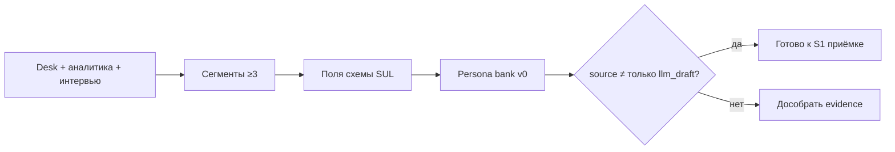

# Н2 · Lesson outline — Клиент, ICP, конкуренты, УТП → S1

| Поле | Значение |
|---|---|
| **Неделя** | 2 · живое занятие ~1,5 ч + практика 4–6 ч |
| **Артефакты** | Research pack · ICP · карта конкурентов · v0 банка персон (**S1 старт**) |
| **Демо instructor** | ICP «Ритм» как эталон структуры (не данные студента) |

---

## Цели

После Н2 студент:

1. Собран **research pack** по **своему** продукту: сегменты, JTBD-черновики, конкуренты, УТП-гипотеза.  
2. Есть **ICP one-pager** (кто / не кто / почему платят / каналы).  
3. Стартовал **банк персон S1**: ≥10 черновых персон, ≥3 сегмента, поля по схеме; план довести до ≥15 к Н3.  
4. Понимает: LLM-черновик персоны ≠ принятая персона без `source` и ограничений.

---

## Теория коротко (40–50 мин)

### 1. ICP ≠ «все, кому может пригодиться»

ICP = сегмент с **платёжным контекстом** и **достижимым каналом**. Анти-ICP обязателен: кого сознательно не обслуживаем.

### 2. От desk research к персоне

Опора: pm-skills market-research · YT Synthetic Users · schema [`../sul/personas/persona.schema.json`](../sul/personas/persona.schema.json).

### 3. Карта конкурентов (рабочая, не MBA)

| Слой | Вопрос |
|---|---|
| Прямые | Кто решает ту же JTBD тем же типом продукта? |
| Косвенные | Excel / чат / «ничего» / привычка |
| Заменители | Что пользователь делает *вместо* вашего продукта? |
| УТП-гипотеза | Чем вы отличаетесь *для ICP*, не «в целом лучше» |

### 4. Банк персон = вход в SUL

S1 критерий программы: ≥15 персон, ≥3 сегмента, нет «среднего пользователя». На Н2 достаточно v0 (≥10) + план дожима.

### 5. Границы

Синтетика наследует смещения desk research. Если ICP выдуман — весь SUL врёт одинаково.

---

## Практика

См. [`student-brief.md`](./student-brief.md) · гид банка: [`../sul/personas/persona-bank-guide.md`](../sul/personas/persona-bank-guide.md).

---

## Тайминг живого занятия

| Мин | Блок |
|---|---|
| 0–10 | Разбор 1–2 ICP студентов (красные флаги) |
| 10–35 | Live: ICP Ритм + 3 сегмента → 2 персоны по схеме |
| 35–55 | Карта конкурентов Ритма (прямые / «ничего» / Excel) |
| 55–75 | Workshop: студент пишет 1 персону своего продукта в чате класса |
| 75–90 | Q&A / критерии S1 |

---

## Materials

[`../materials-by-module.md`](../materials-by-module.md) §Н2.
