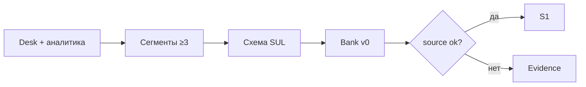

# Слайды · Н2 · ICP, конкуренты, банк персон → S1 старт

> Markdown-колода для paste в Google Slides / Marp / Pitch. Один слайд = блок между `---`.
> Источники: `lecture.md`, `lesson-outline.md`, playbook §Н2.

---

# Н2 · Клиент → ICP → персоны

- Research pack + ICP one-pager
- Карта конкурентов (рабочая, не MBA)
- Банк персон S1 старт: ≥10, ≥3 сегмента

<!-- Notes: Живое ~90 мин + практика 4–6 ч. Эталон: rhythm-exemplars/01-icp-competitive-map.md. Каркас полей — да; сегменты habit-starters — нет. -->

---

# Повестка (~90 мин)

- 0–10 · Красные флаги ICP
- 10–35 · Live ICP + персоны на Ритме
- 35–55 · Карта конкурентов
- 55–75 · Workshop: 1 своя персона
- 75–90 · Q&A / критерии S1

<!-- Notes: Playbook блоки: A ICP 12′ · B Персоны 12′ · C Конкуренты 8′ · rest workshop/Q. -->

---

# Цели недели

- `research/`: icp · competitors · utp · **sources**
- ICP: кто / не кто / WTP / каналы
- ≥10 персон, ≥3 slug; план ≥15 к Н3
- `source: llm_draft` alone = weak

<!-- Notes: Без sources.md pack не принимаем. Смещённый ICP → врёт весь SUL одинаково. -->

---

# Красные флаги ICP

- «Все со смартфоном»
- Нет анти-ICP
- ICP = фича («нужен AI-ассистент»)
- Скопирован Ритм в чужой домен

<!-- Notes: ICP = сегмент с платёжным контекстом и достижимым каналом. Анти-ICP обязателен. -->

---

# ICP · формула курса

- Кто платит / кого сознательно не берём
- Канал достижим
- WTP-proxy (не опрос ради опроса)
- Jobs: 2–3 работы, не каталог фич

<!-- Notes: Фраза модуля: без анти-ICP банк персон раздуется до среднего пользователя. -->

---

# Демо A · ICP Ритм (~12′)

| Поле | Ритм (эталон) |
|---|---|
| Кто | 25–40, бросили трекер на нед. 1–2 |
| Не кто | школьники; corp wellness |
| WTP | ≤300 ₽/мес «для себя» |

<!-- Notes: Teaching assumption — помечать в sources. Студентам копировать цифры нельзя; поля таблицы — можно. Спросить класс: «кого выкинули?» -->

---

# Три сегмента ≠ три имени

- `habit-starters-freelance`
- `relapse-parents`
- `productivity-maxers`
- Сегмент = разный JTBD / constraint

<!-- Notes: 10 персон и один сегмент = один человек в десяти париках. На сдаче ≥3 своих slug — не эти id. -->

---

# От desk к персоне

<!-- Notes: Gate: source ≠ только llm_draft. ≥½ банка — не чистый llm_draft. -->

---

# Схема персоны (обязательное)

- JTBD ≥1 абзац
- constraint · channel · `bias_notes`
- `source` ∈ interview | analytics | desk | mixed | llm_draft

<!-- Notes: Schema: sul/personas/persona.schema.json. Live B: диктовать P02 relapse-parents агенту в harness. -->

---

# Демо B · плохая персона

> Мария, 32, хочет эффективность и рост.

- Нет JTBD / constraint / channel / source
- «Средний пользователь» → красный крест
- Класс чинит вслух

<!-- Notes: Какая работа? Окно дня? Чем платит сейчас (Notes/стыд)? Откуда знаем? -->

---

# Карта конкурентов · слои

| Слой | Вопрос |
|---|---|
| Прямые | та же JTBD, тот же тип продукта |
| Косвенные | Excel / Notion / шаблоны |
| Заменители | что делают *вместо* |
| УТП + falsifier | отличие *для ICP* |

<!-- Notes: Не Apple/Google «потому что большие». TAM сверху — санити-чек, не слайд инвестору. -->

---

# Демо C · заменитель №1

- Ритм: Streaks / Fabulous / Habitica
- Враг №1: **«ничего»** и Notes
- УТП: короткая серия без стыда + falsifier

<!-- Notes: Live: 5 строк в competitors.md. Дома ≥5 + utp-hypothesis.md + sources с live/desk/assumption. -->

---

# УТП-гипотеза

- Одна строка для ICP
- + falsifier: когда гипотеза ломается
- Не «в целом лучше рынка»

<!-- Notes: Пример Ритма: если depth≥3 не растёт при упрощении онбординга — чиним value до paywall. -->

---

# Workshop · одна своя персона

1. ICP + анти-ICP одной фразой
2. Класс: JTBD? constraint? channel?
3. Дикт агенту / черновик P01
4. Охота на «среднего пользователя»

<!-- Notes: Запретить копипаст Ани/habit-starters в B2B. «Как Аня, только менеджер» → стоп, JTBD с нуля. -->

---

# Критерии S1 (старт Н2)

- Pack: icp · competitors · utp · **sources**
- ≥10 файлов, ≥3 segment slug
- ≥½ не чистый `llm_draft`
- План дожима ≥15 к Н3

<!-- Notes: INDEX-таблица обязательна. К Н3 — S1 done по критерию программы. -->

---

# Типичные сбои

- 10 персон = 1 сегмент
- Конкуренты = Apple / Google
- Копируют Аню в B2B
- Нет `sources.md`

<!-- Notes: Реакции playbook: вернуть к ≥3 JTBD; сузить JTBD-overlap; запретить пример-данные; pack без sources не принимать. -->

---

# Демо-биты · шпаргалка

| Beat | Ритм | Свой |
|---|---|---|
| ICP | эталон 01 | `research/icp.md` |
| Сегменты | 3 teaching slug | ≥3 своих |
| Персоны | live P02 + QA | ≥10 + INDEX |
| Конкуренты | Notes / «ничего» | ≥5 строк + УТП |

<!-- Notes: Не выдавать teaching-цифры (25–40, ≤300₽) как прод-факт студенческого продукта. -->

---

# Практика недели

- **A** research pack (+ sources)
- **B** bank ≥10 / ≥3 сегмента / INDEX
- **C** опц. QA skill / n8n digest

<!-- Notes: student-brief.md · persona-bank-guide.md. Gate: checklist.md. -->

---

# Граница синтетики

- LLM-черновик ≠ принятая персона
- Смещения desk наследуются банком
- Exploratory, не confirmatory ship

<!-- Notes: Та же трезвость AgentA/B 4.6: персона ≠ живой пользователь. Не обещать замену интервью. -->

---

# Дальше → Н3

- Гипотезы X→Y→Z
- Red-team LLM-оптимизма
- n8n digest #2 · S2 stub

<!-- Notes: Дома дожать evidence и сегменты. Workshop-персона — заготовка, не вся сдача. -->
