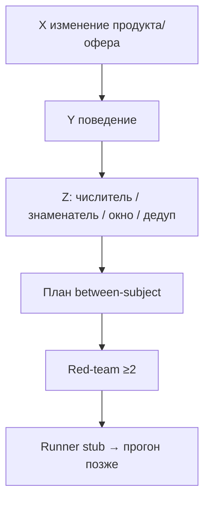

# Н3 · Discovery: X→Y→Z, Минто, red-team → S2

| Поле | Значение |
|---|---|
| **Неделя** | 3 · live ~90 мин + практика 4–6 ч |
| **Тема** | Гипотезы до симуляции · evidence · red-team · n8n digest #2 · S2 stub · дожим S1≥15 |
| **Harness** | ≥1 (Cursor или Claude Code): шаблон гипотез, BRIEF, evidence на диск |
| **n8n** | Flow #2: signals → LLM digest (не автопостинг) |
| **SUL** | S1 done (≥15) · **S2 старт** (runner-stub ≥1 H) |
| **Демо** | Эталон [`instructor/rhythm-exemplars/02-discovery-brief.md`](../instructor/rhythm-exemplars/02-discovery-brief.md) |
| **Сдача** | Свой продукт; Ритм = паттерн структуры, не копипаст данных |

---

## Цели

К концу занятия студент умеет сказать вслух и записать:

1. **5–7 гипотез** своего продукта в форме **X→Y→Z** с метрикой *до* любого прогона агентов.
2. Собрать `evidence/` и провести **red-team ≥2 атаки** на каждую гипотезу (и общий `REDTEAM.md`).
3. Поднять **n8n #2**: inbox сигналов → Markdown digest в `runs/n8n/`.
4. Закрыть **S1** (≥15 персон) и стартовать **S2**: заполненный runner-stub для ≥1 гипотезы.

Одна фраза на доску: *нет Z до прогона = нельзя принимать S2*.

---

## Повестка с таймингом

| Мин | Блок | Что говорите / делаете |
|---|---|---|
| 0–15 | Разбор 2 гипотез студентов | Найти дырявую Z; класс чинит числитель/знаменатель/окно/дедуп |
| 15–40 | Live discovery brief Ритм | Минто BRIEF + H01–H03 paywall/onboarding по эталону 02 |
| 40–60 | Red-team в парах | 5′ на гипотезу; ≥2 атаки; выписать на доску типичные |
| 60–80 | n8n digest #2 | Import/sketch Manual→LLM→`digest-*.md`; не рерайт ICP |
| 80–90 | Gate S1 | ≥15 персон; переход к `student-brief.md` |
| — | Практика 4–6 ч | См. раздел «Переход к практике» |

---

## Нарратив занятия

### Контекст (скажите в первые 2 минуты)

«На Н2 у вас ICP и банк персон. Сегодня мы не «придумываем идеи» — мы пишем **контракт на измерение**. Если гипотеза не говорит, *что* и *как* посчитать, симуляция потом только подтвердит красивую сказку. Ритм на экране — чтобы показать форму. Сдаёте вы **свой** артефакт и **свои** H0N.»

### Concepts — гипотеза = контракт X→Y→Z

Скажите: «X — это изменение продукта или офера, которое человек мог бы увидеть: экран, копирайт, тайминг paywall, длина онбординга. Не “улучшим UX”. Y — поведение, которое должно измениться: успел почувствовать value, понял обмен freemium↔деньги, быстрее дошёл до первой привычки. Z — метрика с четырьмя частями: **числитель, знаменатель, окно, дедуп**. Без четырёх частей Z дырявая.»

Дальше цепочка вслух: «После Z — план **between-subject**: одна персона / один агент видит **один** вариант. Потом red-team. Потом runner. Претест ≠ ship. Это правило AgentA/B и нашей программы, не вкусовщина.»

Минто: «Discovery brief — одна страница. **Ответ сверху**: главная проблема ICP одной фразой. Под ним три аргумента. Под ними строки гипотез. Внизу — чего *не* узнаем без живых людей. Если brief раздувается в эссе, вы прячете отсутствие решения.»

Red-team (обязателен, не «по желанию»): «Симуляция любит confirmation bias. Типовые атаки: (1) LLM уже “любит” ваш нарратив — ложный supports; (2) метрика-суррогат вместо поведения; (3) не тот сегмент; (4) артефакт теста ≠ живой UI; (5) утечка варианта в промпт / within-subject “выбери лучший”. Минимум две атаки в каждой H и сводный `evidence/REDTEAM.md`.»

n8n #2: «Это не SMM и не автопостинг. Inbox сигналов → нормализация → LLM → файл digest. Digest отвечает: top сигналы, дыры в evidence, какие H задеты, что assumption. Если digest пересказывает ICP — flow сломан по смыслу.»

S2: «Runner-stub — план прогона: какие персоны, какой artifact URL, какой success = Z, seed-политика. Полный N на Н7. Сегодня нужен **заполненный план**, не N=60.»

### Examples — Ритм (эталон 02) словами преподавателя

Откройте эталон. Скажите:

«Ответ сверху для Ритма: люди **создают привычку**, но не доходят до **D7 depth ≥3**; early paywall давит до value — ложный сигнал “дорого”, хотя узкое место depth, не цена.

Три аргумента: (1) воронка стенда habit→depth ≈27% — bottleneck; (2) анти-ICP отсечён — не чиним corp wellness; (3) синтетический претест копий дешевле трафика, но **не** ship/kill.

H01 — timing paywall: X = late после `streak_3` vs early; Y = успел почувствовать value; Z = доля habit_created → depth≥3 за 7д, знаменатель = users с habit_created, дедуп user_id. Guardrail: early paywall share; subscribe не падает без объяснения. Red-team: LLM любит “отложить paywall”; скрин ≠ живой UI.

H02 — benefit-copy: X = CTA “снять лимит 3 привычки” + цена vs “Оформить Pro”; Y = понятен обмен; Z для претеста = intent/pay proxy на варианте (не D7 depth). Between-subject только.

H03 — короткий онбординг: X = один экран цели без карусели; Y = time-to-first-habit↓; Z = onboarding_completed → ≥1 check_in в D1.

Дырявая Z для разбора: “увеличим engagement”. Спросите класс: числитель? знаменатель? окно? дедуп? Пока нет — в S2 не пускаем.»

### Anti-patterns — скажите жёстко

- «Увеличим engagement / NPS / love» без Z-контракта — **вернуть**.
- Within-subject: агент видит A и B и «выбирает лучший» — **запрет**.
- Гипотезы без artifact URL / экрана **своего** продукта — блокер сдачи.
- Пять гипотез без evidence и без red-team — не портфель, а wishlist.
- Digest = рерайт ICP или ONEPAGER — не зачёт flow #2.
- Копировать H01–H03 Ритма в B2B SaaS «как есть» — нет; копируете **поля шаблона**.

---

## Демо-биты: свой продукт vs Ритм

| Beat | Ритм (instructor, экран) | Свой продукт (студент) |
|---|---|---|
| Brief Минто 8′ | `02-discovery-brief.md`: проблема depth, 3 аргумента, H-строки | `discovery/BRIEF.md` ≤1 стр. по своему ICP |
| H01–H03 12′ | Полные X/Y/Z/guardrail/artifact/red-team на paywall | `hypotheses/H0N-*.md` по `_TEMPLATE`; **5–7** шт. |
| Дырявая Z 5′ | «engagement» → класс чинит на доске | Самопроверка чеклистом Z перед сдачей |
| Evidence 5′ | inbox: ~27%; copy before/after; note AgentA/B | `evidence/inbox\|curated` + метки live/synthetic/assumption |
| Red-team 10′ | LLM-bias late paywall; скрин≠UI | ≥2 атаки в каждой H + `REDTEAM.md` |
| n8n #2 15′ | Manual + 3 файла → digest в `runs/n8n/` | Schedule/Manual → свой inbox → свой digest |
| S2 5′ | устно: что попадёт в runner H02 | `hypotheses/runners/H0N-plan.md` из stub ≥1 |
| S1 gate | — | INDEX ≥15 персон, ≥3 сегмента |

Говорите между битами: «Процесс копируете. Цифры 27%, streak_3, 299₽ — **не** ваш продукт, пока не измерили сами.»

---

## Доска / mermaid

### 1. Контракт гипотезы



### 2. Пирамида Минто (нарисуйте столбиком)

```text
        [ Ответ сверху: главная проблема ICP ]
     [ Аргумент 1 ] [ Аргумент 2 ] [ Аргумент 3 ]
   [ H01 ] [ H02 ] [ H03 ] … одной строкой каждая
   [ Чего не узнаем без живых людей ]
```

Рядом таблица: дырявая Z vs эталон H01 Z (depth≥3 / знаменатель habit_created / 7д / user_id).

---

## Переход к практике недели → student-brief.md

После gate S1 скажите дословно по смыслу:

«Дома открываете [`student-brief.md`](./student-brief.md). Порядок: **A** дожим S1 ≥15 → **B** 5–7 гипотез X→Y→Z с artifact и red-team → **C** evidence inbox/curated/REDTEAM → **D** BRIEF Минто → **E** n8n #2 с digest в git → **F** чтение voice-of-agents + between-subject reminder. Приёмка — [`checklist.md`](./checklist.md). Нет Z — нет S2. На Н4 из этого портфеля соберём ставки и tornado.»

Не раздавайте домашку как отдельный документ на занятии — только brief.

---

## Не говорить / типичные ловушки

**Не говорить / не показывать**

- API keys LLM на экране; ключи в git/export JSON.
- Private Mail.ru / Яндекс clouds и сырые прод-цифры — только переписанные заглушки.
- Полный Postgres Ритма студентам «для реализма».
- «LLM сказала отложить paywall — значит H01 доказана» без red-team.
- Within-subject как «ускорение демо».

**Типичные ловушки класса**

| Симптом | Реакция ведущего |
|---|---|
| Engagement без определения | Вернуть к четырём частям Z |
| Агент видит оба варианта | Запретить; only between-subject |
| Нет artifact URL | Блокер сдачи |
| Digest = пересказ ICP | Требовать новые сигналы из inbox |
| 10 персон вместо 15 | Не открывать S2 до gate |
| H без сегментов из банка | Привязать persona ids |

---

## Приложение: глоссарий EN

| Термин | Как используем на курсе |
|---|---|
| **X→Y→Z** | Change → behavior → metric contract |
| **red-team** | Атаки на гипотезу до прогона |
| **confirmation bias** | Симуляция «подтверждает» любимый нарратив |
| **between-subject** | Один агент / одна персона = один вариант |
| **within-subject** | Запрещённый режим «увидь оба / выбери» |
| **guardrail** | Метрика, которую нельзя ухудшить без объяснения |
| **artifact under test** | URL/экран/копия, которую реально показывают агенту |
| **runner stub** | План прогона S2 до полного N |
| **S1 / S2** | Persona bank done / hypothesis runner start |
| **digest** | Markdown-сводка сигналов из n8n #2 |
| **Minto** | Answer first → arguments → evidence |
| **WTP** | Willingness to pay (часто proxy, не факт) |
| **paywall / onboarding / depth / streak** | Узлы Ритма-эталона; у себя — свои события |
| **trial / intent proxy** | Суррогат покупки в претесте |
| **AgentA/B** | Between-subject дисциплина симуляции |
| **voice-of-agents** | Внешний материал по этике синтетики |
| **harness** | Cursor/Claude Code: файлы, skills, rules |
| **n8n** | Триггеры и glue; не замена harness |
| **live / synthetic / assumption** | Обязательные метки evidence |
