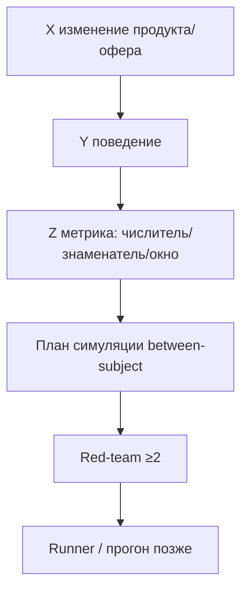

# Н3 · Lesson outline — Discovery + упаковка (Минто) → S2

| Поле | Значение |
|---|---|
| **Неделя** | 3 · ~1,5 ч live + 4–6 ч практика |
| **Артефакты** | 5–7 гипотез X→Y→Z · evidence-папка · red-team · n8n digest · **S2 старт** · дожим S1 ≥15 |
| **Демо instructor** | Discovery brief на Ритме |

---

## Цели

1. Сформулировать **5–7 гипотез** своего продукта в форме X→Y→Z с метрикой *до* симуляции.  
2. Собрать `evidence/` и провести **red-team** (≥2 атаки на гипотезу).  
3. Поднять **n8n flow #2**: сигналы (файлы/webhook) → LLM-сводка digest.  
4. Запустить **S2**: hypothesis runner stub заполнен для ≥1 гипотезы; банк персон ≥15 (S1 done).

---

## Теория коротко

### 1. Гипотеза = контракт на измерение

Шаблон: [`../sul/hypotheses/_TEMPLATE.md`](../sul/hypotheses/_TEMPLATE.md) · runner: [`../sul/hypotheses/hypothesis-runner-stub.md`](../sul/hypotheses/hypothesis-runner-stub.md).

### 2. Минто для discovery brief

Пирамида: **ответ сверху** → аргументы → evidence. Brief на 1 стр.: проблема ICP → инсайт → гипотезы → что узнаем на неделе.

### 3. Red-team (обязателен)

Атаки: confirmation bias симуляции; метрика-суррогат; сегмент не тот; артефакт теста ≠ живой; утечка варианта в промпт.

### 4. n8n digests

Flow #2: папка `evidence/inbox/` или webhook → LLM → `runs/n8n/digest-YYYYMMDD.md`. Не автопостинг.

### 5. Границы

Between-subject по умолчанию (AgentA/B / stats-ab 4.6). Претест ≠ ship.

---

## Тайминг

| Мин | Блок |
|---|---|
| 0–15 | Разбор 2 гипотез студентов (дырявая Z) |
| 15–40 | Live discovery brief Ритм + 3 гипотезы paywall |
| 40–60 | Red-team в парах (5 мин на гипотезу) |
| 60–80 | n8n digest sketch / import идеи flow #2 |
| 80–90 | S1 gate: ≥15 персон |

---

## Materials

[`../materials-by-module.md`](../materials-by-module.md) §Н3 · [voice-of-agents](https://github.com/blakeaber/voice-of-agents).
