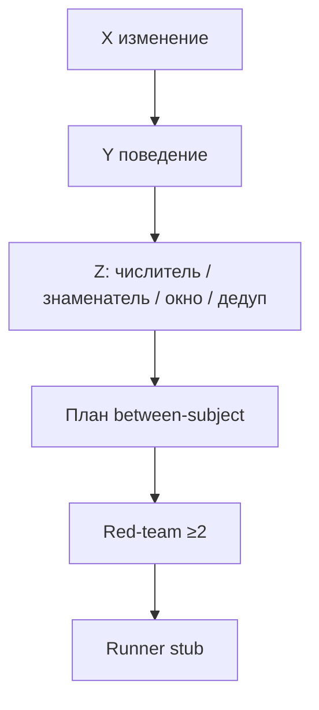

# Слайды · Н3 · Discovery: X→Y→Z, Минто, red-team → S2

> Markdown-колода для paste в Google Slides / Marp / Pitch. Один слайд = блок между `---`.
> Источники: `lecture.md`, `lesson-outline.md`, playbook §Н3.

---

# Н3 · Discovery → S2

- Гипотезы = контракт на измерение
- Red-team до прогона
- n8n digest #2 · S1 done · S2 stub

<!-- Notes: Контекст: на Н2 — ICP и банк персон. Сегодня не «придумываем идеи», а пишем контракт. Ритм на экране = форма; сдаёте свой артефакт и свои H0N. -->

---

# Цели занятия

- 5–7 гипотез X→Y→Z с метрикой *до* прогона
- Evidence + red-team ≥2 на каждую H
- n8n #2 → digest в `runs/n8n/`
- S1 ≥15 · S2 runner-stub ≥1 H

<!-- Notes: Одна фраза на доску: нет Z до прогона = нельзя принимать S2. -->

---

# Повестка (~90 мин)

- 0–15 · Разбор 2 гипотез · дырявая Z
- 15–40 · Live brief Ритм (Минто + H01–H03)
- 40–60 · Red-team в парах
- 60–80 · n8n digest #2
- 80–90 · Gate S1 → практика

<!-- Notes: Playbook A/B/C: X→Y→Z 15′, red-team 10′, brief+n8n 10′ — ядро демо. -->

---

# Фраза на доску

> **Нет Z до прогона = нельзя принимать S2**

- Z = числитель / знаменатель / окно / дедуп
- Без четырёх частей — гипотеза дырявая
- Симуляция без контракта подтвердит сказку

<!-- Notes: Скажите жёстко. Engagement без определения — вернуть. -->

---

# Гипотеза = контракт X→Y→Z

- **X** — изменение продукта/офера (экран, копирайт, тайминг)
- **Y** — поведение, которое должно измениться
- **Z** — метрика с 4 частями
- Дальше: between-subject → red-team → runner

<!-- Notes: Не «улучшим UX». Претест ≠ ship. Between-subject: одна персона / один агент = один вариант. -->

---

# Контракт гипотезы

<!-- Notes: Единственный mermaid-слайд. На доске рядом: дырявая Z vs эталон H01. -->

---

# Дырявая Z · разбор

- «Увеличим engagement / NPS / love»
- Класс чинит: числитель? знаменатель? окно? дедуп?
- Пока нет — **в S2 не пускаем**

<!-- Notes: Разбор 2 студенческих гипотез. Типичный сбой — вернуть к Z-контракту. -->

---

# Демо · Ритм vs свой продукт

| Beat | Ритм (экран) | Свой продукт |
|---|---|---|
| Brief | depth, 3 аргумента | `BRIEF.md` ≤1 стр. |
| H01–H03 | paywall / copy / onb | 5–7 своих H0N |
| Evidence | ~27%, inbox | свои метки live/synth |

<!-- Notes: Процесс копируете. Цифры 27%, streak_3, 299₽ — не ваш продукт. -->

---

# Минто BRIEF · 1 страница

- **Ответ сверху** — главная проблема ICP
- Три аргумента под ним
- Строки гипотез одной строкой каждая
- Внизу — чего *не* узнаем без живых людей

<!-- Notes: Если brief раздувается в эссе — прячете отсутствие решения. -->

---

# Ритм · ответ сверху

- Привычку создают, до **D7 depth ≥3** не доходят
- Early paywall давит до value
- Ложный сигнал «дорого» · узкое место — depth, не цена

<!-- Notes: Три аргумента: воронка habit→depth ≈27%; анти-ICP отсечён; синтетический претест ≠ ship/kill. -->

---

# H01–H03 · Ритм (паттерн)

- **H01** timing paywall · Z = habit → depth≥3 / 7д
- **H02** benefit-copy · Z = intent/pay proxy (не depth)
- **H03** короткий онбординг · Z = onb → check-in D1
- Guardrail + artifact URL + red-team в каждой

<!-- Notes: Копируете поля шаблона, не H01–H03 «как есть» в B2B SaaS. -->

---

# Red-team обязателен

- Confirmation bias симуляции
- Метрика-суррогат · не тот сегмент
- Артефакт ≠ живой UI
- Утечка варианта / within-subject — **запрет**

<!-- Notes: ≥2 атаки в каждой H + сводный evidence/REDTEAM.md. Демо: LLM любит late paywall; скрин ≠ UI. -->

---

# Практика · red-team в парах

- 5′ на гипотезу · ≥2 атаки
- Выписать типичные на доску
- Within-subject: агент видит A и B — стоп

<!-- Notes: Скрипт B ~10′. Класс голосует: это supports или артефакт промпта? -->

---

# n8n digest #2

- Inbox сигналов → нормализация → LLM → файл
- Отвечает: top сигналы · дыры · какие H · assumption
- **Не** автопостинг · **не** рерайт ICP

<!-- Notes: Manual + 3 файла → digest-*.md в runs/n8n/. Digest = пересказ ICP → flow сломан. -->

---

# S1 gate · S2 stub

- **S1 done:** INDEX ≥15 персон, ≥3 сегмента
- **S2 старт:** runner-stub ≥1 H заполнен
- План: персоны · artifact URL · success = Z · seed
- Полный N — на Н7; сегодня план, не N=60

<!-- Notes: 10 персон вместо 15 — не открывать S2. Нет artifact URL — блокер сдачи. -->

---

# Анти-паттерны

- Engagement без Z-контракта → вернуть
- Within-subject «выбери лучший» → запрет
- H без artifact своего продукта → блокер
- Wishlist без evidence/red-team → не портфель

<!-- Notes: Не показывать: API keys, private clouds, полный Postgres Ритма. -->

---

# Практика недели · CTA

Открыть [`student-brief.md`](./student-brief.md):

1. **A** дожим S1 ≥15  
2. **B** 5–7 гипотез X→Y→Z + red-team  
3. **C** evidence · **D** BRIEF · **E** n8n #2 · **F** voice-of-agents  

<!-- Notes: Приёмка — checklist.md. Нет Z — нет S2. Не раздавать homework как отдельный документ live. -->

---

# Что сдать

- `hypotheses/H0N-*.md` · 5–7 шт.
- `discovery/BRIEF.md` · Минто ≤1 стр.
- `evidence/` + `REDTEAM.md`
- Digest в git · runner stub ≥1

<!-- Notes: Harness ≥1 (Cursor/Claude Code): шаблон гипотез, BRIEF, evidence на диск. -->

---

# На следующей неделе · Н4

- Ровно **3 AI-ставки** + kill
- Bottom-up sizing + tornado ≥3
- Strategy memo go / no-go / thin-bet → **S3**
- Из портфеля H0N — не Parallel Universe

<!-- Notes: Фраза Н4: чувствительность важнее абсолюта. Кто принесёт TAM из блога — развернём. -->

---

# Вопросы · старт практики

- Есть ли Z с четырьмя частями?
- Есть ли ≥2 атаки red-team?
- S1 ≥15 — готовы к gate?

<!-- Notes: Повторить доску: нет Z до прогона = нельзя S2. -->
