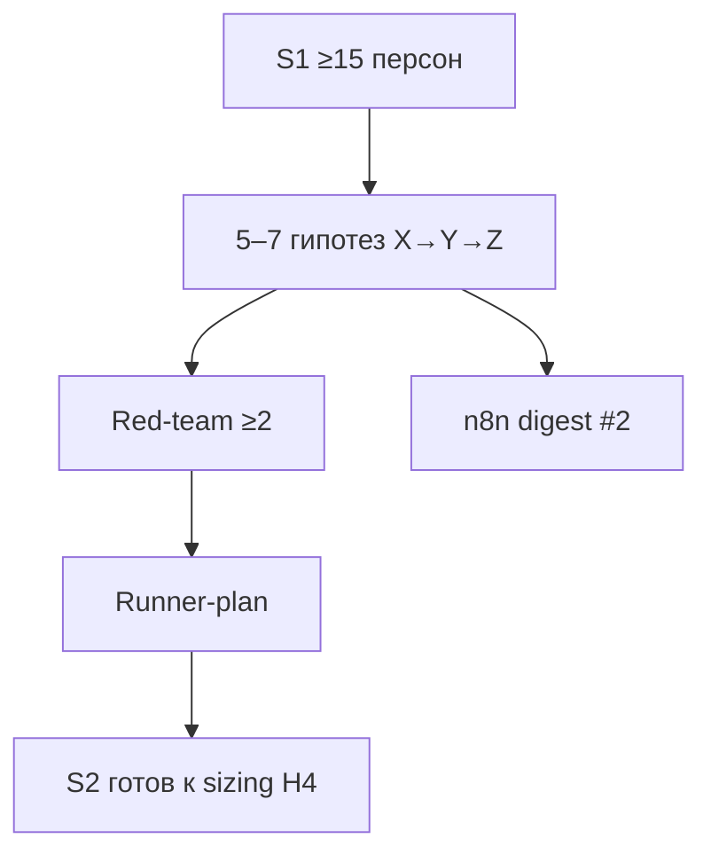

# Н3 · Student brief — гипотезы, evidence, digest, S2

Практика **4–6 ч**. Сдача: `hypotheses/H01…` (5–7) + `evidence/` + 1 digest из n8n + S1 ≥15 персон.



Контракт X→Y→Z: [`lesson-outline.md`](./lesson-outline.md).

---

## A. Дожим S1

- [ ] ≥**15** персон, ≥**3** сегмента.  
- [ ] `personas/INDEX.md` обновлён.  
- [ ] QA: нет среднего пользователя (см. [`../sul/personas/persona-bank-guide.md`](../sul/personas/persona-bank-guide.md)).

---

## B. Гипотезы (5–7)

Для каждой `hypotheses/H0N-<slug>.md` по [`_TEMPLATE.md`](../sul/hypotheses/_TEMPLATE.md):

1. **X→Y→Z** — Z с числителем, знаменателем, окном, дедупом.  
2. Сегменты персон (ids).  
3. Variants A/B или «оффер / нет».  
4. Artifact under test (URL/экран **своего** продукта).  
5. Evidence table + **≥2 red-team** атаки.  

Заполните runner-stub для **≥1** гипотезы: [`../sul/hypotheses/hypothesis-runner-stub.md`](../sul/hypotheses/hypothesis-runner-stub.md) → скопируйте в `hypotheses/runners/H0N-plan.md`.

---

## C. Evidence-папка

```text
evidence/
  inbox/          ← сырые заметки, экспорты, ссылки
  curated/        ← 5–10 карточек «факт → вывод → уверенность»
  REDTEAM.md      ← общие атаки на портфель гипотез
```

Каждый факт: `live` / `synthetic` / `assumption`.

---

## D. Discovery brief (Минто)

`discovery/BRIEF.md` (≤1 стр.):

1. Ответ сверху: главная проблема ICP.  
2. 3 аргумента.  
3. Список гипотез H01–H0N одной строкой каждая.  
4. Что *не* узнаем без живых людей.

---

## E. n8n flow #2 — signals → digest

Схема:

```
Schedule или Manual
  → Read evidence/inbox/*.md  (или Webhook с JSON)
  → LLM: «сводка сигналов за период; top-5; дыры»
  → Write / сохранить runs/n8n/digest-<date>.md
```

В `sul/README.md` добавьте имя workflow #2 и как запускать. Credentials только в UI.

Альтернатива S0-стиля: Manual + копирование output в git вручную — ок, если задокументировано.

---

## F. Чтение

1. [voice-of-agents](https://github.com/blakeaber/voice-of-agents) README (ethics notice).  
2. [Feedback from synthetic users](https://www.youtube.com/watch?v=q_fdcbwHJKQ) — опц.  
3. stats-ab 4.6 AgentA/B — between-subject reminder (свой конспект 5 строк).

---

## Критерии

[`checklist.md`](./checklist.md).
