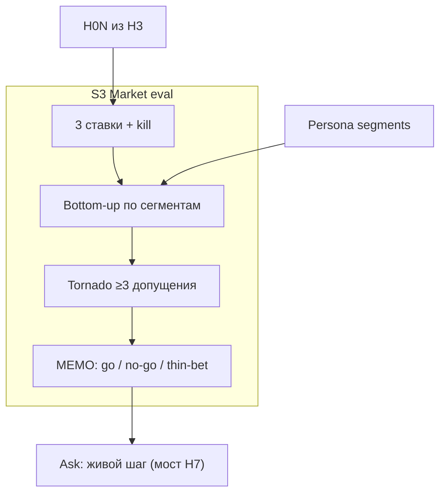

# Н4 · AI-ставки, sizing, tornado → S3

| Поле | Значение |
|---|---|
| **Неделя** | 4 · live ~90 мин + практика 4–6 ч |
| **Тема** | 3 AI-ставки · strategy memo go/no-go/thin-bet · bottom-up + tornado (≥3) · ставка↔H↔персона |
| **Harness** | ≥1: bets/MEMO/tornado как файлы в git, не «чат с итогом» |
| **n8n** | Опц.: JSON допущений → QA tornado → `runs/n8n/tornado-qa.md` |
| **SUL** | **S3**: market eval на персонах + tornado; связь с H0N из Н3 |
| **Демо** | Эталон [`instructor/rhythm-exemplars/03-strategy-go-no-go-memo.md`](../instructor/rhythm-exemplars/03-strategy-go-no-go-memo.md) |
| **Сдача** | Свой продукт; napkin Ритма = teaching assumption, не прод-факт |

---

## Цели

1. Зафиксировать **ровно 3 ставки**: что автоматизируем / где агент в контуре / где человек-судья.
2. Написать **strategy memo**: go / no-go / thin-bet / bet-size по каждой + абзац «чего не решили бы».
3. Закрыть **S3**: bottom-up sizing по ≥3 сегментам банка + **tornado ×≥3** допущения с колонкой source.
4. Каждая ставка связана с **H0N** (не Parallel Universe и не «AI везде»).

Фраза на доску: *чувствительность важнее абсолюта; не рынок $10B из блога*.

---

## Повестка с таймингом

| Мин | Блок | Что говорите / делаете |
|---|---|---|
| 0–10 | Разбор ставок студентов | Rate limit: выкинуть «GPT для всего»; найти отсутствие kill |
| 10–40 | Live memo Ритм + bottom-up | 3 ставки эталона; napkin habit-starters 50k→8%→4%→299₽ |
| 40–65 | Tornado на доске / в MD | Reach ±50% · trial ±3pp · price 199/299/499; «столбик trial длиннее» |
| 65–85 | Связка ставка ↔ H ↔ персона | Таблица ids; голосование kill #3 |
| 85–90 | Мост к практике | `student-brief.md`; ask на живой тест = мост к Н7 |
| — | Практика 4–6 ч | A bets · B MEMO · C S3 · D опц. n8n · E SSR abstract |

---

## Нарратив занятия

### Контекст

«На Н3 вы написали контракты X→Y→Z. Сегодня вопрос другой: **куда ставим внимание и деньги процесса** — harness, n8n, SUL-претест, живой шаг. Ставка — не фича в бэклоге. Ставка = цена ошибки + опцион на обучение. Формат одной строки: *ставим X, потому что Y, убьём если Z*.»

### Concepts — ставка, sizing, tornado, memo

**Ставка ≠ фича.** Скажите: «“Добавим AI-чат” — фича. “Агент претестит две копии лендинга в SUL до закупки трафика, человек читает REPORT” — ставка. В ставке обязательны: глагол+объект, связь с H__, цена ошибки, kill-критерий, контур (harness / n8n / SUL / человек). Без kill memo не принимаем.»

**Три, не тридцать.** «Ровно три — чтобы был выбор и был kill. Если все три “go на полную автономию”, вы не думали. Одна из трёх на демо Ритма мы **убиваем при всех**.»

**Bottom-up, не TAM.** «Сегмент из банка → reach (с меткой assumption/desk/live) → conversion proxy → WTP/ARPU → revenue-сценарий. Потом tornado. Sizing на синтетике и desk — это **чувствительность**, не McKinsey-отчёт. SSR / synthetic intent ≠ purchase. `inconclusive` — нормальный исход, не провал.»

**Tornado.** «Берём base. По одному крутим три допущения. Смотрим, куда “качается” итог. Туда и шлём живое исследование первым — не туда, где удобнее сделать A/B цены. На Ритме napkin показывает: trial/depth сильнее цены → креатив/онбординг раньше прайсинга.»

**Memo.** «1–2 страницы. Контекст ICP. Вердикт по каждой ставке. Bottom-up + tornado top-3. Обязательный абзац: что решили бы по синтетике / чего **не** решили бы. Следующий **живой** шаг и ask. Ask ≠ “поверьте симуляции”.»

**Связка.** «Ставка без H__ — Parallel Universe. Персоны без сегмента в sizing — воздух. Tornado без колонки source — декоративная таблица.»

### Examples — Ритм (эталон 03) словами

Откройте эталон 03. Говорите:

«Ставка #1 thin-bet: претест копий лендинга/paywall в SUL по **H02** до медиа. Kill: если smoke даёт утечку варианта или нет Z — чиним runner, ставку не крутим.

Ставка #2: агент-дайджест метрик paywall (позже n8n #3) раз в неделю для человека. Kill: два раза подряд digest без DEFINITIONS или выдуманный CAC — выключить LLM-шаг.

Ставка #3: полная автономия ship гипотез без человека. **Kill сейчас.** Класс голосует. Синтетика ≠ живой АБ — §3.4 программы.

Bottom-up habit-starters (teaching assumption): reach 50 000 RU/мес → trial 8% → ~4 000 → paid 4% → 160 → ×299₽ ≈ **47 840₽**. Честно произнесите: это napkin, не прод БД.

Tornado: reach 25k/50k/75k; trial 5/8/11%; price 199/299/499. Вывод вслух: *столбик trial длиннее столбика price*. Значит no-go на “сначала A/B цены”; go на thin-bet претест H02; go на digest с человеком; no-go на auto-ship.

Ask к стейкхолдеру (мост Н7): бюджет на **две недели живого теста** креатива/онбординга после SUL — не “апрувните симуляцию”.»

### Anti-patterns

- «Используем GPT для всего» / полная автономия ship — убить на занятии.
- TAM сверху вниз из блога «рынок $10B» — заменить bottom-up от сегментов банка.
- Нет kill-критерия — блокер memo.
- Ставки без связи с H0N — вернуть к портфелю Н3.
- Tornado без source допущений — дописать колонку.
- Первым крутить цену, когда tornado указывает на trial/depth — объяснить ошибку приоритизации.
- Выдавать 50k/8%/4% Ритма как факт студенческого продукта.

---

## Демо-биты: свой продукт vs Ритм

| Beat | Ритм (instructor) | Свой продукт (студент) |
|---|---|---|
| Ставки 10′ | #1 thin-bet H02 · #2 digest · #3 kill auto-ship | `strategy/bets.md`: глагол+объект · H__ · цена ошибки · kill · контур |
| Bottom-up 20′ | 50k → 8% → 4% → 299 → ≈47 840₽; source labels | ≥3 сегмента из **своего** bank; метки assumption/desk/live |
| Tornado 15′ | reach / trial / price; trial сильнее цены | `strategy/tornado.md` из `sul/templates/market-tornado.md` |
| Memo 10′ | thin-bet go · price-first no-go · auto-ship no-go · digest go | `strategy/MEMO.md` + decision-memo-stub на главную ставку |
| Связка 10′ | ставка→H02→habit-starters / … | Явная таблица ставка → H_id → segment ids |
| Опц. n8n | — | JSON допущений → QA → `runs/n8n/tornado-qa.md` |

Между битами: «Копируете **форму** memo и tornado. Цифры reach/trial — свои или честно assumption.»

---

## Доска / mermaid

### 1. Цепочка недели

### 2. Таблица go/no-go (заполните live)

| Ставка | Вердикт | Почему | Kill |
|---|---|---|---|
| 1 претест H__ | | | |
| 2 digest / контур | | | |
| 3 авто-ship | **no-go** | синтетика ≠ AB | сейчас |

Рядом устно нарисовать tornado: длинный столбик trial, короткий price.

---

## Переход к практике недели → student-brief.md

«Открываете [`student-brief.md`](./student-brief.md). **A** ровно 3 ставки в `bets.md` → **B** `MEMO.md` с абзацем границ → **C** S3 sizing + tornado + decision stub → **D** опционально n8n QA → **E** abstract SSR (intent ≠ purchase). Критерии — [`checklist.md`](./checklist.md). Кто принесёт TAM из блога без сегментов банка — развернём на ревью. Следующая неделя: дерево метрик и калибровка чисел; tornado Н4 станет входом в unit.»

---

## Не говорить / типичные ловушки

**Не говорить / не показывать**

- Цифры из private clouds в студенческую выдачу.
- Napkin 50k/8%/4% как «так в проде Ритма».
- SSR как «доказанная покупка».
- Ставка без kill «потом придумаем».
- Обещание, что thin-bet заменяет живой АБ при доступном трафике.

**Типичные ловушки**

| Симптом | Реакция |
|---|---|
| TAM сверху вниз | Bottom-up от persona segments |
| Нет kill | Блокер memo |
| Ставки без H__ | Вернуть к Н3 |
| Tornado без source | Добавить колонку |
| Price-first при слабом trial | Показать tornado снова |
| «AI везде» как ставка #1–#3 | Rate limit; убить #3-паттерн |

---

## Приложение: глоссарий EN

| Термин | Как используем |
|---|---|
| **AI bet / ставка** | Решение вложить процесс (агент/человек), не фича |
| **thin-bet** | Малая ставка на обучение (претест) до крупных затрат |
| **go / no-go** | Вердикт memo |
| **bet-size** | Масштаб ставки относительно цены ошибки |
| **kill-критерий** | Условие свернуть ставку |
| **bottom-up** | Сегмент → reach → conv → $ |
| **reach** | Оценка доступного объёма сегмента |
| **conversion proxy** | Суррогат конверсии с меткой источника |
| **WTP** | Willingness to pay (часто proxy) |
| **ARPU** | Average revenue per user |
| **tornado** | Однофакторная чувствительность допущений |
| **S3** | Market eval / sizing в SUL |
| **SSR** | Synthetic subjects / research (arxiv) — intent ≠ purchase |
| **synthetic market research** | Пайплайн desk+агенты; не закон рынка |
| **intent proxy** | Суррогат покупки в симуляции |
| **adoption latency** | Задержка принятия; не путать с CV |
| **TAM** | Top-down рынок; на курсе подозрителен без bottom-up |
| **inconclusive** | Честный исход memo/претеста |
| **pretest** | SUL/агентный прогон до live |
| **ship / kill** | Финальные продуктовые решения — не по одной синтетике |
| **harness / n8n / SUL** | Контуры ставки |
