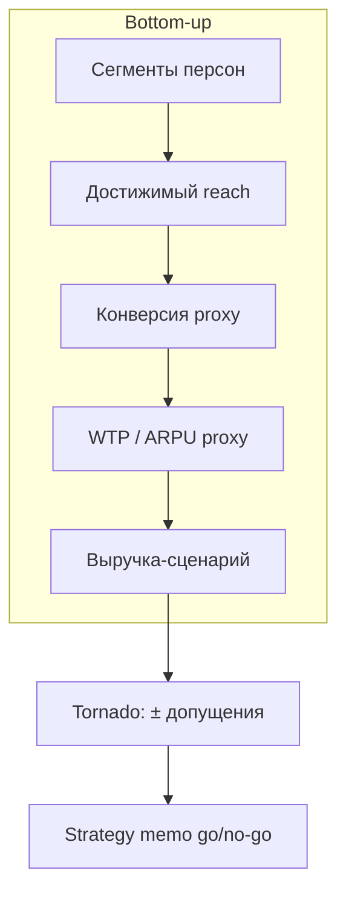

# Н4 · Lesson outline — AI-ставки и стратегия → S3

| Поле | Значение |
|---|---|
| **Неделя** | 4 · ~1,5 ч + 4–6 ч практика |
| **Артефакты** | 3 ставки · strategy memo · synthetic market sizing + tornado (**S3**) |
| **Демо instructor** | Go/no-go memo на Ритме |

---

## Цели

1. Выбрать **3 AI-ставки** по своему продукту (что автоматизируем / где агент в контуре).  
2. Написать **strategy memo** (go / no-go / bet-size).  
3. Сделать **S3**: bottom-up sizing на персонах + **tornado** ×≥3 допущения.  
4. Связать ставки с гипотезами H0N (не отдельный Parallel Universe).

---

## Теория коротко

### 1. Ставка ≠ фича

Ставка = решение с **ценой ошибки** и **опционом на обучение**. Формат: «ставим X, потому что Y, убьём если Z».

### 2. Synthetic market sizing

Опора: [SSR](https://arxiv.org/abs/2510.08338) · [synthetic-market-research](https://github.com/BayramAnnakov/synthetic-market-research).  
Шаблон: [`../sul/templates/market-tornado.md`](../sul/templates/market-tornado.md).

### 3. Tornado

Меняем по одному: размер сегмента, конверсия, цена, adoption latency. Смотрим, что двигает итог сильнее всего — туда живое исследование.

### 4. Границы

Sizing на синтетике = **чувствительность**, не TAM из McKinsey. В memo обязателен блок «чего не решили бы».

---

## Тайминг

| Мин | Блок |
|---|---|
| 0–10 | Разбор ставок студентов (rate limit: не «внедрим AI везде») |
| 10–40 | Live: go/no-go memo Ритм + bottom-up на 3 сегментах |
| 40–65 | Tornado на доске / в MD |
| 65–85 | Связка ставка ↔ гипотеза ↔ персона |
| 85–90 | Домашка S3 |

---

## Materials

[`../materials-by-module.md`](../materials-by-module.md) §Н4.
