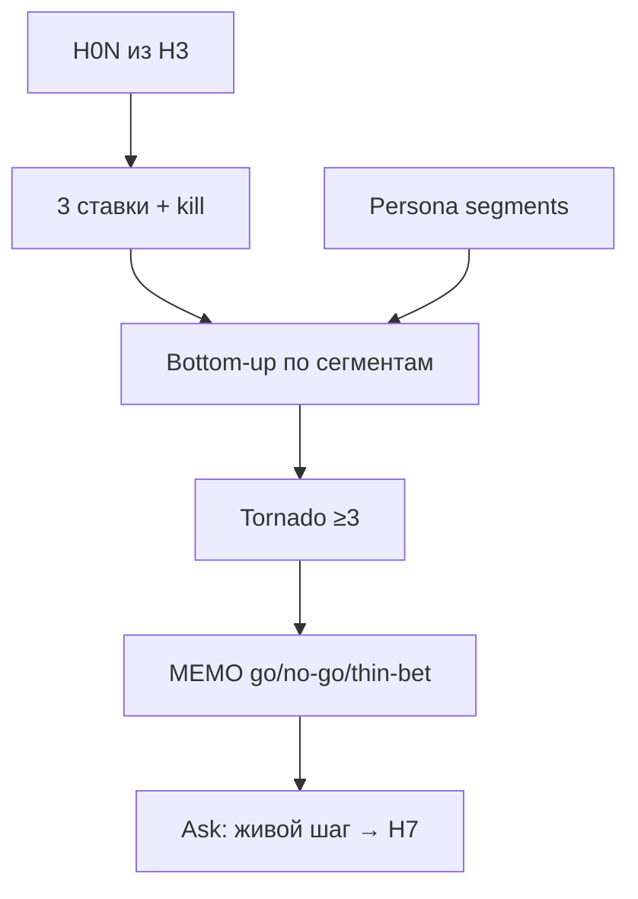

# Слайды · Н4 · AI-ставки, sizing, tornado → S3

> Markdown-колода для paste в Google Slides / Marp / Pitch. Один слайд = блок между `---`.
> Источники: `lecture.md`, `lesson-outline.md`, playbook §Н4.

---

# Н4 · Ставки / sizing / S3

- Куда ставим внимание и деньги процесса
- Не фича в бэклоге — цена ошибки + опцион
- Bottom-up · tornado · memo → **S3**

<!-- Notes: На Н3 — контракты X→Y→Z. Сегодня: harness, n8n, SUL-претест, живой шаг. -->

---

# Цели занятия

- Ровно **3 AI-ставки** + kill на каждой
- Strategy memo: go / no-go / thin-bet
- **S3:** bottom-up ≥3 сегмента + tornado ≥3
- Связь ставка ↔ H0N ↔ персона

<!-- Notes: Фраза на доску: чувствительность важнее абсолюта; не рынок $10B из блога. -->

---

# Повестка (~90 мин)

- 0–10 · Разбор ставок · rate limit
- 10–40 · Live memo Ритм + bottom-up
- 40–65 · Tornado на доске / в MD
- 65–85 · Связка ставка ↔ H ↔ персона
- 85–90 · Мост к практике

<!-- Notes: Playbook A 10′ ставки · B 20′ bottom-up+tornado · C 5′ границы §3.4. -->

---

# Фраза на доску

> **Чувствительность важнее абсолюта**

- Не рынок $10B из блога
- Sizing на синтетике = чувствительность
- `inconclusive` — нормальный исход

<!-- Notes: SSR / synthetic intent ≠ purchase. Napkin ≠ McKinsey-отчёт. -->

---

# Ставка ≠ фича

- «Добавим AI-чат» — фича
- «Агент претестит две копии до трафика, человек читает REPORT» — ставка
- Формат: *ставим X, потому что Y, убьём если Z*

<!-- Notes: Обязательны: глагол+объект, H__, цена ошибки, kill, контур (harness/n8n/SUL/человек). -->

---

# Ровно три, не тридцать

- Чтобы был выбор и был **kill**
- Все три «go на полную автономию» = не думали
- Одну из трёх на демо **убиваем при всех**

<!-- Notes: Rate limit: выкинуть «GPT для всего». Плохая ставка для red-team: «AI напишет весь маркетинг». -->

---

# Демо · 3 ставки Ритма

| # | Ставка | Вердикт |
|---|---|---|
| 1 | Претест копий (H02) в SUL | thin-bet |
| 2 | Агент-дайджест метрик → человек | go |
| 3 | Полная автономия ship | **kill сейчас** |

<!-- Notes: Класс голосует kill на #3. Синтетика ≠ живой АБ — §3.4. -->

---

# Свой продукт · bets.md

- Глагол + объект
- Связь с **H__** из Н3
- Цена ошибки · kill-критерий
- Контур: harness / n8n / SUL / человек

<!-- Notes: Ставка без H__ — Parallel Universe. Без kill — блокер memo. -->

---

# Bottom-up, не TAM

- Сегмент из банка → reach → conv proxy → WTP/ARPU
- Метки: assumption / desk / live
- Потом tornado — не сверху вниз из блога

<!-- Notes: Failures playbook: TAM сверху вниз; нет kill; tornado без source. -->

---

# Ритм · napkin (teaching)

- Reach 50k → trial 8% → paid 4% → ×299₽
- ≈ **47 840₽** / мес (сценарий)
- Произнесите вслух: это napkin, **не** прод БД

<!-- Notes: Копируете форму. Цифры reach/trial — свои или честно assumption. Не выдавать 50k/8%/4% как факт студенческого продукта. -->

---

# Tornado ≥3 допущения

- Reach ±50% · trial ±3pp · price 199/299/499
- Крутим **по одному** · смотрим, куда качается итог
- Туда — живое исследование первым

<!-- Notes: На Ритме: столбик trial длиннее столбика price → креатив/онбординг раньше прайсинга. -->

---

# Цепочка недели · S3

<!-- Notes: Единственный mermaid. Tornado без колонки source — декоративная таблица. -->

---

# Memo · go / no-go / thin-bet

- 1–2 страницы · контекст ICP
- Вердикт по каждой ставке + bet-size
- Bottom-up + tornado top-3
- Абзац: что решили / чего **не** решили бы

<!-- Notes: Ask ≠ «поверьте симуляции». Ask = бюджет на живой тест после SUL. -->

---

# Связка ставка ↔ H ↔ персона

- Ставка → H_id → segment ids
- Персоны без сегмента в sizing — воздух
- Голосование: kill #3-паттерн «AI везде»

<!-- Notes: Таблица на доске. Price-first при слабом trial — показать tornado снова. -->

---

# Границы · §3.4

- SSR / синтетика = **intent proxy**
- Thin-bet ≠ замена живого АБ при трафике
- Ship / kill — не по одной синтетике

<!-- Notes: Скрипт C ~5′. Не обещать, что претест заменяет live. -->

---

# Анти-паттерны

- TAM сверху вниз → bottom-up от банка
- Нет kill → блокер memo
- Ставки без H0N → вернуть к Н3
- Tornado без source → дописать колонку

<!-- Notes: Не тянуть цифры из private clouds. Не выдавать napkin Ритма как прод. -->

---

# Практика недели · CTA

Открыть [`student-brief.md`](./student-brief.md):

1. **A** ровно 3 ставки в `bets.md`  
2. **B** `MEMO.md` + абзац границ  
3. **C** S3 sizing + tornado + decision stub  
4. **D** опц. n8n QA · **E** SSR abstract  

<!-- Notes: Кто принесёт TAM из блога без сегментов — развернём на ревью. -->

---

# Что сдать · S3

- `strategy/bets.md` · ровно 3 + kill
- `strategy/MEMO.md` · go/no-go/thin-bet
- `strategy/tornado.md` · ≥3 · колонка source
- Таблица ставка → H → segment ids

<!-- Notes: Harness ≥1: bets/MEMO/tornado как файлы в git, не «чат с итогом». -->

---

# На следующей неделе · Н5

- Дерево метрик: NS → драйверы → рычаги
- Unit economics · 3 сценария
- Агент считает — **человек калибрует**
- Tornado Н4 → вход в unit · мост к S4

<!-- Notes: Не копировать числа Ритма в свой продукт. DEFINITIONS first. -->

---

# Вопросы · старт практики

- Есть ли kill на каждой из трёх?
- Bottom-up от своих сегментов?
- Что длиннее в tornado: trial или price?

<!-- Notes: Повторить: чувствительность важнее абсолюта. -->
