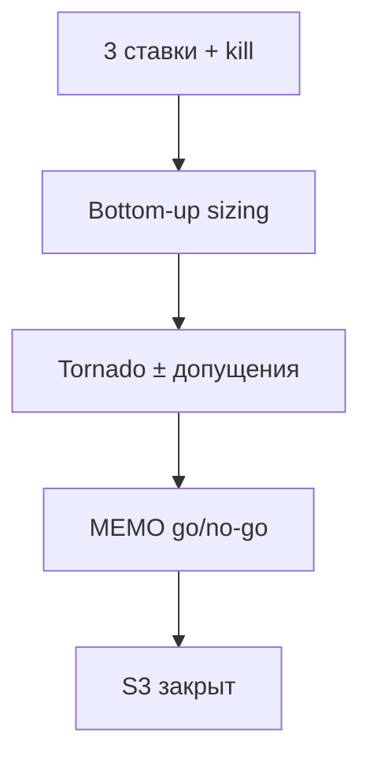

# Н4 · Student brief — ставки, sizing, tornado (S3)

Практика **4–6 ч**. Сдача: `strategy/MEMO.md` + `strategy/bets.md` + заполненный tornado + sizing sheet.

Схема sizing: [`lesson-outline.md`](./lesson-outline.md) · шаблон [`../sul/templates/market-tornado.md`](../sul/templates/market-tornado.md).

---

## A. Три ставки

В `strategy/bets.md` ровно **3** ставки:

| Поле | Требование |
|---|---|
| Название | глагол + объект («агент претестит лендинг до живого трафика») |
| Связь с H__ | id гипотез |
| Цена ошибки | что потеряем, если ставка ложна |
| Kill-критерий | когда сворачиваем |
| Контур | harness / n8n / SUL / человек-приёмка |

Антипаттерн: «используем GPT для всего».

---

## B. Strategy memo

`strategy/MEMO.md` (1–2 стр.):

1. Контекст ICP (ссылка на research).  
2. Рекомендация: **go / no-go / thin-bet** по каждой ставке.  
3. Bottom-up: сегмент → reach → conv proxy → revenue/impact proxy.  
4. Tornado: топ-3 чувствительных допущения.  
5. Обязательный абзац: что решили бы / чего **не** решили бы по синтетике.  
6. Следующий живой шаг.

Шаблон чисел: [`../sul/templates/market-tornado.md`](../sul/templates/market-tornado.md) → ваш `strategy/tornado.md`.

---

## C. S3 Market eval

1. Возьмите ≥3 сегмента из банка персон.  
2. Для каждого: оценка размера (источник + метка assumption/desk/live).  
3. Конверсия/WTP-proxy: откуда взяли (опрос, аналог, LLM — пометить).  
4. Базовый сценарий + tornado (±% по 3 допущениям).  
5. Decision memo stub: [`../sul/templates/decision-memo-stub.md`](../sul/templates/decision-memo-stub.md) для главной ставки.

---

## D. n8n (опционально усиление)

Webhook/Manual: JSON допущений → LLM проверяет полноту tornado-таблицы → комментарий в `runs/n8n/tornado-qa.md`.

---

## E. Чтение

1. Abstract [SSR](https://arxiv.org/abs/2510.08338) (purchase intent).  
2. README [synthetic-market-research](https://github.com/BayramAnnakov/synthetic-market-research) — идеи пайплайна, не копипаст кода обязательно.  
3. Опц. RU: [ИИ-агенты как продукт](https://www.youtube.com/watch?v=Ieq8cY0UcHo).

---

## Критерии

[`checklist.md`](./checklist.md).
