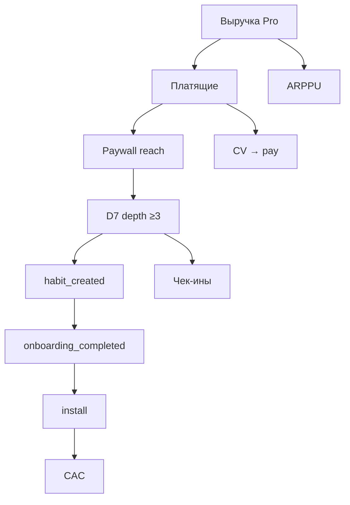

# Н5 · Дерево метрик, unit, калибровка

| Поле | Значение |
|---|---|
| **Неделя** | 5 · live ~90 мин + практика 4–6 ч |
| **Тема** | Дерево метрик → unit economics → 3 сценария · ритуал «агент считает, человек калибрует» · дожим S3 · мост к S4 |
| **Harness** | ≥1: DEFINITIONS/tree/unit/scenarios/CALIBRATION на диск; агент не меняет DEFINITIONS без diff |
| **n8n** | Ядро уже есть (#1–#2); на Н5 фокус — числа и калибровка (digest метрик — намёк на #3 / Н6) |
| **SUL** | Дожим **S3**; метрики Z из гипотез → узлы дерева или явно «вне дерева (претест)» → мост **S4** |
| **Демо** | Эталон [`instructor/rhythm-exemplars/04-metrics-tree-unit-sheet.md`](../instructor/rhythm-exemplars/04-metrics-tree-unit-sheet.md) |
| **Сдача** | Свои числа (live или assumption); **не** копировать napkin Ритма |

---

## Цели

1. Построить **дерево своего продукта**: North Star → драйверы → рычаги; стрелки = гипотезы влияния (H__).
2. Собрать **unit-модель** на одну единицу (user / order / seat): вклад, затраты, payback-proxy или честный `UNKNOWN` + план замера.
3. Прогнать **3 сценария** (base / upside / downside); человек калибрует **≥2 числа** и пишет `CALIBRATION.md`.
4. Не пересказывать курс аналитики с нуля — шпаргалка prior repos + ритуал калибровки.

Фраза на доску: *DEFINITIONS first. Агент считает — человек отвечает за цифру.*

---

## Повестка с таймингом

| Мин | Блок | Что говорите / делаете |
|---|---|---|
| 0–10 | Определения | Что путают: retention window, D7 vs depth≥3, дедуп, live vs assumption |
| 10–40 | Live дерево + unit Ритма | Эталон 04 на демо-числах; узкое место habit→depth ~27% |
| 40–60 | Калибровка | Агент «нашёл» CAC → человек ломает/чинит DEFINITIONS → CALIBRATION |
| 60–80 | Workshop | Студент вставляет свой NS в каркас дерева (старт pack) |
| 80–90 | Мост S3→S4 | Tornado Н4 ↔ unit; какая Z = success event претеста (≠ NS) |
| — | Практика 4–6 ч | DEFINITIONS → tree → unit → scenarios → калибровка ≥2 |

---

## Нарратив занятия

### Контекст

«Н4 дала чувствительность допущений. Сегодня те же числа сажаем на **дерево** и на **одну единицу экономики**. Без DEFINITIONS любое “LTV выросло” — галлюцинация с уверенным тоном. Мы не читаем полный курс LTV/CAC заново: у кого был itmo-product-analytics / Ритм М1.3 — освежите шпаргалку. Здесь экзамен на **дисциплину**: формула, окно, дедуп, источник — до расчёта.»

### Concepts — DEFINITIONS, дерево, unit, калибровка

**DEFINITIONS first.** Скажите: «Таблица: метрика → формула → окно → дедуп → источник (live / assumption / desk). Агент **не имеет права** менять строку без вашего diff. Если CAC не определён — пишете UNKNOWN и план замера. Выдуманный CAC “для красоты” хуже дырки.»

**Дерево.** «North Star наверху. Под ним 4–8 **input**-драйверов. Ниже рычаги: продукт / канал / монетизация. Каждая стрелка — гипотеза влияния; где пересекается с портфелем Н3 — ставите H__. Плоский список KPI без стрелок — не дерево. Узкое место ищите там, где воронка ломается, не там, где удобно крутить цену.»

**Z на дереве.** «Метрика Z из гипотезы либо **узел** дерева, либо явно помечена: *вне дерева — success претеста*. Пример Ритма: D7 depth — кандидат NS; success H02 на лендинге — intent/pay proxy, это не depth. Не смешивайте в одном предложении.»

**Unit.** «Одна единица ценности: paying user / month, заказ, seat — выберите одно. Минимум: revenue proxy на единицу, переменные затраты, contribution margin proxy. CAC/payback — если нет данных, секция UNKNOWN + как замерите. Связь с tornado Н4: те же допущения, что качали, должны быть узнаваемы.»

**Три сценария.** «Downside / base / upside по 1–2 ключевым драйверам. “Что должно быть верно”, чтобы сценарий случился. Красный флаг: агент “улучшил LTV×3” без новой строки в DEFINITIONS.»

**Ритуал калибровки = evals-lite для чисел.** «(1) Даёте DEFINITIONS + tree + допущения. (2) Просите таблицу трёх сценариев. (3) Ломаете ≥2 числа руками. (4) Пишете в CALIBRATION, что агент завысил/занизил и почему. Без лога калибровки сценарии не зачёт.»

### Examples — Ритм (эталон 04) словами

Откройте эталон. Говорите спокойно, без пафоса «у нас идеальная аналитика»:

«NS-кандидат Ритма: Weekly Active Habit Keepers / фактически дисциплина вокруг **D7 depth ≥3**. Определения: install; onboarding_completed; habit_created; D1 check-in (≥1 check_in за 24ч после habit); D7 depth≥3 (≥3 check-ins в разные дни за 7д); paywall view; New Pro (первая оплата, окно 14д от habit для CV); CAC = стоимость одного install — **учебный**; ARPPU с явным mix периода.

Дерево сверху вниз: Выручка Pro → платящие × ARPPU; платящие ← paywall reach × CV; reach ← depth; depth ← habit + чек-ины; habit ← onboarding ← install ← CAC. Рычаги: онбординг, напоминания, timing paywall (H01), benefit-copy (H02), короткий онбординг (H03).

Узкое место демо: habit → depth ≥3 ≈ **27%**. Paywall reach часто больше depth = давление до value. Вывод для класса: чинить depth/онбординг раньше прайсинга — это же вывод tornado Н4, только теперь на дереве.

Unit sheet, волна 10k install (napkin M1.3): onboarding 72% → habit 75% of onb → depth 27% → New Pro ~380 на base; CAC 45₽/install teaching; first payment mix napkin ~806₽; margin 85% teaching. Произнесите: *не прод БД*.

Сценарии: depth 20 / 27 / 35% → New Pro ~280 / 380 / 500. Downside фокус — упростить онбординг + late paywall; upside — + benefit copy после depth.

Калибровка live: попросите агента “найти CAC”. Подставьте или покажите выдуманный CAC без строки DEFINITIONS. Студенты должны остановить и записать в CALIBRATION.»

### Anti-patterns

- Дерево = плоский список KPI без иерархии и стрелок.
- Сценарии без DEFINITIONS — блокер.
- Скопированные 27%, 10k, 45₽, 380 из Ритма в чужой продукт.
- «Нет данных» → пустой файл вместо assumptions + plan.
- Выдуманный CAC как демонстрация rigor — наоборот, анти-пример.
- Путать D7 retention window и depth≥3 в одном предложении без определений.
- Считать success претеста H02 равным NS продукта.

---

## Демо-биты: свой продукт vs Ритм

| Beat | Ритм (instructor) | Свой продукт (студент) |
|---|---|---|
| NS 5′ | WAHK / D7 depth ≥3 + окно | Свой NS в `metrics/DEFINITIONS.md` |
| Драйверы 10′ | D1, D7 depth, paywall view→pay | 4–8 своих драйверов |
| Рычаги 5′ | онбординг, цена, напоминания, H01–H03 | продукт / канал / монетизация + H__ |
| Unit 10′ | paying user / month; волна 10k napkin | одна единица ценности; свои rates |
| Калибровка 15′ | нарочный hallucinated CAC | ≥2 ручных правки → `CALIBRATION.md` |
| Мост S4 5′ | H02 success ≠ D7 depth; primary = intent/pay proxy | Каждая Z: на дереве или явно «вне (претест)» |
| Workshop 60–80 | каркас mermaid на доске | Студент вписывает свой NS в тот же каркас |

Повторите: «Паттерн дерева — да. Числа Ритма — нет.»

---

## Доска / mermaid

### 1. Ритуал чисел

### 2. Дерево Ритма (эталон; на доске упрощайте)

Рядом таблица сценариев: Depth 20/27/35% → New Pro ~280/380/500. Подчеркните узкое место ~27%.

---

## Переход к практике недели → student-brief.md

«После моста S3/S4: дома по [`student-brief.md`](./student-brief.md) — **A** DEFINITIONS → **B** tree.md → **C** unit.md → **D** scenarios.md → калибровка ≥2 в CALIBRATION. Числа свои. Workshop 60–80 уже стартовал pack: кто ушёл с пустым NS — добьёт в brief. Критерии — [`checklist.md`](./checklist.md). На Н6 тот же продукт получит rich context pack и дизайн pretest protocol; сегодняшние DEFINITIONS станут анти-галлюцинационным слоем.»

---

## Не говорить / типичные ловушки

**Не говорить**

- Полная лекция LTV/CAC с нуля на 40 минут — только шпаргалка + калибровка.
- «Вот правильный CAC Ритма, скопируйте» — нет.
- Продавать выдуманный CAC как признак зрелости модели.
- Обещать, что дерево само «докажет» ship.

**Типичные ловушки**

| Симптом | Реакция |
|---|---|
| Список KPI без связей | Требовать стрелки + H__ |
| Сценарии без DEFINITIONS | Блокер |
| Числа Ритма в сдаче | Вернуть к своему продукту |
| «Нет данных» → пусто | Assumptions + plan замера |
| D7 vs depth≥3 в каше | Развести две строки DEFINITIONS |
| Success претеста = NS | Пометить Z «вне дерева» |

---

## Приложение: глоссарий EN

| Термин | Как используем |
|---|---|
| **North Star (NS)** | Главная продуктовая метрика с окном и дедупом |
| **input metrics** | Драйверы под NS |
| **unit economics** | Модель на одну единицу ценности |
| **contribution margin** | Вклад после переменных (proxy ok) |
| **CAC** | Cost to acquire (install/user) — только из DEFINITIONS |
| **payback** | Окупаемость CAC; иначе UNKNOWN |
| **ARPPU** | Average revenue per paying user |
| **LTV** | На курсе — napkin only, с оговорками |
| **base / upside / downside** | Три сценария |
| **evals-lite** | Лёгкая приёмка; для чисел = калибровочный лог |
| **calibration** | Ручная правка ≥2 чисел + запись почему |
| **DEFINITIONS** | Контракт формул до расчёта |
| **harness** | Где живут metrics/* файлы |
| **S3 / S4** | Sizing/tornado дожим · pretest впереди |
| **live / assumption / desk** | Метки источника |
| **depth / retention window** | Не путать без DEFINITIONS |
| **intent proxy** | Success претеста ≠ NS |
