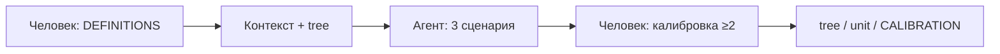

# Слайды · Н5 · Дерево метрик, unit, калибровка

> Markdown-колода для paste в Google Slides / Marp / Pitch. Один слайд = блок между `---`.
> Источники: `lecture.md`, `lesson-outline.md`, playbook §Н5.

---

# Н5 · Дерево / unit / калибровка

- Числа с Н4 сажаем на дерево и unit
- Без DEFINITIONS «LTV выросло» — галлюцинация
- Ритуал: агент считает · человек отвечает за цифру

<!-- Notes: Не читаем полный курс LTV/CAC заново — шпаргалка prior repos + дисциплина формул. -->

---

# Цели занятия

- Дерево: North Star → драйверы → рычаги (+ H__)
- Unit на одну единицу · 3 сценария
- Человек калибрует ≥2 числа → `CALIBRATION.md`
- Мост Z → success event для **S4**

<!-- Notes: Фраза на доску: DEFINITIONS first. Агент считает — человек отвечает за цифру. -->

---

# Повестка (~90 мин)

- 0–10 · Определения (окна, дедуп, live vs assumption)
- 10–40 · Live дерево + unit Ритма
- 40–60 · Калибровка: агент врёт CAC
- 60–80 · Workshop: свой NS в каркас
- 80–90 · Мост S3 → S4

<!-- Notes: Playbook A 15′ дерево · B 15′ unit+калибровка · C 5′ мост S4. -->

---

# Фраза на доску

> **DEFINITIONS first.**  
> **Агент считает — человек отвечает за цифру.**

- Формула · окно · дедуп · источник — до расчёта
- Агент не меняет DEFINITIONS без вашего diff

<!-- Notes: Выдуманный CAC «для красоты» хуже дырки UNKNOWN + план замера. -->

---

# DEFINITIONS first

| Поле | Зачем |
|---|---|
| Формула | Что считаем |
| Окно | За какой период |
| Дедуп | По какому id |
| Источник | live / assumption / desk |

<!-- Notes: Путают: retention window vs D7 depth≥3. Развести две строки. -->

---

# Дерево метрик

- **NS** наверху · 4–8 input-драйверов
- Ниже рычаги: продукт / канал / монетизация
- Каждая стрелка = гипотеза влияния (H__)
- Плоский список KPI — **не** дерево

<!-- Notes: Узкое место — где воронка ломается, не где удобно крутить цену. -->

---

# Z на дереве или вне

- Z из гипотезы = **узел** дерева
- Или явно: *вне дерева — success претеста*
- Не смешивать intent/pay proxy и NS в одном предложении

<!-- Notes: Ритм: D7 depth — кандидат NS; success H02 на лендинге — intent proxy ≠ depth. -->

---

# Демо · Ритм vs свой продукт

| Beat | Ритм | Свой продукт |
|---|---|---|
| NS | D7 depth ≥3 / WAHK | свой NS в DEFINITIONS |
| Узкое место | habit→depth ≈27% | своя воронка |
| Unit | paying user / month | своя единица |

<!-- Notes: Паттерн дерева — да. Числа Ритма (27%, 10k, 45₽, 380) — нет. -->

---

# Ритм · дерево (паттерн)

- Выручка Pro ← платящие × ARPPU
- Платящие ← paywall reach × CV
- Reach ← depth ← habit ← onboarding ← install
- Рычаги: H01 timing · H02 copy · H03 onb

<!-- Notes: Paywall reach часто больше depth = давление до value. Чинить depth раньше прайсинга — тот же вывод tornado Н4. -->

---

# Unit · одна единица

- Выберите: paying user / order / seat
- Revenue proxy · переменные затраты · margin proxy
- CAC / payback — или честный **UNKNOWN** + план
- Связь с tornado Н4: те же допущения узнаваемы

<!-- Notes: Лучше честный gap, чем выдуманный CAC. -->

---

# Три сценария

- Downside / base / upside по 1–2 драйверам
- «Что должно быть верно», чтобы сценарий случился
- Красный флаг: LTV×3 без новой строки DEFINITIONS

<!-- Notes: Ритм teaching: depth 20/27/35% → New Pro ~280/380/500. Не копировать в сдачу. -->

---

# Ритуал калибровки

<!-- Notes: Evals-lite для чисел = калибровочный лог. Без лога сценарии не зачёт. -->

---

# Live · агент врёт CAC

- Просим агента «найти CAC»
- Показываем выдуманный CAC без строки DEFINITIONS
- Студенты останавливают → пишут в `CALIBRATION.md`
- Что завысил / занизил и **почему**

<!-- Notes: Скрипт B. Failures: KPI-список без связей; скопированы числа Ритма. -->

---

# Workshop · свой NS

- Вставить свой North Star в каркас дерева
- 4–8 драйверов · рычаги + H__
- Кто ушёл с пустым NS — добьёт в brief

<!-- Notes: 60–80′. Старт pack на занятии; дома — полный pack. -->

---

# Мост к S4

- Tornado Н4 ↔ unit (те же допущения)
- Какая Z = **success event** претеста?
- Success претеста ≠ North Star продукта
- Пометить Z: на дереве или «вне (претест)»

<!-- Notes: Скрипт C ~5′. На Н6 — bare vs rich + дизайн pretest protocol. -->

---

# Анти-паттерны

- Дерево = список KPI без стрелок
- Сценарии без DEFINITIONS → блокер
- Числа Ритма в чужом продукте → вернуть
- «Нет данных» → пусто вместо assumptions + plan

<!-- Notes: Не продавать выдуманный CAC как зрелость. Не обещать, что дерево «докажет» ship. -->

---

# Практика недели · CTA

Открыть [`student-brief.md`](./student-brief.md):

1. **A** `DEFINITIONS.md`  
2. **B** `tree.md` · **C** `unit.md`  
3. **D** `scenarios.md` · калибровка ≥2  

<!-- Notes: Числа свои (live или assumption). Не копировать napkin Ритма. -->

---

# Что сдать

- DEFINITIONS · tree · unit · scenarios
- `CALIBRATION.md` · ≥2 ручные правки
- Каждая Z: узел или «вне дерева (претест)»
- Дожим S3 при необходимости

<!-- Notes: Harness: агент не меняет DEFINITIONS без diff. -->

---

# На следующей неделе · Н6

- Bare vs rich context pack
- n8n flow #3 (намёк digest метрик)
- Дизайн **S4** pretest protocol
- Сегодняшние DEFINITIONS = анти-галлюцинационный слой

<!-- Notes: Тот же продукт; rich pack поверх дисциплины чисел. -->

---

# Вопросы · старт практики

- NS определён с окном и дедупом?
- Где узкое место на дереве?
- Какие ≥2 числа сломаете руками?

<!-- Notes: Повторить: DEFINITIONS first. Агент считает — человек отвечает за цифру. -->
