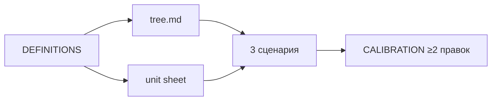

# Н5 · Student brief — дерево, unit, 3 сценария

Практика **4–6 ч**. Сдача: `metrics/tree.md` + `metrics/unit.md` + `metrics/scenarios.md` (или один spreadsheet + README).

Числа — **свои** (факт или честные допущения с метками). Ритм не копировать.

Spreadsheet-шаблон (CSV → Excel/Sheets): [`../sul/templates/unit-sheet/`](../sul/templates/unit-sheet/).

Ритуал «агент считает → человек калибрует»: [`lesson-outline.md`](./lesson-outline.md).

---

## A. Определения сначала

В `metrics/DEFINITIONS.md`:

| Метрика | Формула | Окно | Дедуп | Источник |
|---|---|---|---|---|
| North Star | | | | live/assumption |
| … | | | | |

Агент **не имеет права** менять определения без вашего diff в этом файле.

---

## B. Дерево

`metrics/tree.md` (можно mermaid):

1. NS наверху.  
2. 4–8 драйверов.  
3. Рычаги (продукт / канал / монетизация).  
4. Ссылки на H__ там, где дерево пересекается с гипотезами.

---

## C. Unit economics

`metrics/unit.md` на **одну** единицу ценности (user / org / заказ):

- Выручка на единицу (proxy ok).  
- Переменные затраты.  
- Contribution margin proxy.  
- CAC / payback — если нет данных: секция `UNKNOWN` + план замера.  
- Связь с tornado Н4 (какие допущения те же).

---

## D. Три сценария

`metrics/scenarios.md`:

| | Downside | Base | Upside |
|---|---|---|---|
| Ключевой драйвер 1 | | | |
| … | | | |
| Итог (NS или margin) | | | |
| Что должно быть верно | | | |

Протокол с агентом:

1. Дайте DEFINITIONS + tree + допущения.  
2. Попросите посчитать 3 сценария в таблицу.  
3. **Калибровка:** измените ≥2 числа вручную; запишите в `metrics/CALIBRATION.md`, что агент завысил/занизил.

---

## E. Чтение

Шпаргалки из `itmo-product-analytics` (метрики/юнит) · Ритм unit как *паттерн* · pm-skills analytics README.

---

## Критерии

[`checklist.md`](./checklist.md).

<!-- week-nav -->
---

**Навигация:** [← Н4](../week-04/) · [Н5 индекс](./README.md) · [Н6 →](../week-06/) · [курс](../README.md) · [SUL](../sul/)

