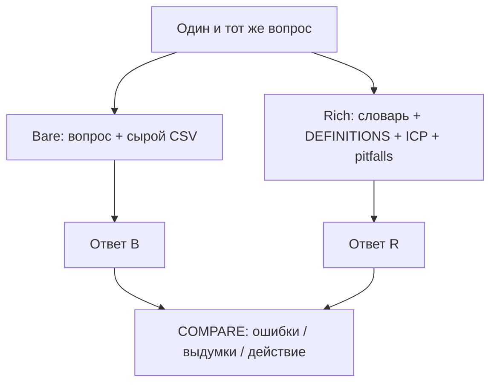

# Н6 · Аналитика с агентом: bare vs rich → старт S4

| Поле | Значение |
|---|---|
| **Неделя** | 6 · ~90 мин live + практика по `student-brief.md` |
| **Тема** | Rich context pack vs bare chat+CSV; n8n schedule digest; дизайн протокола pretest S4 |
| **Демо** | Ритм на экране instructor; сдача — только свой продукт |
| **Эталон** | `docs/course/instructor/rhythm-exemplars/05-bare-vs-rich-context-pack.md` |
| **Harness** | ≥1 рабочий harness + n8n flow #3 |
| **SUL** | Мост S3→S4; полный N — Н7 |

---

## Цели

1. Собрать `context/` pack под **свой** продукт: PRODUCT_CONTEXT, data dictionary, pitfalls, links.
2. Прогнать **один** аналитический вопрос в режимах bare и rich и зафиксировать разницу в `COMPARE.md`.
3. Настроить n8n flow #3: schedule → digests в `runs/n8n/`.
4. Заполнить дизайн pretest protocol (N plan, seed, between-subject); полный прогон N≥50 — на Н7.

---

## Повестка с таймингом

| Мин | Блок | Что делаем |
|---|---|---|
| 0–15 | Bare fail | Ритм: вопрос без контекста → выдуманные причины |
| 15–45 | Rich pack | Тот же вопрос + context → калибровка человека |
| 45–65 | Workshop | Каркас своего `context/` |
| 65–80 | n8n #3 | Schedule digest → артефакт в git |
| 80–90 | Protocol S4 | Разбор template; smoke опционально |

---

## Нарратив занятия

### 0–15 · Bare fail: агент без опоры

Откройте занятие прямо: «На прошлой неделе у вас появились DEFINITIONS и дерево. Сегодня агент впервые работает как аналитик — и мы покажем, где он врёт, если ему дать только таблицу».

На экране — вопрос Ритма из эталона 05: *«Почему paywall conversion просел на прошлой неделе?»* Рядом короткая таблица без словаря:

| week | paywall_views | pays |
|---|---|---|
| W-2 | 420 | 38 |
| W-1 | 410 | 36 |
| W0 | 405 | 22 |

Новый чат. Без PRODUCT_CONTEXT. Без DEFINITIONS. Без календаря релизов. Скажите классу вслух: «Сейчас агент будет *уверенно* отвечать. Ваша задача — ловить галлюцинации».

Типичный провал (покажите или дождитесь): «баг iOS 18» — в таблице нет `platform`; «выросла цена» — цены нет; «сезонность августа» — нет календаря. Остановитесь и зафиксируйте принцип: агент заполняет дыры правдоподобным нарративом. Это не «глупый GPT» — это отсутствие **join keys**, окон и запретов.

Сохраните сырой ответ как демо `analysis/bare.md`. Скажите: «Bare — это не грех. Грех — принимать bare-ответ за расследование».

### 15–45 · Rich pack: тот же вопрос, другая дисциплина

Переключитесь: «Rich — не длинный промпт в чате. Rich — файлы в git, которые переживают сессию». Откройте эталон `05-bare-vs-rich-context-pack.md` и пройдитесь по слоям:

1. **PRODUCT_CONTEXT** — что такое Ритм (habit freemium→Pro), NS (D7 depth≥3), сегменты, табуированные выдумки («не выдумывать события вне tracking», «не ship по синтетике»).
2. **data-dictionary** — `user_id`, `event_name`, `ts`, опциональный `platform`, `experiment_id` / `variant`. Поле, которого нет в словаре, агенту запрещено «находить».
3. **pitfalls** — минимум пять: путает D7 retention и depth≥3; склеивает недели до/после релиза онбординга; выдумывает platform split; ARPU вместо ARPPU; игнорирует early paywall share как guardrail.
4. **links** — пути к DEFINITIONS Н5, ICP, H02, `SYNTHETIC-DATA-NOTICE`.

Добавьте CSV/таблицу-заглушку с явной строкой релиза онбординга на старте W0. Повторите **тот же** вопрос с подключением pack. Ожидаемый сдвиг: агент отказывается от platform-причины, просит словарь, предлагает проверить overlap с релизом.

Калибровка человека — обязательный ритуал: «недели несравнимы — релиз онбординга». Напишите live `COMPARE.md` в пять строк эталона:

1. Bare выдумал iOS-баг.  
2. Rich потребовал dictionary → отказался от platform.  
3. Rich предложил проверить overlap с релизом.  
4. Оба не знают креатив канала — дыра.  
5. Вердикт человека: расследовать релиз + guardrail early PW; **не** крутить цену.

Произнесите трезво: «Rich снижает галлюцинации. Rich **не** отменяет смещение синтетики и не заменяет живые данные. Это AgentA/B-трезвость из stats-ab 4.6: exploratory, не confirmatory».

### 45–65 · Workshop: свой pack

Остановите демо Ритма. «Ритм — паттерн на экране. Сдача — только свой продукт». Дайте каркас на 20 минут:

- Один вопрос (активация, paywall, retention — свой).  
- Черновик `PRODUCT_CONTEXT.md` на полстраницы.  
- Три поля в dictionary с join.  
- Пять pitfalls «агент обычно врёт так».  
- Links на свои DEFINITIONS / ICP / H__.

Обойдите ряд: если кто-то пишет «rich» одним мега-промптом без файлов — стоп. Файлы в репо или неделя не закрыта.

### 65–80 · n8n flow #3: digest как ритуал, не чат

Скажите: «Аналитика без расписания умирает в переписке. Flow #3 превращает снимок метрик в артефакт». Откройте `sul/n8n/flow-03-description.md` и JSON `flow-03-analytics-digest.json`.

Топология на словах: Schedule (или Manual) → normalize metrics + DEFINITIONS → LLM summary → write `runs/n8n/digest-metrics-<date>.md`. На сдаче достаточно одного ручного Execute с пометкой «schedule configured» в SUL README.

Покажите вход-заглушку (числа из STATUS/DEFINITIONS, не prod Metabase). Скажите жёстко: «Ключи только в UI n8n. Credentials Metabase Ритма на экране — запрет. Digest только в чате без файла в `runs/` — не засчитывается».

Человек = судья: digest может предложить три вопроса, но вердикт и действие пишет человек.

### 80–90 · Дизайн протокола S4 (полный N — Н7)

Откройте `sul/templates/pretest-protocol.md`. «S4 — не магия агентов. Это дизайн-док претеста в духе AgentA/B: between-subject, seed, один variant на агента, success = Z из вашей гипотезы».

Пройдите поля вслух: H id, A/B артефакт **своего** продукта, N целевое 50–100, seed, blind. Запреты: within-subject; «выбери лучший»; агент видит оба варианта.

Smoke 3–5 агентов на Н6 — опционально, в `runs/pretest/smoke/`. Устно можно показать идею: одна персона × два варианта лендинга Ритма **раздельно**, не в одном промпте. Полный N и REPORT — Н7. Smoke ≠ S4.

Закройте: «Дома — pack + bare/rich + COMPARE + digest + PROTOCOL. Числа и артефакты — свои».

---

## Демо-биты: свой продукт vs Ритм

| Beat | Ритм (instructor) | Студент |
|---|---|---|
| Вопрос | «Почему paywall conversion просел…?» | Один свой вопрос (напр. активация) |
| Bare | CSV без словаря → iOS / цена / сезон | `analysis/bare.md` |
| Rich | PRODUCT_CONTEXT + dictionary + pitfalls + links | весь `context/` → `rich.md` |
| COMPARE | 5 строк эталона 05 | свой вердикт человека |
| Digest | schedule → `runs/n8n/digest-metrics-*.md` | flow #3, 1× Execute ok |
| S4 старт | smoke устно / 1×2 | `PROTOCOL-H__.md`; dry-run опц. |

**Указатели:** эталон `instructor/rhythm-exemplars/05-bare-vs-rich-context-pack.md` · n8n `sul/n8n/flow-03-description.md` + `flow-03-analytics-digest.json` · protocol `sul/templates/pretest-protocol.md` · runner `sul/runners/README.md` (полный прогон — Н7).

---

## Доска / mermaid

**1. Bare vs rich (на доске или слайде):**

**2. n8n pipeline + поля protocol:** на второй половине доски — `Schedule → Read STATUS → LLM → Write digest`; рядом чеклист: between-subject · N 50–100 · seed · variants · success=Z.

COMPARE на доске пятью строками (iOS-баг · отказ от platform · релиз · дыра креатива · вердикт: релиз + guardrail, не цена).

---

## Переход к практике недели → student-brief.md

Скажите дословно: «Workshop 45–65 уже стартовал pack. Дома дожимаете по `week-06/student-brief.md`: A context pack · B bare/rich + COMPARE · C два сценария (funnel + themes) · D n8n #3 · E PROTOCOL на своей гипотезе. Полный N≥50 — на Н7; smoke не заменяет S4. Критерии — `checklist.md`».

---

## Не говорить / типичные ловушки

- Не светить prod credentials Metabase / API keys Ритма — только заглушки.
- Не обещать, что rich отменяет bias синтетики или заменяет живой АБ.
- Не принимать «rich» как длинный чат без файлов в git.
- Не ставить within-subject в protocol.
- Не засчитывать digest только в мессенджере.
- Блокер недели: нет `COMPARE.md`.
- Trap: путать visitor и user; D7 retention vs depth≥3; копировать текст Ритма в свой pack.

---

## Приложение: глоссарий EN

| Термин | Смысл на занятии |
|---|---|
| bare vs rich | Сырой вопрос+CSV vs pack с словарём и запретами |
| context pack | `context/` файлы в git под продукт |
| data dictionary | Поля, join keys, окна |
| join keys | Ключи склейки событий/сущностей |
| funnel snapshot | Срез воронки с окном и дедупом |
| feedback themes | Темы фидбека (desk/synth с меткой) |
| n8n schedule digest | Расписание → Markdown в `runs/n8n/` |
| pretest protocol | Дизайн-док S4 до полного N |
| between-subject | Один агент — один variant |
| seed | Фиксация воспроизводимости |
| dry-run / smoke | Малый прогон 3–5, не S4 |
| ICP | Сегмент целевого пользователя |
| pitfalls | Типовые галлюцинации агента |
