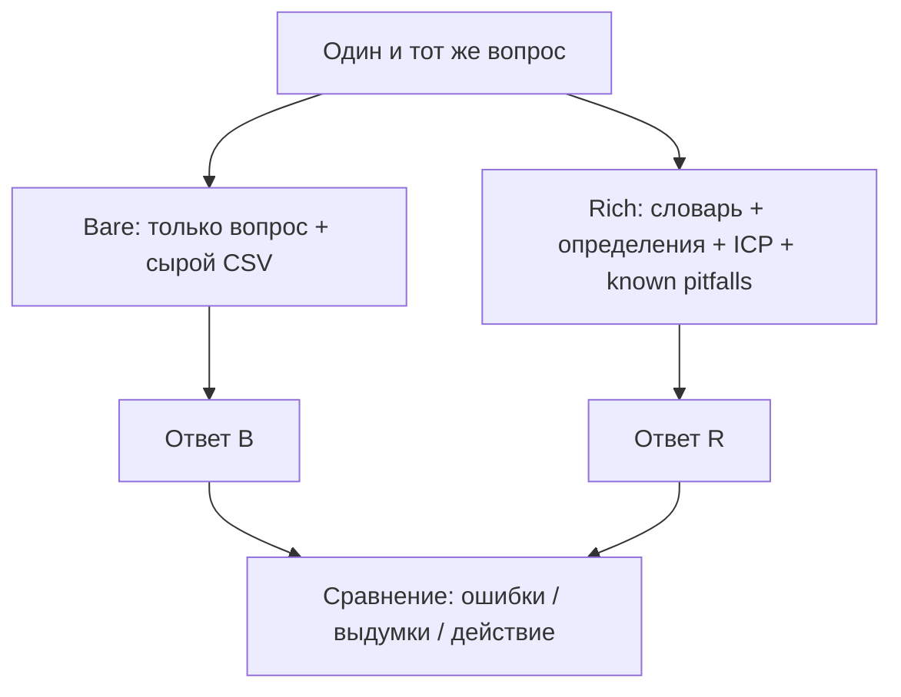

# Н6 · Lesson outline — Аналитика с агентом: bare vs rich → S4 старт

| Поле | Значение |
|---|---|
| **Неделя** | 6 · ~1,5 ч + 4–6 ч практика |
| **Артефакты** | Rich-пакет контекста · 2 сценария анализа · n8n schedule digest · **S4 старт** (протокол претеста) |
| **Демо instructor** | Bare vs rich на данных/файлах Ритма |

---

## Цели

1. Собрать **rich context pack** под свой продукт (не «просто чат с CSV»).  
2. Прогнать **один и тот же** аналитический вопрос в режимах bare и rich — сравнить качество.  
3. Настроить **n8n flow #3**: schedule → digests метрик/сигналов.  
4. Зафиксировать **протокол S4** (ещё без полного N=50–100 — старт дизайн).

---

## Теория коротко

### 1. Bare vs rich

Rich = PRODUCT_CONTEXT · data dictionary · DEFINITIONS · анти-паттерны («не путать visitor и user»).

### 2. Funnel + feedback

Агент помогает собрать воронку и темы фидбека; человек проверяет join keys и окна.

### 3. S4 старт

Прочитать [`../sul/templates/pretest-protocol.md`](../sul/templates/pretest-protocol.md); заполнить дизайн для одной гипотезы (variants, N plan, seeds). Полный прогон — Н7.

### 4. Границы

Rich-контекст снижает галлюцинации, не отменяет смещение синтетики.

---

## Тайминг

| Мин | Блок |
|---|---|
| 0–15 | Показать bare fail на Ритме (выдуманная метрика) |
| 15–45 | Rich pack Ритма → тот же вопрос |
| 45–65 | Студенты: структура своего pack |
| 65–80 | Schedule digest в n8n |
| 80–90 | Разбор pretest protocol |

---

## Materials

[`../materials-by-module.md`](../materials-by-module.md) §Н6 · Ритм PRODUCT_CONTEXT как паттерн.
