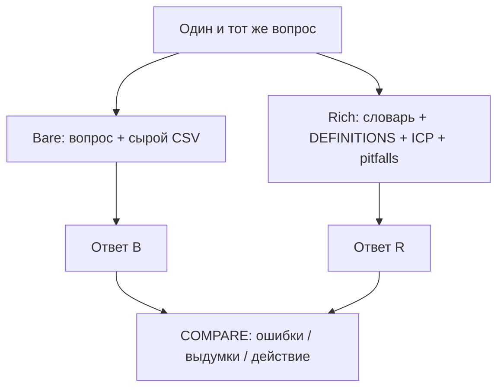

# Слайды · Н6 · Аналитика с агентом: bare vs rich → S4 старт

> Markdown-колода для paste в Google Slides / Marp / Pitch. Один слайд = блок между `---`.
> Источники: `lecture.md`, `lesson-outline.md`, playbook §Н6.

---

# Н6 · Bare vs rich → старт S4

- Rich context pack vs bare chat+CSV
- n8n flow #3: schedule → digest
- Дизайн протокола pretest (полный N — на Н7)
- Демо: Ритм · сдача: свой продукт

<!-- Notes: Открыть: «На прошлой неделе — DEFINITIONS и дерево. Сегодня агент впервые как аналитик — и мы покажем, где он врёт без опоры». -->

---

# Цели недели

- Собрать `context/` pack под **свой** продукт
- Один вопрос: bare vs rich → `COMPARE.md`
- n8n flow #3: digest в `runs/n8n/`
- Заполнить PROTOCOL; полный N≥50 — Н7

<!-- Notes: Четыре цели = четыре артефакта сдачи. Smoke ≠ S4. -->

---

# Повестка · ~90 мин

| Мин | Блок |
|---|---|
| 0–15 | Bare fail на Ритме |
| 15–45 | Rich pack + COMPARE |
| 45–65 | Workshop: свой `context/` |
| 65–80 | n8n #3 digest |
| 80–90 | Protocol S4 |

<!-- Notes: Тайминг playbook: A 10 / B 20 / C 10 + workshop. -->

---

# Демо-бит · Ритм vs свой продукт

- **Ритм (экран):** «Почему paywall conversion просел…?»
- **Вы:** один свой вопрос (активация / retention / paywall)
- Bare → `analysis/bare.md` · Rich → `context/` + `rich.md`
- COMPARE: 5 строк вердикта человека

<!-- Notes: Ритм — паттерн. Копировать текст Ритма в свой pack — trap. -->

---

# Bare fail · вопрос без опоры

- Таблица без словаря / DEFINITIONS / календаря
- Новый чат · без PRODUCT_CONTEXT
- Класс ловит галлюцинации вслух
- Bare ≠ грех · грех — принять за расследование

<!-- Notes: Таблица W-2/W-1/W0: 38→36→22 pays. Типичный провал: «баг iOS 18», «выросла цена», «сезонность». -->

---

# Что выдумывает агент

- «Баг iOS 18» — в таблице нет `platform`
- «Выросла цена» — цены нет
- «Сезонность августа» — нет календаря
- Принцип: дыры → правдоподобный нарратив

<!-- Notes: Это не «глупый GPT» — отсутствие join keys, окон и запретов. Сохранить сырой ответ как bare.md. -->

---

# Rich ≠ длинный промпт

- Rich = **файлы в git**, переживают сессию
- Не мега-промпт в чате
- Слои: PRODUCT_CONTEXT · dictionary · pitfalls · links
- Без файлов в репо — неделя не закрыта

<!-- Notes: Стоп, если кто-то пишет «rich» одним промптом. Failure mode playbook #1. -->

---

# Слои context pack

1. **PRODUCT_CONTEXT** — продукт, NS, сегменты, табу
2. **data-dictionary** — поля, join keys; нет в словаре → нельзя «найти»
3. **pitfalls** — ≥5 типовых галлюцинаций
4. **links** — DEFINITIONS, ICP, H__, SYNTHETIC notice

<!-- Notes: Ритм: habit freemium→Pro; NS = D7 depth≥3; табу: не выдумывать события вне tracking. -->

---

# Bare vs rich · одна схема

<!-- Notes: Единственный mermaid-слайд Н6. Нарисовать на доске, если проектор слабый. -->

---

# COMPARE · 5 строк эталона

1. Bare выдумал iOS-баг
2. Rich отказался от platform → спросил dictionary
3. Rich: проверить overlap с релизом онбординга
4. Оба не знают креатив канала — дыра
5. Вердикт человека: релиз + guardrail · **не** цена

<!-- Notes: Live на экране. Человек калибрует: «недели несравнимы — релиз онбординга». Блокер недели: нет COMPARE.md. -->

---

# Границы SUL · §3.4

- Синтетика ≠ живой трафик
- Rich снижает галлюцинации · **не** отменяет bias
- Exploratory, не confirmatory (AgentA/B-трезвость)
- Не ship / kill по одной симуляции

<!-- Notes: Держать видимым на каждом SUL-блоке. «Rich не заменяет живые данные». -->

---

# Workshop · свой pack (20 мин)

- Один аналитический вопрос своего продукта
- Черновик PRODUCT_CONTEXT (~½ стр.)
- 3 поля dictionary с join
- 5 pitfalls · links на свои DEFINITIONS / ICP / H__

<!-- Notes: Обойти ряд. Остановить копирование Ани/Ритма в B2B. -->

---

# n8n flow #3 · digest-ритуал

- Schedule (или Manual) → normalize → LLM → write
- Артефакт: `runs/n8n/digest-metrics-<date>.md`
- Ключи только в UI n8n · не в git
- Digest только в чате — **не засчитывается**

<!-- Notes: Показать flow-03. Вход-заглушка из STATUS/DEFINITIONS, не prod Metabase. 1× Execute + «schedule configured» ok. -->

---

# Digest · человек = судья

- Digest предлагает вопросы / темы
- Вердикт и действие пишет человек
- Числа из файлов-заглушек, не prod credentials
- Ритуал > разовый чат

<!-- Notes: Ops: не светить Metabase Ритма. Failure: schedule без артефакта в runs/. -->

---

# S4 design · protocol, не магия

- Template: `pretest-protocol.md`
- Between-subject · seed · один variant на агента
- Success = Z из вашей гипотезы
- N plan 50–100 · полный прогон — **Н7**

<!-- Notes: Запреты: within-subject; «выбери лучший»; агент видит оба варианта. Smoke 3–5 опц. ≠ S4. -->

---

# Поля PROTOCOL вслух

- H id · A/B артефакт **своего** продукта
- N целевое · seed · blind
- Variants: чем A≠B одной фразой
- Dry-run / smoke → `runs/pretest/smoke/`

<!-- Notes: Устно: 1 персона × 2 варианта лендинга Ритма раздельно. -->

---

# Ловушки недели

- Rich = длинный промпт без файлов → стоп
- Within-subject в protocol → исправить
- Schedule без файла в `runs/` → не зачёт
- Нет `COMPARE.md` → блокер

<!-- Notes: Trap: visitor vs user; D7 retention vs depth≥3; копировать текст Ритма. -->

---

# Практика · student-brief.md

- A context pack · B bare/rich + COMPARE
- C два сценария (funnel + themes)
- D n8n #3 · E PROTOCOL на своей гипотезе
- Критерии — `checklist.md`

<!-- Notes: Дословно: «Workshop уже стартовал pack. Дома дожимаете. Полный N≥50 — на Н7». -->

---

# На следующей · Н7

- Питч стейкхолдеру (7 секций; ask = живой тест)
- Полный pretest S4 N≥50 + REPORT
- Спарринг ИИ-ЛПР
- Validity: WHERE-IT-LIES

<!-- Notes: Закрыть: «Дома — pack + COMPARE + digest + PROTOCOL. Числа и артефакты — свои». -->
