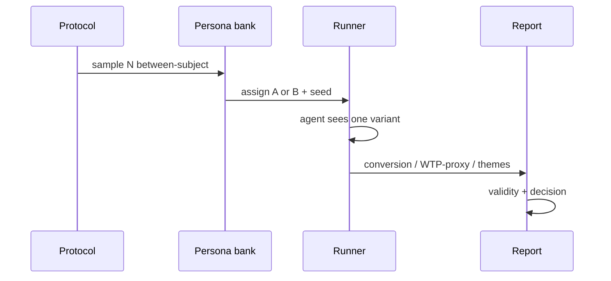

# Н7 · Коммуникации + претест S4

| Поле | Значение |
|---|---|
| **Неделя** | 7 · ~90 мин live + практика по `student-brief.md` |
| **Тема** | Питч стейкхолдеру · спарринг ИИ-ЛПР · полный between-subject pretest S4 (N≥50–100) |
| **Демо** | Питч + кусок претеста + готовый REPORT N=60 на Ритме; сдача — свой артефакт |
| **Эталон** | `docs/course/instructor/rhythm-exemplars/06-pretest-pitch-demo-notes.md` |
| **Sample REPORT** | `docs/course/sul/runners/runs/demo-h02-landing-n60/REPORT.md` |
| **Harness** | ≥1; runner `sul/runners/` (mock/llm) |
| **SUL** | S4 закрытие; мост к S5 |

---

## Цели

1. Собрать питч: проблема → инсайт → ставка → proof → ask (7±2 секции).
2. Провести спарринг с ИИ-ЛПР: возражения → доработка дека (не «получить yes»).
3. Выполнить S4: N≥50 (цель 50–100), 2 варианта, seed, логи в git.
4. Написать REPORT: метрики + themes + validity + supports/rejects/inconclusive + живой шаг.

---

## Повестка с таймингом

| Мин | Блок | Что делаем |
|---|---|---|
| 0–20 | Питч-эталон | 5–7 секций Ритма; underscore «не доказали» |
| 20–40 | Претест | Live малый N + готовый REPORT N=60 |
| 40–60 | ЛПР-спарринг | На глазах класса; 3 удара на доску |
| 60–80 | Validity | Разбор смещений; границы S4 ≠ live AB |
| 80–90 | Критерии сдачи | S4 checklist; smoke Н6 не считается |

---

## Нарратив занятия

### 0–20 · Питч как продукт решения, не тур по Cursor

Откройте: «На Н6 вы спроектировали protocol. Сегодня — полный претест и умение объяснить ставку человеку с бюджетом. Питч — не демо инструментов. Питч — решение с **ценой ошибки** и следующим живым шагом».

Пройдите эталон 06 по семи секциям (~6–7 мин устной формы):

1. **Контекст:** Ритм, ICP, bottleneck depth / paywall.  
2. **Ставка:** thin-bet на copy paywall до медиа.  
3. **Метод:** SUL between-subject N=60, seed `ritm-h02-20260918`, границы.  
4. **Результат:** направление эффекта + top themes (пока без цифр — цифры через 20 минут с экрана REPORT).  
5. **Не доказали:** живой WTP, каналы, смещение LLM — **остановитесь здесь дольше**, чем на «победе».  
6. **Ask:** бюджет 2 недели живого теста креатива/онбординга — не «поверьте симуляции».  
7. **Цена ошибки:** ship по синтетике vs упущенный живой тест.

Покажите A/B copy с доски (два столбца из эталона): A «налог» (тарифы + Продолжить без обмена) vs B benefit (лимит ↔ деньги above fold). Скажите: «Чем A≠B для пользователя — одна фраза. Если не можете сказать одной фразой — тест мусор».

### 20–40 · Претест live + готовый REPORT N=60

Откройте protocol на экране. Напомните AgentA/B-трезвость: симуляционная фаза до живого теста; exploratory; between-subject потому что агент, как человек, запоминает первый вариант.

**Live кусок (2–6 агентов):** возьмите 2 персоны из банка, назначьте A или B по seed, покажите агенту **только** свой variant. Запрет: «сравни A и B» / within-subject. Запишите outcome + 1–3 themes голосом персоны.

Затем — готовый лог, чтобы не ждать API: `sul/runners/runs/demo-h02-landing-n60/REPORT.md`. Проговорите таблицу:

| Variant | Success | N | Rate |
|---|---|---|---|
| A (control_tax) | 12 | 30 | 40% |
| B (treatment_benefit) | 18 | 30 | 60% |
| Δ | | | +20 п.п. |

Primary = success_rate **proxy**, не живой pay. **p-value не считаем** на демо; если кто-то прокрасит χ² — стоп-слово: «Это претест, не launch-тест на миллионе».

Themes вслух: A — путаница тарифа/CTA; B — понятен лимит, early paywall раздражает. Вердикт эталона: **supports (B direction)**. Следующий живой шаг — 2 недели креатива/benefit-copy на трафике после калибровки depth.

Укажите runner: `python3 pretest_runner.py --n 60 --seed …` (mock по умолчанию) · README runners · notebook twin. Ключи не в git.

### 40–60 · Спарринг с ИИ-ЛПР

Скажите: «Цель спарринга — дыры в деке, не согласие». Brief на экране: *CPO маркетплейса привычек, ненавидит vanity metrics*.

10–12 минут живого диалога. После — выпишите на доску три возражения (типичные): «Где живая калибровка?», «Почему N=60, а не 12 дешёвых?», «Почему ask — медиа, а не онбординг depth?». Покажите, как дек меняется после ударов: усилить «не доказали», уточнить ask, убрать vanity (DAU без окна).

Запрет: ЛПР, который всегда говорит yes. Файл-паттерн для студентов: `pitch/lp-brief.md` + `SPARRING.md` (топ-5 ударов + что изменили).

### 60–80 · Validity: где врёт, и всё равно полезно

Разберите секцию 4 REPORT: синтетика смещена к «осознанности»; артефакт = текст, не live UI / App Store; mock усиливает заданный эффект benefit-copy — для демо. Between-subject соблюдён.

Слайд границ (держите видимым): S4 ≠ живой АБ при доступном трафике; совпадение знака с живым тестом не доказано a priori; вердикты supports / rejects / **inconclusive** без стыда. Честность > прокрас — критерий программы, не мораль.

Свяжите со stats-ab 4.6: AgentA/B на Amazon совпал по знаку с 2 млн — «многообещающе», не «доказано». У вас N=60 mock — ещё скромнее. Цена ошибки ship по синтетике: зря медиа или упущенный тест онбординга.

### 80–90 · Критерии сдачи S4

Пройдите checklist вслух: protocol финален; N≥50; assignments + raw + aggregate + REPORT в `runs/pretest/<run_id>/`; секции REPORT все шесть; питч 7±2; спарринг зафиксирован. **Smoke Н6 не засчитывается.** Резать tokens/модель — можно; резать N ниже 50 без согласования — нет.

Дома: полный S4 на **своём** артефакте + дек + спарринг. Ритм — эталон на экране, не содержимое сдачи.

---

## Демо-биты: свой продукт vs Ритм

| Beat | Ритм (instructor) | Студент |
|---|---|---|
| A/B | «налог» vs benefit-copy paywall | 2 варианта **своего** артефакта |
| Live | 2–6 агентов / 2 персоны × assignment | полный N≥50 |
| Готовый лог | REPORT N=60: 40%→60%, Δ+20% | свой `REPORT.md` |
| Питч | Ask = 2 нед. живого теста | свой ask + цена ошибки |
| ЛПР | CPO, hates vanity | `pitch/lp-brief.md` + `SPARRING.md` |

**Sample REPORT beats (демо):** themes A = путаница тарифа/CTA; B = понятен лимит, early PW раздражает; verdict **supports (B direction)**; primary = success_rate proxy; p не считаем.

**Указатели:** `06-pretest-pitch-demo-notes.md` · `demo-h02-landing-n60/REPORT.md` · `sul/templates/pretest-protocol.md` · `sul/runners/README.md` · `pretest_runner.py` / `.ipynb`.

---

## Доска / mermaid

**1. Pipeline претеста:**

**2. На доске параллельно:** два столбца A vs B copy · таблица метрик N=60 с экрана · три возражения ЛПР · слайд границ §S4≠live AB.

---

## Переход к практике недели → student-brief.md

«Validity 60–80 готовит обязательный блок отчёта. Дома по `week-07/student-brief.md`: A питч-дек · B спарринг ЛПР · C полный S4 N≥50 с логами и REPORT. Smoke не считается. Читаете AgentA/B abstract refresh. Критерии — `checklist.md`».

---

## Не говорить / типичные ловушки

- Не «поверьте симуляции» как ask — ask = живой шаг + ресурсы.
- Не прокрашивать p-value / ship по синтетике.
- Не принимать N=12 «дорого» без согласования — резать модель, не N.
- Не давать агенту оба варианта / within-subject / «выбери лучший».
- Не принимать отчёт без validity.
- Не превращать питч в тур по Cursor/n8n.
- Предупредить стоимость API; дешёвая модель ok при том же seed-протоколе.
- Trap: vanity metrics в питче; отчёт без «не доказали».

---

## Приложение: глоссарий EN

| Термин | Смысл на занятии |
|---|---|
| pitch | Дек решения: ставка, proof, ask |
| stakeholder | Получатель ask и цены ошибки |
| sparring | Прогон возражений с ИИ-ЛПР |
| LP / decision-maker (ЛПР) | Роль CFO/CPO/founder в brief |
| between-subject | Один агент — один variant |
| seed | Воспроизводимость assignment/outcome |
| WTP-proxy | Прокси готовности платить, не живой pay |
| validity | Честный блок смещений |
| supports / rejects / inconclusive | Три допустимых вердикта |
| vanity metrics | Метрики без окна/связи со ставкой |
| AgentA/B | arXiv-претест LLM-агентами |
| SimAB | Родственная линия симуляций АБ |
| thin-bet | Узкая ставка до дорогого живого теста |
| guardrail | Метрика «не сломать» рядом с primary |
