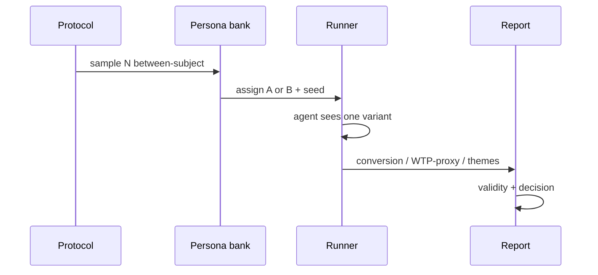

# Н7 · Lesson outline — Коммуникации + претест S4

| Поле | Значение |
|---|---|
| **Неделя** | 7 · ~1,5 ч + 4–6 ч практика |
| **Артефакты** | Питч-дек · спарринг с ИИ-ЛПР · отчёт симуляции **S4** (≥50–100 агентов) |
| **Демо instructor** | Питч-эталон + претест на лендинге Ритма |

---

## Цели

1. Собрать **питч** стейкхолдеру своего кейса (проблема → инсайт → ставка → proof → ask).  
2. Провести **спарринг** с ИИ в роли ЛПР (возражения → доработка дека).  
3. Выполнить **S4**: between-subject претест ≥**50–100** агентов, 2 варианта на своём артефакте.  
4. Написать отчёт: метрики + темы + раздел валидности + вердикт supports/rejects/inconclusive.

---

## Теория коротко

### 1. Питч как продукт решения

Не «рассказ про AI», а **решение с ценой ошибки** и следующим живым шагом.

### 2. Претест pipeline

Протокол: [`../sul/templates/pretest-protocol.md`](../sul/templates/pretest-protocol.md).  
Опора: AgentA/B · SimAB · stats-ab 4.6.

### 3. ИИ-ЛПР

Роль: CFO / CPO / founder — фиксированный brief. Цель спарринга — найти дыры, не «получить yes».

### 4. Границы (слайд)

S4 не заменяет живой АБ при доступном трафике. Честность > прокрас.

---

## Тайминг

| Мин | Блок |
|---|---|
| 0–20 | Питч-эталон Ритм (5–7 слайдов) |
| 20–40 | Live претест кусок (малый N) + обсуждение полного N |
| 40–60 | Спарринг ЛПР на глазах класса |
| 60–80 | Разбор validity секции |
| 80–90 | Критерии сдачи S4 |

---

## Materials

[`../materials-by-module.md`](../materials-by-module.md) §Н7.
