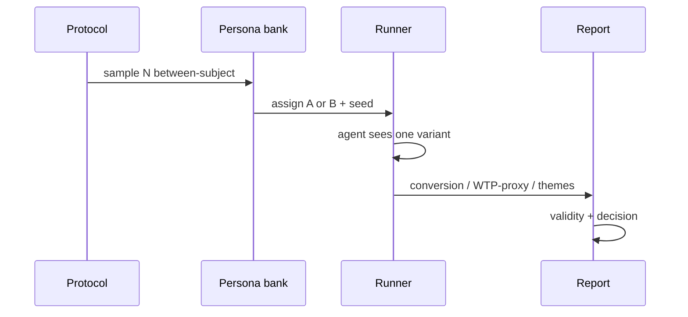

# Слайды · Н7 · Коммуникации + претест S4

> Markdown-колода для paste в Google Slides / Marp / Pitch. Один слайд = блок между `---`.
> Источники: `lecture.md`, `lesson-outline.md`, playbook §Н7.

---

# Н7 · Питч + полный pretest S4

- Питч как продукт решения (не тур Cursor)
- Live кусок + готовый REPORT N=60
- Спарринг ИИ-ЛПР · validity
- Демо: Ритм · сдача: свой артефакт

<!-- Notes: «На Н6 — protocol. Сегодня — полный претест и умение объяснить ставку человеку с бюджетом». -->

---

# Цели недели

- Питч: проблема → инсайт → ставка → proof → ask
- Спарринг ЛПР → доработка дека (не «получить yes»)
- S4: N≥50 (цель 50–100), 2 варианта, seed, логи
- REPORT: метрики + themes + validity + вердикт + живой шаг

<!-- Notes: Smoke Н6 не засчитывается. -->

---

# Повестка · ~90 мин

| Мин | Блок |
|---|---|
| 0–20 | Питч-эталон Ритм |
| 20–40 | Претест live + REPORT N=60 |
| 40–60 | ЛПР-спарринг |
| 60–80 | Validity / WHERE-IT-LIES |
| 80–90 | Критерии сдачи S4 |

<!-- Notes: Playbook A 15 / B 15 / C 10–15. -->

---

# Демо-бит · Ритм vs свой продукт

- **Ритм:** A «налог» vs B benefit-copy paywall
- **Вы:** 2 варианта **своего** артефакта
- Live 4–6 агентов на экране · полный N≥50 — дома
- Sample: `demo-h02-landing-n60/REPORT.md`

<!-- Notes: Чем A≠B — одна фраза. Иначе тест мусор. -->

---

# Питч = продукт решения

- Не «рассказ про AI» и не тур по Cursor/n8n
- Решение с **ценой ошибки**
- Следующий **живой** шаг + ресурсы
- 7±2 секции · 6–7 мин устной формы

<!-- Notes: Failure: питч = тур Cursor → вернуть к ставке и ask. -->

---

# 7 секций эталона

1. Контекст · ICP · bottleneck
2. Ставка (thin-bet)
3. Метод: SUL between-subject · N · seed · границы
4. Результат: направление + themes
5. **Не доказали** (дольше, чем «победа»)
6. Ask = бюджет на живой тест
7. Цена ошибки ship по синтетике

<!-- Notes: Underscore слайд 5. Ask ≠ «поверьте симуляции». -->

---

# A vs B · одна фраза

| A control_tax | B treatment_benefit |
|---|---|
| Тарифы + «Продолжить без обмена» | Лимит ↔ деньги above fold |
| Путаница тарифа/CTA | Понятен лимит; early PW раздражает |

- Если не можете сказать A≠B одной фразой — стоп

<!-- Notes: Два столбца на доске рядом с питчем. -->

---

# Претест pipeline

<!-- Notes: Единственный mermaid Н7. Between-subject: агент запоминает первый вариант. -->

---

# Live кусок · 4–6 агентов

- 2 персоны из банка · assignment по seed
- Агент видит **только** свой variant
- Запрет: «сравни A и B» / within-subject
- Outcome + 1–3 themes голосом персоны

<!-- Notes: Затем сразу готовый лог — не ждать API на занятии. -->

---

# REPORT N=60 · sample

| Variant | Success | N | Rate |
|---|---|---|---|
| A (control_tax) | 12 | 30 | 40% |
| B (treatment_benefit) | 18 | 30 | 60% |
| Δ | | | **+20 п.п.** |

- Primary = success_rate **proxy**, не живой pay
- Вердикт эталона: **supports (B direction)**

<!-- Notes: Themes: A — путаница; B — лимит понятен, early PW раздражает. Живой шаг: 2 нед. креатива. -->

---

# p-value · стоп-слово

- На демо **p не считаем**
- Если кто-то прокрасит χ² — остановить
- «Это претест, не launch-тест на миллионе»
- N=12 «дорого» → резать модель, не N

<!-- Notes: Failure modes playbook. API cost: предупредить; дешёвая модель ok при том же seed. -->

---

# Спарринг ИИ-ЛПР

- Цель — дыры в деке, не согласие
- Brief: CPO · ненавидит vanity metrics
- 10–12 мин живого диалога
- Файлы: `pitch/lp-brief.md` + `SPARRING.md`

<!-- Notes: Запрет: ЛПР, который всегда говорит yes. -->

---

# Три удара на доску

1. «Где живая калибровка?»
2. «Почему N=60, а не 12 дешёвых?»
3. «Почему ask — медиа, а не онбординг depth?»

- После ударов: усилить «не доказали» · уточнить ask · убрать vanity

<!-- Notes: Показать, как дек меняется на глазах класса. -->

---

# Validity · WHERE-IT-LIES

- Синтетика смещена к «осознанности»
- Артефакт = текст, не live UI / App Store
- Mock может усиливать заданный эффект
- Between-subject соблюдён · всё равно полезно

<!-- Notes: Обязательный блок REPORT. Без validity — блокер. -->

---

# Границы SUL · §3.4

- S4 ≠ живой АБ при доступном трафике
- Совпадение знака с живым тестом не доказано a priori
- Вердикты: supports / rejects / **inconclusive** — без стыда
- Честность > прокрас

<!-- Notes: AgentA/B на Amazon — «многообещающе», не «доказано». N=60 mock — ещё скромнее. -->

---

# Критерии сдачи S4

- Protocol финален · N≥50
- `runs/pretest/<run_id>/`: assignments + raw + aggregate + REPORT
- Питч 7±2 · спарринг зафиксирован
- **Smoke Н6 не считается**

<!-- Notes: Резать tokens/модель — можно; резать N ниже 50 без согласования — нет. -->

---

# Ловушки недели

- N=12 «дорого» без согласования
- p-value / ship по синтетике
- Агент видит оба варианта
- Питч = тур по Cursor · отчёт без «не доказали»

<!-- Notes: Trap: vanity metrics; ask без живого шага. -->

---

# Практика · student-brief.md

- A питч-дек · B спарринг ЛПР
- C полный S4 N≥50 + логи + REPORT
- Refresh: AgentA/B abstract
- Критерии — `checklist.md`

<!-- Notes: «Ритм — эталон на экране, не содержимое сдачи». -->

---

# На следующей · Н8 капстоун

- Образцово честная защита (inconclusive OK)
- Ротация 7+3 · peer-review
- WHERE-IT-LIES обязателен · S5
- Закрытие курса: живой АБ + harness в работе

<!-- Notes: Пакет defense/ готовить до входа в аудиторию Н8. -->
