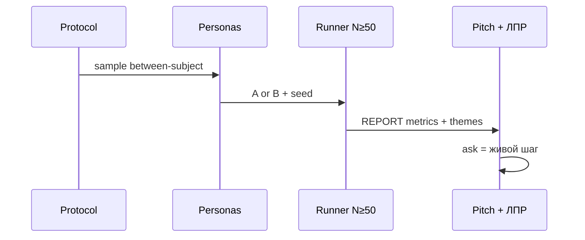

# Н7 · Student brief — питч, ЛПР-спарринг, претест S4

Практика **4–6 ч** (прогон может занять основное время). Сдача: `pitch/` + `runs/pretest/` отчёт с N≥50.

Pipeline: [`lesson-outline.md`](./lesson-outline.md) · protocol [`../sul/templates/pretest-protocol.md`](../sul/templates/pretest-protocol.md).

---

## A. Питч-дек

`pitch/deck.md` (или PDF) — **7±2** слайда/секции:

1. Контекст ICP / проблема.  
2. Инсайт (из discovery).  
3. Ставка (из Н4).  
4. Что симулировали (дизайн S4).  
5. Результат (метрики + 3 темы).  
6. Что *не* доказали.  
7. Ask: следующий живой шаг + ресурсы.

Язык: RU; цифры с источниками.

---

## B. Спарринг с ИИ-ЛПР

1. Файл `pitch/lp-brief.md`: роль, цели, красные линии ЛПР.  
2. Прогон в harness: 10–15 возражений.  
3. `pitch/SPARRING.md`: топ-5 ударов + что изменили в деке.  
4. Запрещено: ЛПР, который всегда соглашается.

---

## C. Претест S4 (ядро)

1. Финализируйте protocol по [`../sul/templates/pretest-protocol.md`](../sul/templates/pretest-protocol.md).  
2. N **≥50** (цель курса **50–100**); between-subject; seed зафиксирован.  
3. 2 варианта артефакта **своего** продукта (URL/копии экранов/офера).  
4. Логи: `runs/pretest/<run_id>/` — assignments, raw outputs, aggregate.  
5. Отчёт `runs/pretest/<run_id>/REPORT.md`:

| Блок | Обязателен |
|---|---|
| Дизайн | да |
| Таблица метрик A vs B | да |
| Qualitative themes | да |
| Смещения / валидность | да |
| Вердикт supports/rejects/inconclusive | да |
| Следующий живой шаг | да |

Можно оркестрировать через n8n (триггер батча) или Python/ноутбук — главное воспроизводимость и логи в git (без ключей).

Smoke с Н6 не засчитывается как S4.

---

## D. Чтение

AgentA/B PDF/abstract · SimAB abstract · pm-skills GTM (skim).

---

## Критерии

[`checklist.md`](./checklist.md).

<!-- week-nav -->
---

**Навигация:** [← Н6](../week-06/) · [Н7 индекс](./README.md) · [Н8 →](../week-08/) · [курс](../README.md) · [SUL](../sul/)

