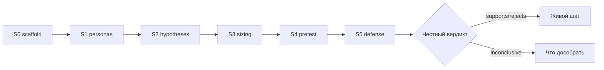

# Н8 · Капстоун / защита S5

| Поле | Значение |
|---|---|
| **Неделя** | 8 · ~90 мин live (защиты + peer) + дожим pack |
| **Тема** | SUL v1 · калибровка · peer-review · защита S5; честность > прокрас |
| **Демо** | Образцово честная защита Ритма (в т.ч. inconclusive) |
| **Talk-track** | `docs/course/instructor/rhythm-exemplars/06-pretest-pitch-demo-notes.md` § Talk-track S5 |
| **Рубрика** | `docs/course/sul/templates/s5-defense-rubric.md` (max **/51**) |
| **Доказательная база S4** | `sul/runners/runs/demo-h02-landing-n60/REPORT.md` |
| **Harness** | Следы harness + n8n в репо обязательны (D3) |
| **SUL** | S0→S5 закрытие |

---

## Цели

1. Довести SUL до v1: S0–S4 связаны, README актуален.
2. Сделать калибровку vs живой/публичный кейс **или** calibration debt + план.
3. Пройти peer-review по рубрике (только наблюдаемые артефакты).
4. Защитить S5: что решили бы / чего не решили бы; обязательный абзац вердикта.

---

## Повестка с таймингом

| Мин | Блок | Что делаем |
|---|---|---|
| 0–15 | Эталон защиты Ритм | Дуга S0→S5; inconclusive намеренно; WHERE-IT-LIES |
| 15–45 | Защиты студентов | Таймер **7+3**; вопросы только по делу |
| 45–70 | Peer-review ротация | `PEER.md` по рубрике |
| 70–85 | Красные флаги | Общий разбор auto-fail |
| 85–90 | Что дальше | Живой АБ; harness+n8n на работе |

---

## Нарратив занятия

### 0–15 · Эталон: образцово честная защита, не идеальный прокрас

Откройте таймер и принцип: «Защита = качество решения, не демо тулов. Сегодня эталон Ритма специально неидеален — и это повышает, а не снижает оценку».

Пройдите talk-track S5 из эталона 06 (~6 мин):

1. **Дуга S0→S5 за ~1 мин:** scaffold + notice + harness/n8n → банк персон → гипотезы → sizing/tornado → pretest H02 N=60 → defense.  
2. **Вердикт:** по H02 — **supports direction** (см. sample REPORT: A 40% → B 60%); кусок соседней ставки (H01) — **inconclusive** намеренно. Произнесите: «Inconclusive — валидный исход, не провал курса».  
3. **Где врёт:** LLM-осознанность; нет live UI; N=60 ≠ мощность живого АБ; mock усиливает benefit-copy. Минимум пять пунктов в духе `WHERE-IT-LIES.md`.  
4. **Калибровка:** вслух «знак совпал / не совпал с маленьким прошлым АБ стенда» — или calibration debt, если истории нет.  
5. **Next:** живой тест креатива; перенос harness+n8n в рабочий контур.

Откройте рубрику на экране: A дизайн 15 + B персоны 12 + C валидность 12 + D процесс 12 = **/51**. Ориентир эталона: реалистично **~24–30**, не «идеал 51». В старых заметках мог мелькать знаменатель 39 — на занятии опираемся только на `s5-defense-rubric.md`.

Обязательный абзац — проговорить эталоном:

> По симуляции мы бы: приоритизировали benefit-copy paywall перед медиа.  
> Этого недостаточно, чтобы: шипить прайсинг или убивать онбординг.  
> Следующий живой шаг: 2 недели теста креатива на трафике + калибровка depth.

Слайд границ обязателен на **каждой** защите, включая эталон.

### 15–45 · Очередь защит студентов

Фасилитация, не лекция. Правила вслух до первой защиты:

- **7 минут** talk-track + **3 минуты** вопросов. Таймер виден.  
- Вопросы аудитории только: primary metric? N и seed? validity / где врёт? живой шаг?  
- Стоп-слово при ship/kill без оговорок — попросить переформулировать через обязательный абзац.  
- Демо Cursor/n8n вместо решения — срезать, вернуть к вердикту.

Если группа большая — часть защит в параллельных комнатах с peer-листами; instructor ротируется. Ритм больше не показывается как «правильный ответ» — только как паттерн честности.

### 45–70 · Peer-review ротация

«Баллы только по артефактам в репо, не за старание и не за харизму». Раздайте/откройте короткий peer-лист из рубрики:

1. Нашёл primary metric за 30 сек?  
2. Понял, чего *не* доказали?  
3. Вердикт честный относительно цифр?  
4. Один сильнейший риск смещения?  
5. Один совет по живому шагу?

Заполняют `defense/PEER.md`. Self vs peer Δ>8 — обсудить на защите вслух (не «усреднить втихую»). Напомните блок C: ноль во внешней валидности (C1–C4) → нельзя утверждать ship/kill.

### 70–85 · Красные флаги / auto-fail

Вынесите на общий слайд и проговорите без смягчения:

- Утверждение ship/kill при 0 в C1–C4.  
- Нет REPORT S4 / N<50 без письменного исключения.  
- API keys в git.  
- Кейс Ритма сдан как «свой продукт».  
- Within-subject претест.  
- Нет `WHERE-IT-LIES` (≥5) — S5 не закрыт.  
- Нет обязательного абзаца вердикта.  
- Peer «за старание».

Три паттерна класса (назовите по факту комнаты): что почти все делают хорошо; где массово прокрашивают; где забывают живой шаг. Подчеркните: **честный inconclusive повышает оценку** относительно натянутого supports.

### 85–90 · Что дальше после курса

Коротко и трезво: «SUL v1 — лаборатория решения. Дальше — живой АБ там, где есть трафик; harness и n8n digests — в рабочем репо без ключей в git; калибруйте симуляции на истории своих тестов, прежде чем верить новым претестам. AgentA/B остаётся фильтром приоритета, не заменой launch-теста».

Н8 = сама практика/защита. Prep до занятия уже должен был случиться: обмен репо за 24ч, self-рубрика, WHERE-IT-LIES. После эталона 0–15 — очередь.

---

## Демо-биты: свой продукт vs Ритм

| Beat | Ритм (instructor) | Студент |
|---|---|---|
| Дуга | S0→S5 за ~1 мин | свой talk-track 5–7 мин |
| Вердикт | H02 supports direction; H01 кусок **inconclusive** | согласован с данными |
| Где врёт | LLM-осознанность, нет live UI, N=60 ≠ мощность АБ | `WHERE-IT-LIES.md` ≥5 |
| Калибровка | знак совпал/не совпал с маленьким АБ | `CALIBRATION.md` или debt |
| Рубрика | реалистично ~24–30 / 51 | `RUBRIC-SELF` + `PEER` |

**Указатели:** talk-track в `06-pretest-pitch-demo-notes.md` · рубрика `sul/templates/s5-defense-rubric.md` · sample REPORT `demo-h02-landing-n60/REPORT.md` · сдача: `defense/TALK-TRACK.md`, `SLIDES.md`, `RUBRIC-SELF.md`, `PEER.md`, `WHERE-IT-LIES.md`, `CALIBRATION.md` + SUL v1 README.

---

## Доска / mermaid

**1. Цепочка решения:**

**2. Peer-вопросы + auto-fail список** на втором слайде/половине доски; слайд границ — обязателен у каждого защищающегося.

---

## Переход к практике недели → student-brief.md

«Н8 — сама практика. Дожим по `week-08/student-brief.md`: A SUL v1 checklist · B CALIBRATION или debt · C defense pack · D peer-протокол. Критерии и auto-fail — `checklist.md` + рубрика. После эталона сразу очередь защит — пакет `defense/` должен быть готов до входа в аудиторию».

---

## Не говорить / типичные ловушки

- Не ставить зачёт без WHERE-IT-LIES / без абзаца вердикта.
- Не хвалить прокрас: честный inconclusive > натянутый supports.
- Не принимать демо инструментов вместо решения.
- Не игнорировать auto-fail «ради атмосферы».
- Вопросы аудитории только: метрика, N, validity, живой шаг.
- Peer только по наблюдаемым артефактам; self vs peer Δ>8 — на защиту.
- Trap: «у нас 45/51 потому что красивые слайды» — нет, баллы по A–D и красным флагам.

---

## Приложение: глоссарий EN

| Термин | Смысл на занятии |
|---|---|
| capstone | Итоговая сборка SUL v1 + защита |
| defense | Устная защита решения (S5) |
| calibration / calibration debt | Сверка знака с живым/публичным кейсом или явный долг |
| peer-review | Оценка соседом по артефактам |
| external validity | Блок C рубрики: перенос на живых |
| talk-track | Скрипт 5–7 мин устной защиты |
| supports / rejects / inconclusive | Допустимые вердикты S4/S5 |
| ship/kill | Решение раскатить/убить — только с оговорками |
| harness | Рабочий контур агента(ов) в репо |
| auto-fail | Условие провала независимо от суммы |
| rubric | `s5-defense-rubric.md`, max 51 |
| AgentA/B | Претест LLM-агентами; не замена live AB |
| SimAB | Родственная линия симуляций |
