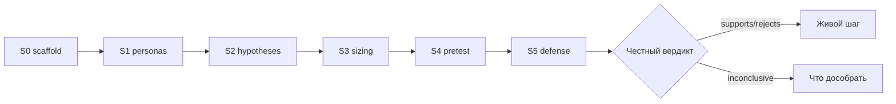

# Н8 · Lesson outline — Капстоун / защита S5

| Поле | Значение |
|---|---|
| **Неделя** | 8 · ~1,5 ч live + дожим практики |
| **Артефакты** | v1 SUL · калибровка · взаимный разбор · **защита S5** |
| **Демо instructor** | Разбор эталонной защиты на Ритме |

---

## Цели

1. Довести SUL до **v1**: S0–S4 связаны, README актуальный.  
2. Сделать **калибровку** vs известный кейс / прошлый живой тест (или честно «нечего калибровать» + план).  
3. Пройти **peer-review** по рубрике.  
4. Защитить **S5**: что решили бы / чего не решили бы; честность > прокрас.

---

## Теория коротко

### 1. Защита = decision quality

Рубрика: [`../sul/templates/s5-defense-rubric.md`](../sul/templates/s5-defense-rubric.md) (+ stub валидности).

### 2. Калибровка

Идеал: знак эффекта совпал/не совпал с прошлым живым тестом.  
Если нет истории — калибровка на публичном кейсе *или* секция «calibration debt».

### 3. Peer-review

Сосед заполняет рубрику; спорят только фактами из репо.

### 4. Границы

Ноль в блоке внешней валидности → нельзя утверждать ship/kill.

---

## Тайминг

| Мин | Блок |
|---|---|
| 0–15 | Эталон защиты Ритм (что сработало / где врали) |
| 15–45 | Защиты студентов (тайминг 5–7 мин + 3 мин вопросы) |
| 45–70 | Peer-review ротация |
| 70–85 | Общий разбор красных флагов |
| 85–90 | Что дальше после курса (живой АБ, harness в работе) |

---

## Materials

[`../materials-by-module.md`](../materials-by-module.md) §Н8 · AgentA/B · SimAB.
