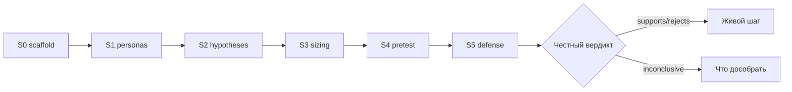

# Слайды · Н8 · Капстоун / защита S5

> Markdown-колода для paste в Google Slides / Marp / Pitch. Один слайд = блок между `---`.
> Источники: `lecture.md`, `lesson-outline.md`, playbook §Н8.

---

# Н8 · Капстоун S5

- SUL v1 · калибровка · peer · защита
- Эталон: честная защита (inconclusive намеренно)
- Честность > прокрас
- Демо: Ритм-паттерн · сдача: свой продукт

<!-- Notes: «Защита = качество решения, не демо тулов. Эталон специально неидеален — и это повышает оценку». -->

---

# Цели недели

- SUL v1: S0–S4 связаны · README актуален
- Калибровка vs живой кейс **или** calibration debt
- Peer-review по рубрике (только артефакты)
- S5: что решили бы / чего не решили бы

<!-- Notes: Н8 = сама практика/защита. Prep до занятия обязателен. -->

---

# Повестка · ~90 мин

| Мин | Блок |
|---|---|
| 0–15 | Эталон защиты Ритм |
| 15–45 | Ротация защит 7+3 |
| 45–70 | Peer-review |
| 70–85 | Auto-fail / красные флаги |
| 85–90 | После курса |

<!-- Notes: Фасилитация, не лекция. Таймер виден. -->

---

# Демо-бит · Ритм vs свой продукт

- **Ритм:** дуга S0→S5 · H02 supports · H01 inconclusive
- **Вы:** talk-track 5–7 мин · вердикт согласован с данными
- WHERE-IT-LIES ≥5 · CALIBRATION или debt
- Рубрика: реалистично ~24–30 / **51**

<!-- Notes: Sample REPORT N=60 на экране как доказательная база эталона. -->

---

# Цепочка решения

<!-- Notes: Единственный mermaid Н8. Inconclusive → learn, не стыд. -->

---

# Эталон · talk-track ~6 мин

1. Дуга S0→S5 за ~1 мин
2. Вердикт: supports direction + **inconclusive** намеренно
3. Где врёт: ≥5 пунктов WHERE-IT-LIES
4. Калибровка: знак совпал / не совпал / debt
5. Next: живой тест + harness в работе

<!-- Notes: «Inconclusive — валидный исход, не провал курса». -->

---

# Обязательный абзац вердикта

> По симуляции мы бы: …  
> Этого недостаточно, чтобы: …  
> Следующий живой шаг: …

- Без абзаца — S5 не закрыт
- Стоп-слово при ship/kill без оговорок

<!-- Notes: Эталон: benefit-copy до медиа · недостаточно для прайсинга · 2 нед. креатива + depth. -->

---

# Рубрика · /51

| Блок | Баллы |
|---|---|
| A Дизайн | 15 |
| B Персоны | 12 |
| C Валидность | 12 |
| D Процесс | 12 |

- Ориентир эталона: **~24–30**, не идеал 51
- Ноль в C1–C4 → нельзя ship/kill

<!-- Notes: Опора только на s5-defense-rubric.md (не старый знаменатель 39). -->

---

# Правила защиты · 7+3

- **7 мин** talk-track + **3 мин** вопросов
- Таймер на экране
- Вопросы только: метрика · N/seed · validity · живой шаг
- Демо Cursor/n8n вместо решения — срезать

<!-- Notes: Большая группа → параллельные комнаты; instructor ротируется. -->

---

# Peer-review · 5 вопросов

1. Primary metric за 30 сек?
2. Чего *не* доказали?
3. Вердикт честный относительно цифр?
4. Сильнейший риск смещения?
5. Один совет по живому шагу?

- Баллы только по артефактам в репо · `defense/PEER.md`

<!-- Notes: Self vs peer Δ>8 — обсудить вслух, не усреднить втихую. -->

---

# WHERE-IT-LIES · минимум 5

- LLM-«осознанность» / оптимизм
- Нет live UI / App Store
- N=60 ≠ мощность живого АБ
- Mock / seed могут усиливать эффект
- Каналы / WTP / сегменты вне симуляции

<!-- Notes: Нет WHERE-IT-LIES ≥5 → не ставить зачёт S5. Failure #2 playbook. -->

---

# Границы SUL · §3.4

- Синтетика ≠ живой трафик
- S4/S5 не заменяют live AB при доступном трафике
- AgentA/B = фильтр приоритета, не launch-тест
- Честный inconclusive > натянутый supports

<!-- Notes: Слайд границ обязателен на **каждой** защите, включая эталон. -->

---

# Auto-fail · красные флаги

- Ship/kill при 0 в C1–C4
- Нет REPORT S4 / N<50 без исключения
- API keys в git · кейс Ритма как «свой»
- Within-subject · нет WHERE-IT-LIES · нет абзаца вердикта
- Peer «за старание» · репо без S4 логов

<!-- Notes: Проговорить без смягчения. Failure: демо тулов; нет WHERE-IT-LIES; репо без S4 логов. -->

---

# Три паттерна класса

- Что почти все делают хорошо
- Где массово прокрашивают
- Где забывают живой шаг

- Назвать по факту комнаты, не абстрактно

<!-- Notes: Подчеркнуть: честный inconclusive повышает оценку. -->

---

# Пакет defense/ до входа

- `TALK-TRACK.md` · `SLIDES.md`
- `RUBRIC-SELF.md` · `PEER.md`
- `WHERE-IT-LIES.md` · `CALIBRATION.md`
- SUL v1 README · обмен репо за 24ч

<!-- Notes: «После эталона 0–15 — сразу очередь. Пакет должен быть готов». -->

---

# Практика · student-brief.md

- A SUL v1 checklist
- B CALIBRATION или debt
- C defense pack
- D peer-протокол · критерии + auto-fail в `checklist.md`

<!-- Notes: Н8 — сама практика. Дожим pack параллельно защитам при необходимости. -->

---

# Ловушки защиты

- Демо инструментов вместо вердикта → срезать
- Нет WHERE-IT-LIES → S5 не закрыт
- Репо без S4 логов → не принимается
- «45/51 потому что красивые слайды» — нет

<!-- Notes: Вопросы аудитории только по делу. Peer только по наблюдаемым артефактам. -->

---

# После курса

- SUL v1 = лаборатория решения
- Дальше: живой АБ там, где есть трафик
- Harness + n8n digests — в рабочий репо (без ключей в git)
- Калибруйте симуляции на истории своих тестов

<!-- Notes: «AgentA/B остаётся фильтром приоритета, не заменой launch-теста». -->

---

# Закрытие · спасибо

- Честность > прокрас — критерий программы
- Свой продукт прошёл дугу S0→S5
- Следующий шаг — живой, не синтетический
- Вопросы / обмен контактами / репо

<!-- Notes: Коротко и трезво. Не обещать, что симуляции «доказали» продукт. -->
