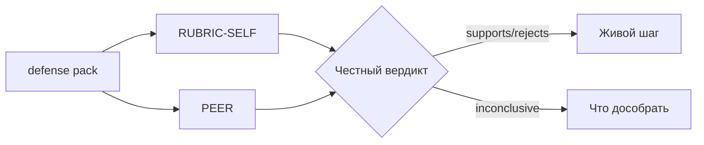

# Н8 · Student brief — капстоун и защита S5

Практика: дожим + защита. Сдача: ссылка на SUL v1 + `defense/` пакет + заполненная рубрика.

Пример заполненной рубрики (**EXAMPLE**, не копировать кейс): [`../sul/examples/s5-rhythm-filled-rubric.md`](../sul/examples/s5-rhythm-filled-rubric.md).

Цепочка S0→S5: [`lesson-outline.md`](./lesson-outline.md).

---

## A. SUL v1 checklist

Пройдите по вехам:

| Веха | Доказательство в репо |
|---|---|
| S0 | README, notice, harness + n8n #1 |
| S1 | ≥15 персон, ≥3 сегмента |
| S2 | 5–7 гипотез + runner plan |
| S3 | sizing + tornado |
| S4 | pretest N≥50 + REPORT |
| S5 | defense pack (ниже) |

Обновите корневой `sul/README.md`: статус каждой вехи.

---

## B. Калибровка

`defense/CALIBRATION.md`:

1. Эталон для сравнения (свой прошлый АБ / публичный кейс / «нет данных»).  
2. Ожидаемый знак vs факт (если есть).  
3. Что это меняет в доверии к S4.  
4. Если данных нет — **calibration debt**: какой живой тест закроет долг.

---

## C. Пакет защиты

`defense/`:

| Файл | Содержание |
|---|---|
| `TALK-TRACK.md` | 5–7 мин устной защиты |
| `SLIDES.md` или PDF | визуал; обязателен слайд границ |
| `RUBRIC-SELF.md` | самооценка по [`../sul/templates/s5-defense-rubric.md`](../sul/templates/s5-defense-rubric.md) |
| `PEER.md` | лист от соседа (на занятии) |
| `WHERE-IT-LIES.md` | честный раздел «где врёт симуляция» (≥5 пунктов) |

Обязательный абзац (из рубрики):

> По симуляции мы бы: …  
> Этого недостаточно, чтобы: …  
> Следующий живой шаг: …

---

## D. Peer-review протокол

1. Обмен репо за 24 ч до защиты (или на занятии).  
2. Рецензент ставит баллы только по наблюдаемым артефактам.  
3. Расхождение self vs peer > 8 баллов — обсудить на защите.

---

## E. Чтение

Полная рубрика S5 · AgentA/B + SimAB (калибровка) · ваш REPORT S4.

---

## Критерии

[`checklist.md`](./checklist.md).

<!-- week-nav -->
---

**Навигация:** [← Н7](../week-07/) · [Н8 индекс](./README.md) · · капстоун · · [курс](../README.md) · [SUL](../sul/)

